<!-- .slide: class="titleslide" -->
# Python, Datenanalyse und Machine Learning
### Von der ersten Zeile Python bis zum eigenen ML-Workflow

Dr.-Ing. Grigory Devadze

---

## Was Sie mitnehmen

+ **Python** lesen und schreiben: Datentypen, Kontrollstrukturen, Funktionen <!-- .element: class="fragment" data-fragment-index="1" -->
+ Daten mit **pandas** einlesen, bereinigen, gruppieren und mit **matplotlib** und **seaborn** darstellen <!-- .element: class="fragment" data-fragment-index="2" -->
+ **Klassifikation, Regression und Clustering** mit scikit-learn trainieren und mit passenden Kennzahlen bewerten <!-- .element: class="fragment" data-fragment-index="3" -->
+ Einen vollständigen **ML-Workflow als Pipeline**, den Sie auf eigene Daten übertragen können <!-- .element: class="fragment" data-fragment-index="4" -->

---

<!-- .slide: class="smaller" -->
## Ablauf

| Teil | Thema |
|------|-------|
| 1 | Python-Grundlagen |
| 2 | NumPy und pandas |
| 3 | Daten einlesen, aufbereiten, explorieren und visualisieren |
| 4 | Grundlagen von Machine Learning und KI |
| 5 | Überwachtes Lernen: Regression und Klassifikation |
| 6 | Modelltraining, Feature Engineering, Hyperparameter und Evaluation |
| 7 | Unüberwachtes Lernen: Clustering und Segmentierung |
| 8 | Einführung in Deep Learning |
| 9 | Der ML-Workflow mit scikit-learn |
| 10 | Praxisbeispiele und Interpretation von Modellen |
| 11 | Transfer in die Praxis |

---

## Kursmaterial

+ Ein öffentliches Repository enthält Folien, Notebooks, Daten und Umgebungsdateien <!-- .element: class="fragment" data-fragment-index="1" -->
+ `https://github.com/grigory-consulting/python-ml-grundlagen` <!-- .element: class="fragment" data-fragment-index="2" -->
+ Die Daten im Ordner `data/` reichen für fast alle Beispiele, ohne Download <!-- .element: class="fragment" data-fragment-index="3" -->
+ Das Repository bleibt nach dem Kurs erreichbar <!-- .element: class="fragment" data-fragment-index="4" -->

---

<!-- .slide: data-background-color="#183b66" -->
# Teil 1: Python-Grundlagen

Die Sprachbausteine, die Sie für Datenanalyse und Machine Learning brauchen: Werte, Entscheidungen, Schleifen, Sammlungen und Funktionen.

--

## Was Sie in diesem Teil lernen

+ Werte in Variablen ablegen und die Datentypen `int`, `float`, `str`, `bool`, `None` unterscheiden <!-- .element: class="fragment" data-fragment-index="1" -->
+ Mit Operatoren rechnen und Texte mit f-Strings formatieren <!-- .element: class="fragment" data-fragment-index="2" -->
+ Abläufe mit `if`, `for` und `while` steuern <!-- .element: class="fragment" data-fragment-index="3" -->
+ Daten in Listen, Tupeln, Sets und Dictionaries ablegen und wieder herausholen <!-- .element: class="fragment" data-fragment-index="4" -->
+ Eigene Funktionen schreiben, Fehlermeldungen lesen und Module importieren <!-- .element: class="fragment" data-fragment-index="5" -->

--

## Python im Überblick

+ Python ist eine interpretierte, universell einsetzbare Programmiersprache <!-- .element: class="fragment" data-fragment-index="1" -->
+ Ihr Code wird Anweisung für Anweisung ausgeführt, ein eigener Übersetzungsschritt (Kompilieren) entfällt <!-- .element: class="fragment" data-fragment-index="2" -->
+ Python ist dynamisch typisiert: Sie deklarieren keinen Typ, der Wert bringt ihn mit <!-- .element: class="fragment" data-fragment-index="3" -->
+ Blöcke entstehen durch Einrückung, nicht durch geschweifte Klammern <!-- .element: class="fragment" data-fragment-index="4" -->
+ Einsatzgebiete: Datenanalyse, künstliche Intelligenz, wissenschaftliches Rechnen, Automatisierung, Webentwicklung <!-- .element: class="fragment" data-fragment-index="5" -->
+ Die große Standardbibliothek und die aktive Community liefern Werkzeuge für fast jede Aufgabe <!-- .element: class="fragment" data-fragment-index="6" -->

--

<!-- .slide: class="smaller" -->
## Syntax und Einrückung

```python
alter = 17

if alter >= 18:
    print("volljährig")          # gehört zum if-Block
    print("eigener Vertrag")     # gehört auch zum if-Block
print("Prüfung beendet")         # steht außerhalb, läuft immer

# -> Prüfung beendet
```

+ Eine Anweisung pro Zeile, kein Semikolon am Zeilenende <!-- .element: class="fragment" data-fragment-index="1" -->
+ Ein Doppelpunkt eröffnet einen Block, die Einrückung legt fest, was dazugehört <!-- .element: class="fragment" data-fragment-index="2" -->
+ Üblich sind vier Leerzeichen pro Ebene. VS Code setzt sie nach dem Doppelpunkt selbst. <!-- .element: class="fragment" data-fragment-index="3" -->
+ `#` leitet einen Kommentar ein: Python ignoriert den Rest der Zeile <!-- .element: class="fragment" data-fragment-index="4" -->
+ Groß- und Kleinschreibung zählt: `alter` und `Alter` sind zwei verschiedene Namen <!-- .element: class="fragment" data-fragment-index="5" -->

<div class="fragment" data-fragment-index="6">

> [!warning]
> Falsche Einrückung ist kein Schönheitsfehler. Python meldet `IndentationError` oder führt den falschen Block aus.

</div>

--

<!-- .slide: class="smaller" -->
## Variablen und Zuweisung

```python
alter = 45
monatsbeitrag = 412.50
name = "Erika Muster"

alter = alter + 1                 # rechts rechnen, dann links ablegen
monatsbeitrag = monatsbeitrag * 2
print(alter, monatsbeitrag)       # -> 46 825.0

a = b = c = 0                     # derselbe Wert für mehrere Namen
x, y, z = 1, 2, 3                 # mehrere Werte auf einmal
```

+ Eine Variable ist ein Name für einen Wert. `=` heißt „weise zu", nicht „ist gleich". <!-- .element: class="fragment" data-fragment-index="1" -->
+ Der Typ muss nicht deklariert werden und darf sich ändern: `alter = "unbekannt"` ist erlaubt <!-- .element: class="fragment" data-fragment-index="2" -->
+ Namen beginnen mit Buchstabe oder Unterstrich, danach Buchstaben, Ziffern, Unterstriche <!-- .element: class="fragment" data-fragment-index="3" -->
+ Konvention in Python: Kleinbuchstaben mit Unterstrich, zum Beispiel `monatsbeitrag` <!-- .element: class="fragment" data-fragment-index="4" -->

--

<!-- .slide: class="smaller" -->
## Datentypen

| Typ     | Bedeutung                 | Beispiel                     |
|---------|---------------------------|------------------------------|
| `int`   | ganze Zahl                | `alter = 45`                 |
| `float` | Gleitkommazahl            | `monatsbeitrag = 412.50`     |
| `str`   | Text (Zeichenkette)       | `plz = "01067"`              |
| `bool`  | Wahrheitswert             | `raucher = False`            |
| `None`  | „kein Wert vorhanden"     | `austrittsdatum = None`      |

```python
print(type(45), type(412.50), type("01067"))
# -> <class 'int'> <class 'float'> <class 'str'>
print(type(False), type(None))
# -> <class 'bool'> <class 'NoneType'>
```

> [!tip]
> Eine Postleitzahl ist Text, keine Zahl: Als `int` verliert `01067` die führende Null.

--

## Typen umwandeln

```python
print("6" + "7")                  # -> 67    Text wird aneinandergehängt
print(6 + 7)                      # -> 13    Zahlen werden addiert
print(float("6") + float("7"))    # -> 13.0

print(int("01067"))               # -> 1067  führende Null ist weg
print(str(45) + " Jahre")         # -> 45 Jahre
print(int(412.99))                # -> 412   schneidet ab, rundet nicht
print(6.0 + 7)                    # -> 13.0  int und float gemischt: float
```

+ `int()`, `float()`, `str()` und `bool()` wandeln einen Wert in den jeweiligen Typ um <!-- .element: class="fragment" data-fragment-index="1" -->
+ `"45" + 1` führt zu einem `TypeError`: Python rät nicht, was gemeint ist <!-- .element: class="fragment" data-fragment-index="2" -->
+ `int("abc")` führt zu einem `ValueError`: der Text enthält keine Zahl <!-- .element: class="fragment" data-fragment-index="3" -->

--

## Arithmetische Operatoren

```python
print(1 + 4 * 3)        # -> 13   Punkt vor Strich
print((1 + 4) * 3)      # -> 15   Klammern legen die Reihenfolge fest
print(2 ** 10)          # -> 1024 Potenz

jahresbeitrag = 12 * 412.50
print(jahresbeitrag)    # -> 4950.0
print(round(412.456, 2))   # -> 412.46
print(abs(-5), max(5, 9), min(5, 9))   # -> 5 9 5
```

+ Ein Ausdruck ist ein Wert oder eine Rechnung, die einen Wert ergibt <!-- .element: class="fragment" data-fragment-index="1" -->
+ Operatoren: `+`, `-`, `*`, `/`, `//`, `%`, `**` <!-- .element: class="fragment" data-fragment-index="2" -->
+ `**` bindet am stärksten, dann `*`, `/`, `//`, `%`, danach `+` und `-` <!-- .element: class="fragment" data-fragment-index="3" -->
+ Kurzformen: `summe += 10` bedeutet `summe = summe + 10`, ebenso `-=`, `*=`, `/=` <!-- .element: class="fragment" data-fragment-index="4" -->

--

<!-- .slide: class="smaller" -->
## Division: `/`, `//` und `%`

```python
print(35 / 5)      # -> 7.0    / liefert immer float
print(84 / 10)     # -> 8.4
print(84 // 10)    # -> 8      ganzzahlige Division
print(84 % 10)     # -> 4      Rest der Division (Modulo)
print(43 % 5)      # -> 3

tage = 45
print(tage // 7, "Wochen und", tage % 7, "Tage")
# -> 6 Wochen und 3 Tage
```

+ `/` liefert in Python 3 immer ein `float`, auch wenn die Division aufgeht <!-- .element: class="fragment" data-fragment-index="1" -->
+ `//` schneidet auf die ganze Zahl ab, `%` liefert den Rest <!-- .element: class="fragment" data-fragment-index="2" -->
+ Typische Anwendung von `%`: gerade oder ungerade prüfen mit `n % 2 == 0` <!-- .element: class="fragment" data-fragment-index="3" -->

<div class="fragment" data-fragment-index="4">

> [!warning]
> Gleitkommazahlen sind nicht exakt: `0.1 + 0.2` ergibt `0.30000000000000004`. Geldbeträge für die Ausgabe runden.

</div>

--

<!-- .slide: class="smaller" -->
## Strings

```python
stadt = "  Dresden "
name = "Erika Muster"

print(len(name))                    # -> 12
print(name[0], name[-1])            # -> E r    Index ab 0, -1: letztes
print(name[:5])                     # -> Erika  Slicing: bis vor Index 5
print(name.upper(), name.lower())   # -> ERIKA MUSTER erika muster
print(stadt.strip())                # -> Dresden   Leerzeichen am Rand weg
print(name.startswith("Er"))        # -> True
print(name.split(" "))              # -> ['Erika', 'Muster']
print("Erika" + " " + "Muster")     # -> Erika Muster
```

+ Strings stehen in einfachen oder doppelten Anführungszeichen <!-- .element: class="fragment" data-fragment-index="1" -->
+ Methoden lassen sich verketten: `stadt.strip().lower().startswith("dr")` <!-- .element: class="fragment" data-fragment-index="2" -->
+ Strings sind unveränderlich: `upper` und `strip` liefern einen **neuen** String <!-- .element: class="fragment" data-fragment-index="3" -->

--

<!-- .slide: class="smaller" -->
## f-Strings

```python
alter = 45
beitrag = 412.5
name = "Erika Muster"

print(f"Sie haben {65 - alter} Jahre bis zur Rente")
# -> Sie haben 20 Jahre bis zur Rente

print(f"{name}: {beitrag:.2f} EUR pro Monat")
# -> Erika Muster: 412.50 EUR pro Monat

print(f"Jahresbeitrag: {12 * beitrag:,.2f} EUR")
# -> Jahresbeitrag: 4,950.00 EUR
print(f"Anteil: {0.256:.1%}")       # -> Anteil: 25.6%
```

+ Ein `f` vor dem Anführungszeichen, Ausdrücke in geschweiften Klammern <!-- .element: class="fragment" data-fragment-index="1" -->
+ Nach dem Doppelpunkt steht das Format: `.2f` zwei Nachkommastellen, `,` Tausendertrenner, `.1%` Prozent <!-- .element: class="fragment" data-fragment-index="2" -->
+ Ältere Schreibweisen, die Sie in fremdem Code sehen: `"{} Jahre".format(20)` und `"%d Jahre" % 20` <!-- .element: class="fragment" data-fragment-index="3" -->

--

## Ausgabe und Eingabe: `print` und `input`

```python
print("Alter:", 45, "Jahre")            # -> Alter: 45 Jahre
print("01067", "Dresden", sep=";")      # -> 01067;Dresden
print("ohne Zeilenumbruch", end=" ")
print("weiter")                         # -> ohne Zeilenumbruch weiter

name = input("Wie heißen Sie? ")
alter = int(input("Wie alt sind Sie? "))
print(f"Hallo {name}, in {65 - alter} Jahren sind Sie 65.")
```

+ `print` gibt mehrere Werte aus und setzt Leerzeichen dazwischen, `sep` und `end` ändern das <!-- .element: class="fragment" data-fragment-index="1" -->
+ `input` zeigt den Text an, wartet auf eine Eingabe und liefert sie **immer als String** <!-- .element: class="fragment" data-fragment-index="2" -->
+ Für Rechnungen die Eingabe mit `int()` oder `float()` umwandeln <!-- .element: class="fragment" data-fragment-index="3" -->
+ In VS Code erscheint das Eingabefeld von `input` oben am Fensterrand <!-- .element: class="fragment" data-fragment-index="4" -->

--

<!-- .slide: class="smaller" -->
## Vergleiche und logische Operatoren

```python
alter, arztbesuche = 45, 8

print(alter == 45)     # -> True     gleich (zwei Gleichheitszeichen)
print(alter != 45)     # -> False    ungleich
print(alter < 65)      # -> True
print(arztbesuche >= 10)                   # -> False

print(alter > 40 and arztbesuche > 5)      # -> True   beide Seiten wahr
print(alter > 60 or arztbesuche > 5)       # -> True   mindestens eine wahr
print(not alter > 60)                      # -> True   kehrt um
print(18 <= alter < 65)                    # -> True   Bereichsprüfung
```

+ Vergleichsoperatoren: `==`, `!=`, `<`, `>`, `<=`, `>=`. Das Ergebnis ist immer `True` oder `False`. <!-- .element: class="fragment" data-fragment-index="1" -->
+ Logische Operatoren: `and`, `or`, `not`. Klammern machen lange Bedingungen lesbar. <!-- .element: class="fragment" data-fragment-index="2" -->
+ `=` weist zu, `==` vergleicht <!-- .element: class="fragment" data-fragment-index="3" -->

--

<!-- .slide: class="smaller" -->
## `if` und `else`

```python
alter = 17

if alter >= 18:
    print("volljährig")
else:
    print("minderjährig")
# -> minderjährig

if alter < 18:
    print("Mitversicherung über die Eltern prüfen")
# -> Mitversicherung über die Eltern prüfen
```

+ `if` führt den eingerückten Block nur aus, wenn die Bedingung `True` ergibt <!-- .element: class="fragment" data-fragment-index="1" -->
+ `else` ist optional und fängt alle übrigen Fälle ab <!-- .element: class="fragment" data-fragment-index="2" -->
+ Bedingung, Doppelpunkt, eingerückter Block: dieselbe Form wie später bei `for`, `while` und `def` <!-- .element: class="fragment" data-fragment-index="3" -->

--

<!-- .slide: class="smaller" -->
## `if`, `elif`, `else`

```python
alter = 45

if alter < 18:
    gruppe = "unter 18"
elif alter < 40:
    gruppe = "18 bis 39"
elif alter < 65:
    gruppe = "40 bis 64"
else:
    gruppe = "65 und älter"

print(gruppe)     # -> 40 bis 64
```

+ Python prüft die Bedingungen von oben nach unten und nimmt den **ersten** Treffer <!-- .element: class="fragment" data-fragment-index="1" -->
+ Alle weiteren Zweige werden übersprungen, deshalb genügt `alter < 40` ohne Untergrenze <!-- .element: class="fragment" data-fragment-index="2" -->
+ Beliebig viele `elif`, höchstens ein `else` am Ende <!-- .element: class="fragment" data-fragment-index="3" -->

--

<!-- .slide: class="smaller" -->
## Truthiness: Wahrheitswert beliebiger Objekte

```python
name = ""
if name:
    print("Name vorhanden")
else:
    print("Name fehlt")        # -> Name fehlt

versicherte = []
if not versicherte:
    print("Liste ist leer")    # -> Liste ist leer

print(bool(0), bool(""), bool([]), bool(None))
# -> False False False False
print(bool(7), bool("x"), bool([0]))
# -> True True True
```

+ Als falsch gelten: `False`, `None`, `0`, `0.0`, leerer String, leere Liste, leeres Dict, leeres Set, leeres Tupel <!-- .element: class="fragment" data-fragment-index="1" -->
+ Alles andere gilt als wahr <!-- .element: class="fragment" data-fragment-index="2" -->
+ `if versicherte:` liest sich als „wenn die Liste etwas enthält" <!-- .element: class="fragment" data-fragment-index="3" -->

--

## `for`-Schleife und `range`

```python
for jahr in range(1, 4):
    print(jahr, "Jahr(e):", jahr * 12, "Monatsbeiträge")
# -> 1 Jahr(e): 12 Monatsbeiträge
# -> 2 Jahr(e): 24 Monatsbeiträge
# -> 3 Jahr(e): 36 Monatsbeiträge

print(list(range(5)))           # -> [0, 1, 2, 3, 4]
print(list(range(2, 6)))        # -> [2, 3, 4, 5]
print(list(range(10, 0, -2)))   # -> [10, 8, 6, 4, 2]
```

+ `for variable in folge:` führt den Block einmal pro Element aus <!-- .element: class="fragment" data-fragment-index="1" -->
+ `range(start, stop, step)`: `start` zählt mit, `stop` zählt **nicht** mit <!-- .element: class="fragment" data-fragment-index="2" -->
+ `range(5)` beginnt bei 0 und liefert fünf Werte <!-- .element: class="fragment" data-fragment-index="3" -->

--

<!-- .slide: class="smaller" -->
## `for` über Listen und Strings, `enumerate`

```python
staedte = ["Berlin", "Dresden", "Köln"]

for stadt in staedte:
    print(stadt.upper())
# -> BERLIN  DRESDEN  KÖLN   (je eine Zeile)

for zeichen in "PLZ":
    print(zeichen, end=" ")            # -> P L Z

for nr, stadt in enumerate(staedte, start=1):
    print(nr, stadt)
# -> 1 Berlin
# -> 2 Dresden
# -> 3 Köln
```

+ Eine `for`-Schleife läuft über alles, was Elemente hat: Listen, Strings, Tupel, Dicts, Dateien <!-- .element: class="fragment" data-fragment-index="1" -->
+ Ein Zähler von Hand (`i = i + 1`) ist fast nie nötig <!-- .element: class="fragment" data-fragment-index="2" -->
+ `enumerate` liefert Position und Wert zusammen. Ohne `start` beginnt die Zählung bei 0. <!-- .element: class="fragment" data-fragment-index="3" -->

--

<!-- .slide: class="smaller" -->
## Kumulative Schleifen: summieren und zählen

```python
leistungen = [120.0, 0.0, 845.5, 60.0, 0.0, 310.0]

summe = 0
anzahl_ohne = 0
for betrag in leistungen:
    summe += betrag
    if betrag == 0:
        anzahl_ohne += 1

print("Summe:", summe)                        # -> Summe: 1335.5
print("ohne Leistung:", anzahl_ohne)          # -> ohne Leistung: 2
print("Mittel:", round(summe / len(leistungen), 2))   # -> Mittel: 222.58
```

+ Das Muster: Startwert **vor** der Schleife setzen, in der Schleife fortschreiben, danach ausgeben <!-- .element: class="fragment" data-fragment-index="1" -->
+ Für Summen ist der Startwert 0, für Produkte 1 <!-- .element: class="fragment" data-fragment-index="2" -->
+ Abkürzungen für Standardfälle: `sum(leistungen)`, `len(leistungen)`, `max(leistungen)` <!-- .element: class="fragment" data-fragment-index="3" -->

--

<!-- .slide: class="smaller" -->
## `while`-Schleife

```python
guthaben = 1000.0
monate = 0

while guthaben >= 412.5:
    guthaben -= 412.5
    monate += 1

print(monate, "Monate gedeckt, Rest:", guthaben)
# -> 2 Monate gedeckt, Rest: 175.0
```

+ `while` wiederholt den Block, solange die Bedingung wahr ist <!-- .element: class="fragment" data-fragment-index="1" -->
+ Geeignet, wenn vorher nicht feststeht, wie oft wiederholt wird <!-- .element: class="fragment" data-fragment-index="2" -->
+ Ist die Bedingung schon zu Beginn falsch, läuft der Block kein einziges Mal <!-- .element: class="fragment" data-fragment-index="3" -->
+ Im Block muss sich etwas ändern, das die Bedingung irgendwann falsch macht <!-- .element: class="fragment" data-fragment-index="4" -->

<div class="fragment" data-fragment-index="5">

> [!warning]
> Endlosschleife im Notebook: Die Zelle zeigt dauerhaft den Laufindikator. Mit **Unterbrechen** in der Werkzeugleiste stoppen.

</div>

--

## `break` und `continue`

```python
plz_liste = ["10115", "01067", "", "5066", "50667", "STOP", "80331"]

for plz in plz_liste:
    if plz == "STOP":
        break                 # Schleife sofort verlassen
    if len(plz) != 5:
        continue              # diesen Wert überspringen
    print(plz, end=" ")
# -> 10115 01067 50667
```

+ `break` beendet die Schleife vollständig <!-- .element: class="fragment" data-fragment-index="1" -->
+ `continue` springt zum nächsten Durchlauf, der Rest des Blocks entfällt <!-- .element: class="fragment" data-fragment-index="2" -->
+ Beide gelten für `for` und `while` und wirken nur auf die innerste Schleife <!-- .element: class="fragment" data-fragment-index="3" -->

--

<!-- .slide: class="smaller" -->
## Listen

```python
alter = [34, 51, 27, 68, 45]
gemischt = [1, "Dresden", 412.5, True]      # Typen dürfen gemischt sein
leer = []

print(len(alter))          # -> 5
print(51 in alter)         # -> True
print(min(alter), max(alter), sum(alter))   # -> 27 68 225

matrix = [[1, 2, 3],
          [4, 5, 6]]       # Liste von Listen
print(matrix[1][2])        # -> 6
```

+ Eine Liste ist eine geordnete, veränderbare Sammlung in eckigen Klammern <!-- .element: class="fragment" data-fragment-index="1" -->
+ Die Reihenfolge bleibt erhalten, Duplikate sind erlaubt <!-- .element: class="fragment" data-fragment-index="2" -->
+ Listen gehören zu den meistverwendeten Datenstrukturen in Python <!-- .element: class="fragment" data-fragment-index="3" -->
+ Eine Spalte einer Tabelle können Sie sich vorerst als Liste vorstellen <!-- .element: class="fragment" data-fragment-index="4" -->

--

<!-- .slide: class="smaller" -->
## Listen: Indexing und Slicing

```python
beitraege = [310, 325, 340, 355, 370]

print(beitraege[0])      # -> 310              erstes Element
print(beitraege[-1])     # -> 370              letztes Element
print(beitraege[1:4])    # -> [325, 340, 355]  Index 1 bis vor 4
print(beitraege[:3])     # -> [310, 325, 340]  die ersten drei
print(beitraege[3:])     # -> [355, 370]       ab Index 3
print(beitraege[::2])    # -> [310, 340, 370]  jedes zweite
print(beitraege[::-1])   # -> [370, 355, 340, 325, 310]  umgekehrt
```

| Index | 0 | 1 | 2 | 3 | 4 |
|---|---|---|---|---|---|
| **Wert** | 310 | 325 | 340 | 355 | 370 |
| **negativer Index** | -5 | -4 | -3 | -2 | -1 |

+ Der Index beginnt bei 0. Negative Indizes zählen vom Ende. <!-- .element: class="fragment" data-fragment-index="1" -->
+ `liste[start:stop:step]`: `stop` zählt nicht mit, das Ergebnis ist eine neue Liste <!-- .element: class="fragment" data-fragment-index="2" -->

--

<!-- .slide: class="smaller" -->
## Listen verändern

```python
staedte = ["Berlin", "Dresden", "Köln"]

staedte[1] = "Leipzig"           # Element ersetzen
staedte.append("Hamburg")        # am Ende anfügen
staedte.insert(1, "Bonn")        # an Index 1 einfügen
print(staedte)
# -> ['Berlin', 'Bonn', 'Leipzig', 'Köln', 'Hamburg']

staedte.remove("Bonn")           # nach Wert entfernen
letzte = staedte.pop()           # letztes entfernen und zurückgeben
print(letzte)                    # -> Hamburg
print(staedte)                   # -> ['Berlin', 'Leipzig', 'Köln']

print(staedte + ["Kiel", "Ulm"])
# -> ['Berlin', 'Leipzig', 'Köln', 'Kiel', 'Ulm']
```

+ Listen sind veränderbar (mutable): Methoden wie `append` ändern die Liste selbst und geben `None` zurück <!-- .element: class="fragment" data-fragment-index="1" -->

<div class="fragment" data-fragment-index="2">

> [!warning]
> `staedte = staedte.append("Kiel")` zerstört die Liste: Danach ist `staedte` gleich `None`.

</div>

--

<!-- .slide: class="smaller" -->
## Listen: wichtige Methoden

| Aufruf                | Wirkung                                                  |
|-----------------------|----------------------------------------------------------|
| `len(liste)`          | Anzahl der Elemente                                      |
| `liste.append(x)`     | fügt `x` am Ende an                                      |
| `liste.insert(i, x)`  | fügt `x` an Index `i` ein                                |
| `liste.remove(x)`     | entfernt das erste Vorkommen von `x`                     |
| `liste.pop(i)`        | entfernt das Element an Index `i` und gibt es zurück (ohne `i`: das letzte) |
| `liste.index(x)`      | Index des ersten Vorkommens von `x`                      |
| `liste.count(x)`      | zählt, wie oft `x` vorkommt                              |
| `liste.sort()`        | sortiert die Liste selbst                                |
| `liste.reverse()`     | kehrt die Reihenfolge um                                 |
| `liste.copy()`        | flache Kopie                                             |
| `liste.clear()`       | entfernt alle Elemente                                   |

```python
alter = [34, 51, 27, 68, 27]
print(alter.count(27))     # -> 2
alter.sort()
print(alter)               # -> [27, 27, 34, 51, 68]
```

--

## Listen kopieren

```python
a = [[1, 2], [3, 4]]
b = a.copy()              # flache Kopie: die inneren Listen werden geteilt

import copy
c = copy.deepcopy(a)      # tiefe Kopie: alles wird dupliziert

a[0][0] = 99
print(b)     # -> [[99, 2], [3, 4]]   Änderung schlägt durch
print(c)     # -> [[1, 2], [3, 4]]    unabhängig
```

+ `copy()` kopiert nur die äußere Liste, die inneren Objekte bleiben gemeinsam <!-- .element: class="fragment" data-fragment-index="1" -->
+ `copy.deepcopy()` dupliziert auch alle inneren Objekte <!-- .element: class="fragment" data-fragment-index="2" -->
+ Eine Zuweisung `b = a` kopiert gar nichts: beide Namen zeigen auf dieselbe Liste <!-- .element: class="fragment" data-fragment-index="3" -->

--

<!-- .slide: class="smaller" -->
## Tupel

```python
versicherter = ("Erika Muster", 45, "01067")

print(versicherter[0])       # -> Erika Muster
print(versicherter[:2])      # -> ('Erika Muster', 45)
print(len(versicherter))     # -> 3

einzeln = (45,)              # ein Element: Komma nicht vergessen

versicherter[1] = 46
# -> TypeError: 'tuple' object does not support item assignment
```

+ Ein Tupel ist eine unveränderliche Liste: runde Klammern, Elemente durch Kommas getrennt <!-- .element: class="fragment" data-fragment-index="1" -->
+ Indexing und Slicing funktionieren wie bei Listen <!-- .element: class="fragment" data-fragment-index="2" -->
+ Ändern, Anfügen und Entfernen sind nicht möglich <!-- .element: class="fragment" data-fragment-index="3" -->
+ Einsatz: feste Wertegruppen wie Koordinaten, eine Tabellenzeile, mehrere Rückgabewerte <!-- .element: class="fragment" data-fragment-index="4" -->

--

<!-- .slide: class="smaller" -->
## Tupel entpacken

```python
versicherter = ("Erika Muster", 45, "01067")
name, alter, plz = versicherter          # Unpacking
print(name, plz)                         # -> Erika Muster 01067

standorte = {(52.5, 13.4): "Berlin", (48.8, 2.3): "Paris"}
print(standorte[(52.5, 13.4)])           # -> Berlin

def min_max(werte):
    return min(werte), max(werte)        # gibt ein Tupel zurück

juengste, aelteste = min_max([34, 51, 27, 68])
print(juengste, aelteste)                # -> 27 68

print(tuple([1, 2, 3]), list((1, 2, 3)))   # -> (1, 2, 3) [1, 2, 3]
```

+ Links so viele Namen wie rechts Werte: Python verteilt sie der Reihe nach <!-- .element: class="fragment" data-fragment-index="1" -->
+ Tupel sind als Schlüssel in einem Dict erlaubt, Listen nicht <!-- .element: class="fragment" data-fragment-index="2" -->
+ `tuple()` und `list()` wandeln ineinander um <!-- .element: class="fragment" data-fragment-index="3" -->

--

<!-- .slide: class="smaller" -->
## Sets

```python
plz_liste = ["10115", "01067", "10115", "50667", "01067"]

eindeutig = set(plz_liste)
print(eindeutig)             # -> {'10115', '01067', '50667'}
print(len(eindeutig))        # -> 3
print("50667" in eindeutig)  # -> True

eindeutig.add("80331")
eindeutig.discard("99999")   # kein Fehler, wenn der Wert fehlt
leeres_set = set()           # {} wäre ein leeres Dict
```

+ Ein Set ist eine ungeordnete Sammlung **eindeutiger** Elemente: keine Duplikate, kein Index, die Reihenfolge der Ausgabe ist beliebig <!-- .element: class="fragment" data-fragment-index="1" -->
+ Typische Aufgaben: Duplikate entfernen, Zugehörigkeit prüfen, Mengen vergleichen <!-- .element: class="fragment" data-fragment-index="2" -->
+ Elemente müssen unveränderlich sein: Zahlen, Strings, Tupel, aber keine Listen <!-- .element: class="fragment" data-fragment-index="3" -->

--

<!-- .slide: class="smaller" -->
## Mengenoperationen

```python
kurs_a = {"Anna", "Marc", "Lisa", "Ben"}
kurs_b = {"Lisa", "Marc", "Eva"}

print(kurs_a & kurs_b)    # -> {'Lisa', 'Marc'}          in beiden
print(kurs_a | kurs_b)    # -> alle fünf Namen           in A oder B
print(kurs_a - kurs_b)    # -> {'Anna', 'Ben'}           nur in A
print(kurs_a ^ kurs_b)    # -> {'Anna', 'Ben', 'Eva'}    in genau einem
```

| Operator | Bedeutung                  |
|----------|----------------------------|
| `&`      | Schnittmenge               |
| `\|`     | Vereinigung                |
| `-`      | Differenz                  |
| `^`      | symmetrische Differenz     |

Anwendung: Welche Versichertennummern stehen in Datei A, fehlen aber in Datei B?

--

<!-- .slide: class="smaller" -->
## Dictionaries

```python
versicherter = {
    "name": "Erika Muster",
    "alter": 45,
    "plz": "01067",
    "raucher": False,
}

print(versicherter["alter"])          # -> 45
versicherter["alter"] = 46            # Wert ändern
versicherter["stadt"] = "Dresden"     # neues Paar anlegen
print(len(versicherter))              # -> 5
print(versicherter)
# -> {'name': 'Erika Muster', 'alter': 46, 'plz': '01067',
#     'raucher': False, 'stadt': 'Dresden'}
```

+ Ein Dictionary (Dict) speichert Schlüssel-Wert-Paare: Zugriff über den Schlüssel, nicht über eine Position <!-- .element: class="fragment" data-fragment-index="1" -->
+ Schlüssel sind eindeutig und unveränderlich (meist Strings), Werte dürfen alles sein <!-- .element: class="fragment" data-fragment-index="2" -->
+ Einsatz: Nachschlagen, Konfigurationen, Zählungen, eine Tabellenzeile mit benannten Feldern <!-- .element: class="fragment" data-fragment-index="3" -->

--

## Dictionaries: sicher zugreifen mit `get`

```python
beitrag = {"10115": 398.0, "01067": 412.5}

# beitrag["50667"]                      -> KeyError: '50667'

print(beitrag.get("50667"))              # -> None
print(beitrag.get("50667", 0.0))         # -> 0.0   eigener Ersatzwert
print("01067" in beitrag)                # -> True  prüft die Schlüssel

del beitrag["10115"]                     # Paar löschen
wert = beitrag.pop("01067")              # löschen und Wert zurückgeben
print(wert, beitrag)                     # -> 412.5 {}
```

+ `d[schluessel]` wirft einen `KeyError`, wenn der Schlüssel fehlt <!-- .element: class="fragment" data-fragment-index="1" -->
+ `d.get(schluessel, ersatz)` liefert stattdessen den Ersatzwert, ohne Angabe `None` <!-- .element: class="fragment" data-fragment-index="2" -->
+ `in` prüft Schlüssel, nicht Werte <!-- .element: class="fragment" data-fragment-index="3" -->

--

<!-- .slide: class="smaller" -->
## Dictionaries durchlaufen

```python
anzahl = {"Berlin": 1200, "Dresden": 640, "Köln": 910}

for stadt in anzahl:                       # läuft über die Schlüssel
    print(stadt, anzahl[stadt])

for stadt, n in anzahl.items():            # Schlüssel und Wert zusammen
    print(f"{stadt:<8}{n:>6}")
# -> Berlin    1200
# -> Dresden    640
# -> Köln       910

print(list(anzahl.keys()))      # -> ['Berlin', 'Dresden', 'Köln']
print(list(anzahl.values()))    # -> [1200, 640, 910]
print(sum(anzahl.values()))     # -> 2750
```

+ `items()` liefert Tupel aus Schlüssel und Wert, das Unpacking im Schleifenkopf verteilt sie <!-- .element: class="fragment" data-fragment-index="1" -->
+ `keys()` und `values()` liefern nur die eine Seite <!-- .element: class="fragment" data-fragment-index="2" -->
+ Die Reihenfolge entspricht der Reihenfolge des Einfügens <!-- .element: class="fragment" data-fragment-index="3" -->

--

<!-- .slide: class="smaller" -->
## List Comprehensions

```python
alter = [34, 51, 27, 68, 45]

# klassisch mit Schleife
ab_40 = []
for a in alter:
    if a >= 40:
        ab_40.append(a)

# dasselbe als Comprehension
ab_40 = [a for a in alter if a >= 40]
print(ab_40)                                # -> [51, 68, 45]

in_5_jahren = [a + 5 for a in alter]
print(in_5_jahren)                          # -> [39, 56, 32, 73, 50]
print([x * x for x in range(1, 6)])         # -> [1, 4, 9, 16, 25]
```

+ Form: `[ausdruck for element in folge if bedingung]`, der `if`-Teil ist optional <!-- .element: class="fragment" data-fragment-index="1" -->
+ Lesen Sie von der Mitte aus: erst `for`, dann `if`, zuletzt der Ausdruck vorn <!-- .element: class="fragment" data-fragment-index="2" -->

--

<!-- .slide: class="smaller" -->
## Dict Comprehensions

```python
print({x: x * x for x in range(5)})
# -> {0: 0, 1: 1, 2: 4, 3: 9, 4: 16}

staedte = ["Berlin", "Dresden", "Köln"]
laenge = {s: len(s) for s in staedte}
print(laenge)     # -> {'Berlin': 6, 'Dresden': 7, 'Köln': 4}

kuerzel = {"deu": "Deutsch", "eng": "Englisch"}
umgedreht = {wert: key for key, wert in kuerzel.items()}
print(umgedreht)  # -> {'Deutsch': 'deu', 'Englisch': 'eng'}
```

| Schreibweise                    | Ergebnis |
|---------------------------------|----------|
| `[x * x for x in werte]`        | Liste    |
| `{x: x * x for x in werte}`     | Dict     |
| `{x * x for x in werte}`        | Set      |

--

<!-- .slide: class="smaller" -->
## Funktionen: `def` und `return`

```python
def jahresbeitrag(monatsbeitrag):
    """Rechnet einen Monatsbeitrag auf zwölf Monate hoch."""
    ergebnis = 12 * monatsbeitrag
    return ergebnis

print(jahresbeitrag(412.5))        # -> 4950.0
summe = jahresbeitrag(398.0) + jahresbeitrag(412.5)
print(summe)                       # -> 9726.0
```

+ `def name(parameter):` definiert die Funktion, der eingerückte Block ist ihr Rumpf <!-- .element: class="fragment" data-fragment-index="1" -->
+ `return` gibt einen Wert zurück und beendet die Funktion. Ohne `return` liefert sie `None`. <!-- .element: class="fragment" data-fragment-index="2" -->
+ Parameter stehen in der Definition, Argumente sind die Werte beim Aufruf <!-- .element: class="fragment" data-fragment-index="3" -->
+ Der Docstring in dreifachen Anführungszeichen erscheint bei `help(jahresbeitrag)` <!-- .element: class="fragment" data-fragment-index="4" -->
+ Variablen aus dem Rumpf (`ergebnis`) existieren außerhalb der Funktion nicht <!-- .element: class="fragment" data-fragment-index="5" -->

--

<!-- .slide: class="smaller" -->
## Defaultwerte und Keyword-Argumente

```python
def beitrag(einkommen, satz=0.15, zuschlag=0.0):
    return einkommen * satz + zuschlag

print(beitrag(3000))                       # -> 450.0  beide Defaults
print(beitrag(3000, 0.16))                 # -> 480.0  nach Position
print(beitrag(3000, zuschlag=25.0))        # -> 475.0  per Name
print(beitrag(zuschlag=25.0, einkommen=3000, satz=0.16))   # -> 505.0
```

+ Ein Parameter mit Defaultwert darf beim Aufruf fehlen <!-- .element: class="fragment" data-fragment-index="1" -->
+ Parameter ohne Default stehen in der Definition vor denen mit Default <!-- .element: class="fragment" data-fragment-index="2" -->
+ Keyword-Argumente (`name=wert`) sind unabhängig von der Reihenfolge und machen Aufrufe lesbar <!-- .element: class="fragment" data-fragment-index="3" -->

<div class="fragment" data-fragment-index="4">

> [!tip]
> So lesen Sie später Aufrufe wie `pd.read_csv("data/titanic.csv", sep=",")`: ein Pflichtargument nach Position, der Rest per Name mit Defaults.

</div>

--

<!-- .slide: class="smaller" -->
## Mehrere Rückgabewerte, `*args` und `**kwargs`

```python
def min_max(werte):
    return min(werte), max(werte)        # zwei Werte: ein Tupel

lo, hi = min_max([34, 51, 27, 68])
print(lo, hi)                            # -> 27 68

def addiere_alle(*args):                 # beliebig viele Argumente
    return sum(args)                     # args ist ein Tupel

def info_ausgeben(**kwargs):             # beliebig viele Keyword-Argumente
    for key, value in kwargs.items():    # kwargs ist ein Dict
        print(f"{key}: {value}")

print(addiere_alle(1, 2, 3, 4))          # -> 10
info_ausgeben(alter=50, stadt="Wuppertal")
# -> alter: 50   stadt: Wuppertal   (je eine Zeile)
```

+ Mehrere Rückgabewerte sind ein Tupel, das Sie beim Aufruf entpacken <!-- .element: class="fragment" data-fragment-index="1" -->
+ `*args` und `**kwargs` müssen Sie im Kurs nicht selbst schreiben, aber in Dokumentationen erkennen <!-- .element: class="fragment" data-fragment-index="2" -->

--

## Type Hints

```python
def jahresbeitrag(monatsbeitrag: float, monate: int = 12) -> float:
    return monatsbeitrag * monate

def verdoppeln(werte: list[int]) -> list[int]:
    return [2 * x for x in werte]

print(jahresbeitrag(412.5))          # -> 4950.0
print(jahresbeitrag("ab", 3))        # -> ababab   kein Fehler!

print(isinstance(412.5, float))      # -> True   Typprüfung zur Laufzeit
```

+ Type Hints geben an, welche Typen eine Funktion erwartet und zurückgibt <!-- .element: class="fragment" data-fragment-index="1" -->
+ Python prüft sie zur Laufzeit **nicht**: es sind Hinweise für Menschen, Editoren und Prüfwerkzeuge wie `mypy` <!-- .element: class="fragment" data-fragment-index="2" -->
+ VS Code nutzt sie für Autovervollständigung und Warnungen <!-- .element: class="fragment" data-fragment-index="3" -->
+ Mit `isinstance(obj, Typ)` prüfen Sie einen Typ zur Laufzeit selbst <!-- .element: class="fragment" data-fragment-index="4" -->

--

<!-- .slide: class="smaller" -->
## Fehlermeldungen lesen

```python
def jahresbeitrag(monatsbeitraege):
    summe = 0.0
    for b in monatsbeitraege:
        summe = summe + b
    return summe

print(jahresbeitrag([412.5, 412.5, "412,5"]))
```

```text
Traceback (most recent call last):
  File "beitrag.py", line 7, in <module>
    print(jahresbeitrag([412.5, 412.5, "412,5"]))
  File "beitrag.py", line 4, in jahresbeitrag
    summe = summe + b
TypeError: unsupported operand type(s) for +: 'float' and 'str'
```

+ Von **unten nach oben** lesen: Die letzte Zeile nennt Fehlertyp und Ursache <!-- .element: class="fragment" data-fragment-index="1" -->
+ Darüber steht die Zeile mit dem Fehler: Zeile 4, in `jahresbeitrag` <!-- .element: class="fragment" data-fragment-index="2" -->
+ Weiter oben folgt die Aufrufkette bis zu Ihrer eigenen Zelle <!-- .element: class="fragment" data-fragment-index="3" -->

--

<!-- .slide: class="smaller" -->
## Häufige Fehlertypen

| Fehlertyp             | Typische Ursache                                    | Beispiel                     |
|-----------------------|-----------------------------------------------------|------------------------------|
| `SyntaxError`         | Doppelpunkt, Klammer oder Anführungszeichen fehlt   | `if alter > 18`              |
| `IndentationError`    | Einrückung fehlt oder passt nicht                   | Block nach `if` nicht eingerückt |
| `NameError`           | Name unbekannt: Tippfehler oder Zelle nicht ausgeführt | `print(altr)`             |
| `TypeError`           | Operation passt nicht zum Typ                       | `"45" + 1`                   |
| `ValueError`          | Typ stimmt, Wert nicht                              | `int("abc")`                 |
| `IndexError`          | Index außerhalb der Liste                           | `liste[10]`                  |
| `KeyError`            | Schlüssel fehlt im Dict                             | `d["stadt"]`                 |
| `ZeroDivisionError`   | Division durch 0                                    | `summe / 0`                  |
| `ModuleNotFoundError` | Paket fehlt oder falscher Kernel                    | `import pandas`              |

> [!tip]
> Die letzte Zeile der Meldung vollständig lesen, bevor Sie etwas ändern. Sie nennt fast immer die Ursache.

--

<!-- .slide: class="smaller" -->
## Fehler abfangen mit `try` und `except`

```python
eingaben = ["412.5", "398", "k.A.", "405.0"]
betraege = []

for text in eingaben:
    try:
        betraege.append(float(text))
    except ValueError as e:
        print("übersprungen:", e)

print(betraege)
# -> übersprungen: could not convert string to float: 'k.A.'
# -> [412.5, 398.0, 405.0]
```

+ Python versucht den `try`-Block. Tritt der genannte Fehler auf, läuft stattdessen der `except`-Block. <!-- .element: class="fragment" data-fragment-index="1" -->
+ Das Programm läuft danach weiter, statt abzubrechen <!-- .element: class="fragment" data-fragment-index="2" -->
+ Fangen Sie den **konkreten** Fehlertyp ab, nicht pauschal alles <!-- .element: class="fragment" data-fragment-index="3" -->
+ Optional: `else` läuft nur ohne Fehler, `finally` läuft immer <!-- .element: class="fragment" data-fragment-index="4" -->

--

<!-- .slide: class="smaller" -->
## Module importieren

```python
import math
print(math.sqrt(16), math.floor(2.9), math.ceil(2.3))   # -> 4.0 2 3
print(math.pi)                   # -> 3.141592653589793

from math import sqrt, log10
print(sqrt(16), log10(100))                             # -> 4.0 2.0

import random as rd
rd.seed(42)
print(rd.randint(0, 9))          # ganze Zufallszahl von 0 bis 9
```

| Schreibweise               | Aufruf danach    |
|----------------------------|------------------|
| `import math`              | `math.sqrt(16)`  |
| `from math import sqrt`    | `sqrt(16)`       |
| `import pandas as pd`      | `pd.read_csv(...)` |

+ Ein Modul ist eine Datei mit fertigen Funktionen. Die Standardbibliothek ist installiert, Pakete wie pandas kommen über `pip` dazu. <!-- .element: class="fragment" data-fragment-index="1" -->

--

<!-- .slide: class="smaller" -->
## Objekte und Methoden: was `df.head()` bedeutet

```python
name = "erika muster"
print(name.title())            # -> Erika Muster   Methode eines str

alter = [34, 51, 27]
alter.append(68)               # Methode eines list-Objekts
print(type(alter))             # -> <class 'list'>

import pandas as pd
df = pd.read_csv("data/versicherte.csv")    # df ist ein DataFrame-Objekt
df.head()                      # Methode: die ersten fünf Zeilen
df.shape                       # Attribut ohne Klammern: (Zeilen, Spalten)
```

+ In Python ist jeder Wert ein Objekt mit einem Typ (einer Klasse) <!-- .element: class="fragment" data-fragment-index="1" -->
+ Eine **Methode** ist eine Funktion, die zum Objekt gehört: `objekt.methode(argumente)` <!-- .element: class="fragment" data-fragment-index="2" -->
+ Ein **Attribut** ist ein Datenwert des Objekts: `objekt.attribut`, ohne Klammern <!-- .element: class="fragment" data-fragment-index="3" -->
+ Der Typ bestimmt, welche Methoden es gibt: `str` hat `title`, `list` hat `append`, `DataFrame` hat `head` <!-- .element: class="fragment" data-fragment-index="4" -->

<div class="fragment" data-fragment-index="5">

> [!tip]
> `df.head()` heißt: „Objekt `df`, führe deine Methode `head` aus." Welche Methoden ein Objekt hat, zeigt `Tab` nach dem Punkt.

</div>

--

## Zusammenfassung

+ Fünf Grundtypen: `int`, `float`, `str`, `bool`, `None`. `/` liefert immer `float`, `//` und `%` rechnen ganzzahlig. <!-- .element: class="fragment" data-fragment-index="1" -->
+ Einrückung bildet Blöcke: `if`/`elif`/`else` entscheidet, `for` läuft über Elemente, `while` läuft bis zu einer Bedingung <!-- .element: class="fragment" data-fragment-index="2" -->
+ Vier Sammlungen: Liste (geordnet, veränderbar), Tupel (unveränderlich), Set (eindeutig), Dict (Schlüssel und Wert, sicherer Zugriff mit `get`) <!-- .element: class="fragment" data-fragment-index="3" -->
+ Funktionen mit `def`, `return`, Defaultwerten und Keyword-Argumenten: so sind auch pandas und scikit-learn aufgebaut <!-- .element: class="fragment" data-fragment-index="4" -->
+ Fehlermeldungen von unten nach oben lesen, Module mit `import` einbinden, Methoden mit `objekt.methode()` aufrufen <!-- .element: class="fragment" data-fragment-index="5" -->

---

<!-- .slide: data-background-color="#183b66" -->
# Teil 2: NumPy und pandas

Mit Arrays rechnen und Tabellen auswerten: die beiden Bibliotheken, auf denen Datenanalyse in Python meist aufbaut.

--

## Was Sie in diesem Teil lernen

- Sie legen NumPy-Arrays an und rechnen ohne Schleife mit ganzen Spalten
- Sie wählen Werte mit Indizes, Slices und Boolean-Masken aus
- Sie lesen eine CSV-Datei als DataFrame ein und verschaffen sich einen Überblick
- Sie filtern, sortieren und ergänzen Spalten (BMI, Altersgruppe)
- Sie werten Tabellen mit `groupby` aus und verbinden zwei Tabellen mit `merge`

--

## NumPy, pandas, matplotlib: wer macht was

| Bibliothek | Kernobjekt | Wofür |
|------------|------------|---------|
| **NumPy** | `ndarray` | schnelles Rechnen mit Zahlenfeldern (Vektoren, Matrizen) |
| **pandas** | `Series`, `DataFrame` | Tabellen mit Spaltennamen, gemischten Typen und fehlenden Werten |
| **matplotlib / seaborn** | `Figure`, `Axes` | Diagramme |

```python
import numpy as np
import pandas as pd
```

Die Kürzel `np` und `pd` sind Konvention: Die Dokumentation und fast alle Beispiele verwenden sie.

--

<!-- .slide: class="smaller" -->
## ndarray anlegen, `shape` und `dtype`

```python
a = np.array([1, 2, 3, 4])          # aus einer Liste
m = np.array([[1, 2], [3, 4]])      # verschachtelte Liste: Matrix

a.shape        # -> (4,)      ein Eintrag: Vektor mit 4 Werten
m.shape        # -> (2, 2)    (Zeilen, Spalten)
a.dtype        # -> int64     ein Typ für alle Elemente

np.zeros((2, 4))        # 2x4 Nullen
np.ones((4, 2))         # 4x2 Einsen
np.arange(0, 1, 0.25)   # -> [0.   0.25 0.5  0.75]
np.linspace(0, 1, 5)    # -> [0.   0.25 0.5  0.75 1.  ]
np.eye(3)               # 3x3 Einheitsmatrix
```

> [!tip]
> Eine Liste darf Typen mischen, ein Array nicht: `np.array([4., 5, 6])` wird komplett zu `float64`.

--

## Rechnen mit ganzen Arrays

```python
a = np.array([1, 2, 3])
b = np.array([4, 5, 6])

a + b        # -> [5 7 9]
a * 2        # -> [2 4 6]
a ** 2       # -> [1 4 9]
a * b        # -> [ 4 10 18]   elementweise, kein Matrixprodukt
np.sqrt(b)   # -> [2.   2.236 2.449]
```

+ Operatoren wirken **elementweise** auf das ganze Array <!-- .element: class="fragment" data-fragment-index="1" -->
+ NumPy-Funktionen wie `np.sqrt`, `np.log`, `np.round` ebenfalls <!-- .element: class="fragment" data-fragment-index="2" -->
+ Mit Listen geht das nicht: `[1, 2, 3] * 2` ergibt `[1, 2, 3, 1, 2, 3]` <!-- .element: class="fragment" data-fragment-index="3" -->

--

<!-- .slide: class="smaller" -->
## Vektorisierung statt Schleife

<div class="two-col">
<div style="flex: 50">

**Schleife über jedes Element**

```python
import time
rng = np.random.default_rng(42)
arr = rng.random(1_000_000)

start = time.time()
out = np.zeros_like(arr)
for i in range(arr.size):
    out[i] = arr[i] ** 2
print(time.time() - start, "s")
```

</div>
<div style="flex: 50">

**Vektorisiert**

```python
start = time.time()
out = arr ** 2
print(time.time() - start, "s")
```

Gleiches Ergebnis, eine Zeile, und die Rechnung läuft in kompiliertem Code statt im Python-Interpreter.

</div>
</div>

> [!tip]
> Wenn Sie über ein Array oder eine DataFrame-Spalte eine `for`-Schleife schreiben wollen: erst prüfen, ob es einen Array-Ausdruck dafür gibt.

--

<!-- .slide: class="smaller" -->
## Broadcasting

NumPy rechnet auch mit Arrays **unterschiedlicher Form**, wenn sich die kleinere Form auf die größere „strecken" lässt.

```python
m = np.array([[1, 2, 3],
              [4, 5, 6]])            # shape (2, 3)
v = np.array([10, 20, 30])           # shape (3,)

m + 100      # Skalar auf jedes Element
# -> [[101 102 103]
#     [104 105 106]]

m + v        # v wird auf jede Zeile angewendet
# -> [[11 22 33]
#     [14 25 36]]
```

> [!important]
> Regel: Die Formen werden von rechts verglichen. Jede Dimension muss gleich sein oder 1. `(2, 3)` und `(3,)` passt, `(2, 3)` und `(2,)` ergibt einen `ValueError`.

--

## Indizierung und Slicing

```python
data = np.array([[1, 2, 3],
                 [4, 5, 6],
                 [7, 8, 9]])

data[0, 1]       # -> 2           erste Zeile, zweite Spalte
data[:, 1]       # -> [2 5 8]     zweite Spalte
data[2, :]       # -> [7 8 9]     dritte Zeile
data[1:3, :2]    # -> [[4 5]
                 #     [7 8]]     Zeilen 1 bis 2, Spalten 0 bis 1
```

+ Schreibweise bei zwei Dimensionen: `[Zeile, Spalte]`, Zählung ab 0 <!-- .element: class="fragment" data-fragment-index="1" -->
+ `:` allein heißt „alles in dieser Richtung" <!-- .element: class="fragment" data-fragment-index="2" -->
+ Wie bei Listen: Der Endindex eines Slice gehört nicht mehr dazu <!-- .element: class="fragment" data-fragment-index="3" -->

--

<!-- .slide: class="smaller" -->
## Boolean-Masken

```python
alter = np.array([34, 71, 19, 66, 45, 82])

maske = alter >= 65
maske              # -> [False  True False  True False  True]
alter[maske]       # -> [71 66 82]

maske.sum()        # -> 3      True zählt als 1
maske.mean()       # -> 0.5    Anteil der Treffer

alter[(alter >= 18) & (alter < 65)]    # -> [34 19 45]
```

> [!warning]
> Bedingungen verknüpfen Sie mit `&` (und), `|` (oder), `~` (nicht). Jede Bedingung steht in Klammern. `and` und `or` funktionieren mit Arrays nicht.

--

<!-- .slide: class="smaller" -->
## Aggregationen und `axis`

```python
data = np.array([[1, 2, 3],
                 [4, 5, 6]])

data.sum()            # -> 21         über alles
data.mean()           # -> 3.5
data.std()            # -> 1.7078...
data.max()            # -> 6

data.sum(axis=0)      # -> [5 7 9]    je Spalte
data.sum(axis=1)      # -> [ 6 15]    je Zeile
data.mean(axis=0)     # -> [2.5 3.5 4.5]
```

> [!tip]
> `axis` nennt die Richtung, die **verschwindet**: `axis=0` fasst die Zeilen zusammen (ein Wert je Spalte), `axis=1` fasst die Spalten zusammen (ein Wert je Zeile).

--

<!-- .slide: class="smaller" -->
## Zufallszahlen mit `default_rng(42)`

```python
rng = np.random.default_rng(42)       # Generator mit festem Startwert

rng.random(3)                         # 3 Werte gleichverteilt in [0, 1)
rng.integers(1, 7, size=5)            # 5 Würfelwürfe (7 ausgeschlossen)
rng.normal(loc=170, scale=10, size=5) # normalverteilt um 170

# Simulation: zwei Würfel, 10 000 Würfe. Wie oft ist die Summe 7?
wuerfe = rng.integers(1, 7, size=(10_000, 2))
summen = wuerfe.sum(axis=1)
(summen == 7).mean()                  # -> ca. 0.167 (Theorie: 1/6)
```

+ Derselbe Startwert liefert bei jedem Lauf dieselben Zahlen: Ergebnisse bleiben **reproduzierbar** <!-- .element: class="fragment" data-fragment-index="1" -->
+ In diesem Kurs ist der Startwert bei NumPy immer `42`, bei scikit-learn heißt der Parameter `random_state` und steht immer auf `1` <!-- .element: class="fragment" data-fragment-index="2" -->

--

<!-- .slide: class="smaller" -->
## Matrixprodukt mit `@`

```python
a = np.array([1, 2, 3])
b = np.array([4, 5, 6])

a * b        # -> [ 4 10 18]   elementweise
a @ b        # -> 32           Skalarprodukt: 1*4 + 2*5 + 3*6

A = np.array([[5, 10], [15, 20], [25, 30]])    # shape (3, 2)
B = np.array([[1, 2], [3, 4]])                 # shape (2, 2)

A @ B        # shape (3, 2)
# -> [[ 35  50]
#     [ 75 110]
#     [115 170]]
```

Die inneren Dimensionen müssen übereinstimmen: `(3, 2) @ (2, 2)` ergibt `(3, 2)`. `np.dot(A, B)` rechnet dasselbe.

--

<!-- .slide: class="smaller" -->
## pandas: Series und DataFrame

<div class="two-col">
<div style="flex: 45">

**Series:** eine Spalte mit Index

```python
s = pd.Series([72, 85, 64],
              name="gewicht_kg")
s.mean()      # -> 73.666...
```

**DataFrame:** Tabelle aus mehreren Series mit gemeinsamem Index

```python
df = pd.DataFrame({
    "vorname": ["Anna", "Ben", "Cem"],
    "alter": [25, 41, 30],
    "gewicht_kg": [72, 85, 64],
})
```

</div>
<div style="flex: 55">

```text
  vorname  alter  gewicht_kg
0    Anna     25          72
1     Ben     41          85
2     Cem     30          64
```

+ Links steht der **Index** (Zeilenbeschriftung) <!-- .element: class="fragment" data-fragment-index="1" -->
+ Jede Spalte hat **einen** Datentyp <!-- .element: class="fragment" data-fragment-index="2" -->
+ `df["alter"]` ist eine Series, `df["alter"].to_numpy()` ein NumPy-Array <!-- .element: class="fragment" data-fragment-index="3" -->
+ Von den NumPy-Folien gilt weiter: Rechnen, Masken, `mean`, `sum` <!-- .element: class="fragment" data-fragment-index="4" -->

</div>
</div>

--

## CSV-Datei einlesen

```python
import pandas as pd

df = pd.read_csv("data/versicherte.csv")

df.shape        # -> (5025, 18)
df.head()       # die ersten 5 Zeilen
df.tail(10)     # die letzten 10 Zeilen
df.sample(5, random_state=1)   # 5 zufällige Zeilen
```

+ Der Pfad ist relativ zum aktuellen Arbeitsverzeichnis <!-- .element: class="fragment" data-fragment-index="1" -->
+ `head()` und `tail()` nach jedem Einlesen: Stimmen Spaltennamen und Werte? <!-- .element: class="fragment" data-fragment-index="2" -->
+ Der Datensatz ist **synthetisch**: rund 5000 erfundene Versicherte, keine echten Personen <!-- .element: class="fragment" data-fragment-index="3" -->

--

<!-- .slide: class="smaller" -->
## Überblick mit `info` und `describe`

```python
df.info()
```

```text
RangeIndex: 5025 entries, 0 to 5024
Data columns (total 18 columns):
 #   Column                 Non-Null Count  Dtype
 0   versicherten_nr        5025 non-null   ...
 4   alter                  5025 non-null   int64
 ...
```

```python
df.describe()                  # Kennzahlen aller Zahlenspalten
df["leistungsausgaben_eur"].describe()
df.describe(include="all").T   # auch Textspalten, gedreht
```

+ `info()`: Spaltennamen, Datentyp, Anzahl vorhandener Werte <!-- .element: class="fragment" data-fragment-index="1" -->
+ `describe()`: Anzahl, Mittelwert, Standardabweichung, Minimum, Quartile (25 %, 50 % = Median, 75 %), Maximum <!-- .element: class="fragment" data-fragment-index="2" -->

--

## Spalten auswählen

```python
df["bmi"]                                   # eine Spalte: Series
df[ ["vorname", "nachname", "bundesland"] ]   # mehrere Spalten: DataFrame

df["bmi"].mean()
df["bmi"].max()

klein = df[ ["vorname", "nachname", "geburtsdatum"] ].copy()
```

+ Einfache Klammer mit Name: **Series**. Doppelte Klammer mit Liste: **DataFrame**. <!-- .element: class="fragment" data-fragment-index="1" -->
+ `df.bmi` funktioniert auch, aber nicht bei Leerzeichen im Namen und nicht beim Anlegen neuer Spalten. Bleiben Sie bei `df["bmi"]`. <!-- .element: class="fragment" data-fragment-index="2" -->
+ `.copy()` erzeugt eine unabhängige Kopie, die Sie gefahrlos verändern können <!-- .element: class="fragment" data-fragment-index="3" -->

--

<!-- .slide: class="smaller" -->
## Zeilen und Spalten mit `loc` und `iloc`

<div class="two-col">
<div style="flex: 50">

**`loc`: nach Beschriftung**

```python
df.loc[5, "groesse_cm"]
df.loc[:, "gewicht_kg"]
df.loc[100:200, "beruf":"raucher"]
df.loc[[5, 10], ["alter", "bmi"]]

# Wert setzen
df.loc[5, "groesse_cm"] = 166
```

Slices mit `loc` schließen das Ende **ein**: `100:200` sind 101 Zeilen.

</div>
<div style="flex: 50">

**`iloc`: nach Position**

```python
df.iloc[5, 12]
df.iloc[:, 13]
df.iloc[100:200, 9:12]
df.iloc[:5, :3]

# erste und letzte Zeile
df.iloc[ [0, -1] ]
```

Slices mit `iloc` schließen das Ende **aus**, wie bei Listen und NumPy.

</div>
</div>

> [!tip]
> Im Alltag fast immer `loc`: Spaltennamen bleiben gültig, auch wenn sich die Reihenfolge der Spalten ändert.

--

<!-- .slide: class="smaller" -->
## Filtern mit Masken

```python
maske = df["alter"] >= 65
df[maske]                          # nur Zeilen mit True in der Maske

# mehrere Bedingungen: Frauen von 18 bis unter 30, Nichtraucherinnen
auswahl = df[
    (df["alter"] >= 18)
    & (df["alter"] < 30)
    & (df["geschlecht"] == "weiblich")
    & (~df["raucher"])
]
len(auswahl)                       # Anzahl Treffer

df[df["bundesland"].isin(["Berlin", "Brandenburg"])]
df[df["leistungsausgaben_eur"].between(1000, 2000)]
```

Dieselben Regeln wie bei NumPy: `&`, `|`, `~` und jede Bedingung in Klammern.

--

## Filtern mit `query`

```python
df.query("geschlecht == 'männlich' and bmi > 30")

df.query("alter >= 65 and raucher == True")

grenze = 5000
df.query("leistungsausgaben_eur > @grenze")

df.query("bundesland in ['Berlin', 'Hamburg', 'Bremen']")
```

+ Die Bedingung steht als Text da, Spaltennamen ohne `df[...]` <!-- .element: class="fragment" data-fragment-index="1" -->
+ Hier sind `and`, `or`, `not` erlaubt <!-- .element: class="fragment" data-fragment-index="2" -->
+ Python-Variablen sprechen Sie mit `@name` an <!-- .element: class="fragment" data-fragment-index="3" -->

<div class="fragment" data-fragment-index="4">

> [!tip]
> Maske und `query` liefern dasselbe Ergebnis. Nehmen Sie, was Sie in drei Wochen noch lesen können.

</div>

--

<!-- .slide: class="smaller" -->
## Neue Spalten berechnen

```python
# BMI = Gewicht in kg / (Größe in m)^2
groesse_m = df["groesse_cm"] / 100
df["bmi_neu"] = (df["gewicht_kg"] / groesse_m ** 2).round(1)

# Kontrolle gegen die vorhandene Spalte
(df["bmi_neu"] - df["bmi"]).abs().max()

# Ausgaben je Arztbesuch, Flag-Spalte
df["ausgaben_je_besuch"] = (
    df["leistungsausgaben_eur"] / df["arztbesuche_jahr"]
)
df["senior"] = df["alter"] >= 65
```

+ Die Rechnung läuft vektorisiert über alle 5025 Zeilen, ohne Schleife <!-- .element: class="fragment" data-fragment-index="1" -->
+ Zuweisung an einen neuen Spaltennamen legt die Spalte an, an einen vorhandenen überschreibt sie <!-- .element: class="fragment" data-fragment-index="2" -->

--

## Altersgruppen mit `pd.cut`

```python
df["altersgruppe"] = pd.cut(
    df["alter"],
    bins=[0, 18, 65, 120],
    labels=["Kind", "Erwachsen", "Senior"],
    right=False,              # [0, 18), [18, 65), [65, 120)
)

df["altersgruppe"].value_counts()
```

+ `bins` sind die Grenzen, `labels` die Namen der Klassen dazwischen (eine weniger als Grenzen) <!-- .element: class="fragment" data-fragment-index="1" -->
+ `right=False`: Die linke Grenze gehört dazu, die rechte nicht. Ein Alter von 18 fällt in „Erwachsen", 65 in „Senior". <!-- .element: class="fragment" data-fragment-index="2" -->
+ Das Ergebnis hat den Typ `category` mit fester Reihenfolge <!-- .element: class="fragment" data-fragment-index="3" -->

--

<!-- .slide: class="smaller" -->
## `apply`: eigene Funktion je Wert, sparsam einsetzen

```python
def bmi_klasse(bmi):
    if pd.isna(bmi):            # fehlender Wert bleibt fehlend
        return None
    if bmi < 18.5:
        return "Untergewicht"
    elif bmi < 25:
        return "Normalgewicht"
    elif bmi < 30:
        return "Übergewicht"
    else:
        return "Adipositas"

df["bmi_klasse"] = df["bmi"].apply(bmi_klasse)
```

+ `apply` ruft die Funktion für **jeden Wert einzeln** auf: bequem, aber eine versteckte Python-Schleife <!-- .element: class="fragment" data-fragment-index="1" -->
+ Dasselbe vektorisiert: `pd.cut(df["bmi"], bins=[0, 18.5, 25, 30, 100], labels=[...], right=False)` <!-- .element: class="fragment" data-fragment-index="2" -->

<div class="fragment" data-fragment-index="3">

> [!tip]
> Reihenfolge der Wahl: Spaltenarithmetik, dann pandas-Funktionen (`pd.cut`, `.str`, `.dt`, `map`), erst zuletzt `apply`.

</div>

--

<!-- .slide: class="smaller" -->
## Sortieren und Zählen

```python
# die fünf höchsten Leistungsausgaben
df.sort_values("leistungsausgaben_eur", ascending=False).head()

# erst nach Bundesland, darin nach Alter absteigend
df.sort_values(["bundesland", "alter"], ascending=[True, False])

df.nlargest(5, "arztbesuche_jahr")          # Kurzform für die Top 5

# Häufigkeiten
df["bundesland"].value_counts()             # absolut
df["blutgruppe"].value_counts(normalize=True).round(3)   # Anteile
df["beruf"].nunique()                       # Anzahl verschiedener Werte
```

+ `sort_values` gibt eine **neue**, sortierte Tabelle zurück. `df` selbst bleibt unverändert. <!-- .element: class="fragment" data-fragment-index="1" -->
+ `value_counts` ist die schnellste Antwort auf „Welche Werte kommen wie oft vor?" <!-- .element: class="fragment" data-fragment-index="2" -->

--

<!-- .slide: class="smaller" -->
## Gruppieren mit `groupby` und `agg`

```python
# mittlere Leistungsausgaben je Bundesland
df.groupby("bundesland")["leistungsausgaben_eur"].mean()

# mehrere Kennzahlen auf einmal
df.groupby("bundesland")["leistungsausgaben_eur"].agg(
    ["count", "mean", "median", "max"]
).round(0)

# je Spalte eine eigene Kennzahl
df.groupby(["geschlecht", "raucher"]).agg({
    "groesse_cm": "mean",
    "gewicht_kg": "mean",
    "bmi": "max",
})
```

Das Muster hat drei Schritte: **aufteilen** (`groupby`), **Spalte wählen**, **zusammenfassen** (`mean`, `sum`, `agg`).

--

<!-- .slide: class="smaller" -->
## Zwei Gruppierungsschlüssel

```python
mittel = (
    df.groupby(["bundesland", "altersgruppe"], observed=True)
      ["leistungsausgaben_eur"]
      .mean()
      .round(0)
)
mittel.loc["Berlin"]                 # alle Altersgruppen in Berlin
mittel.loc[("Berlin", "Senior")]     # ein einzelner Wert

# als Kreuztabelle: Bundesländer in Zeilen, Altersgruppen in Spalten
tabelle = mittel.unstack()
tabelle.sort_values("Senior", ascending=False).head()

# Gruppen filtern: Bundesländer mit Mittel über 3000 Euro
je_land = df.groupby("bundesland")["leistungsausgaben_eur"].mean()
je_land[je_land > 3000]
```

--

<!-- .slide: class="smaller" -->
## Zwei Tabellen verbinden mit `merge`

```python
# zweite Tabelle: 20 % der Versicherten nehmen an einem Programm teil
teilnahme = (
    df[ ["versicherten_nr"] ].drop_duplicates()
    .sample(frac=0.2, random_state=1)
    .assign(programm=True)
)

gesamt = pd.merge(df, teilnahme, on="versicherten_nr", how="left")
gesamt["programm"].isna().sum()      # -> 4021 ohne Teilnahme
```

| `how=` | Ergebnis |
|--------|----------|
| `"inner"` | nur Schlüssel, die in **beiden** Tabellen vorkommen |
| `"left"` | alle Zeilen der linken Tabelle, rechts fehlende Werte werden `NaN` |
| `"outer"` | alle Zeilen aus beiden Tabellen |

`indicator=True` ergänzt die Spalte `_merge` mit `left_only`, `right_only` oder `both`.

--

<!-- .slide: class="smaller" -->
## Datumsspalten

```python
df["geburtsdatum"] = pd.to_datetime(df["geburtsdatum"])
df["geburtsdatum"].dtype             # -> datetime64[...]: Datum statt Text

df["geburtsjahr"] = df["geburtsdatum"].dt.year
df["geburtsmonat"] = df["geburtsdatum"].dt.month
df["wochentag"] = df["geburtsdatum"].dt.day_name()

# Alter in Jahren aus dem Geburtsjahr
heute = pd.Timestamp("today")
df["alter_neu"] = heute.year - df["geburtsjahr"]

# Tage seit einem Datum
(heute - df["geburtsdatum"]).dt.days
```

+ Nach `read_csv` ist ein Datum zunächst Text. Erst `pd.to_datetime` macht daraus ein Datum. <!-- .element: class="fragment" data-fragment-index="1" -->
+ Über `.dt` erreichen Sie Jahr, Monat, Tag, Wochentag <!-- .element: class="fragment" data-fragment-index="2" -->

--

<!-- .slide: class="smaller" -->
## Ergebnisse speichern

```python
auswertung = (
    df.groupby(["bundesland", "altersgruppe"], observed=True)
      ["leistungsausgaben_eur"]
      .agg(["count", "mean"])
      .reset_index()
)

auswertung.to_csv("auswertung.csv", index=False)

# für Excel mit deutscher Ländereinstellung
auswertung.to_csv("auswertung_excel.csv", index=False,
                  sep=";", decimal=",", encoding="utf-8-sig")
```

+ `index=False` lässt die Zeilennummern weg <!-- .element: class="fragment" data-fragment-index="1" -->
+ `reset_index()` macht aus den Gruppierungsschlüsseln wieder normale Spalten <!-- .element: class="fragment" data-fragment-index="2" -->
+ `to_excel("auswertung.xlsx")` schreibt direkt eine Excel-Datei, braucht aber das Zusatzpaket `openpyxl` <!-- .element: class="fragment" data-fragment-index="3" -->

--

<!-- .slide: class="smaller" -->
## Zusammenfassung

- NumPy rechnet elementweise mit ganzen Arrays. Schleifen über Daten brauchen Sie fast nie.
- Boolean-Masken mit `&`, `|`, `~` filtern Arrays und DataFrames auf dieselbe Weise
- `axis=0` fasst je Spalte zusammen, `axis=1` je Zeile
- pandas-Grundrezept: `read_csv`, `head`/`info`/`describe`, filtern, Spalten ableiten, `groupby` + `agg`
- `merge` verbindet Tabellen über einen Schlüssel, `pd.to_datetime` und `.dt` erschließen Datumsangaben

---

<!-- .slide: data-background-color="#183b66" -->
# Teil 3: Daten einlesen, aufbereiten, explorieren und visualisieren

Von der Rohdatei zum geprüften, bereinigten Datensatz und zu Diagrammen, die Muster sichtbar machen.

--

## Was Sie in diesem Teil lernen

- Sie lesen CSV-Dateien mit den passenden Parametern ein und erkennen typische Einlesefehler
- Sie prüfen einen neuen Datensatz systematisch: Größe, Typen, Kennzahlen, fehlende Werte
- Sie behandeln fehlende Werte, Duplikate, falsche Datentypen und Ausreißer nachvollziehbar
- Sie bauen Diagramme mit matplotlib und seaborn: Histogramm, Countplot, Boxplot, Scatterplot, Heatmap
- Sie lesen Korrelationen richtig und verwechseln sie nicht mit Ursachen

--

<!-- .slide: class="smaller" -->
## Von der Rohdatei zur Analyse

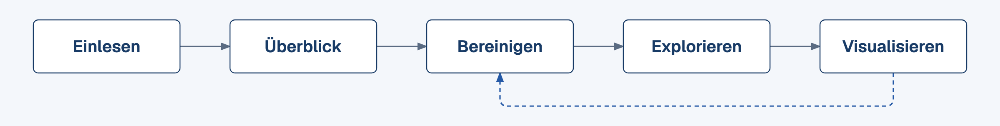

+ **Einlesen:** Datei, Trennzeichen, Kodierung, Datentypen <!-- .element: class="fragment" data-fragment-index="1" -->
+ **Überblick:** Größe, Spalten, Kennzahlen, fehlende Werte <!-- .element: class="fragment" data-fragment-index="2" -->
+ **Bereinigen:** fehlende Werte, Duplikate, Typen, Ausreißer <!-- .element: class="fragment" data-fragment-index="3" -->
+ **Explorieren und Visualisieren:** Verteilungen, Gruppen, Zusammenhänge <!-- .element: class="fragment" data-fragment-index="4" -->

<div class="fragment" data-fragment-index="5">

> [!important]
> Viele Probleme zeigen sich schon vor dem ersten Modell: Schiefe, Ausreißer, fehlende Werte. Wer sie hier findet, spart später viele Durchläufe in der Modellphase.

</div>

--

<!-- .slide: class="smaller" -->
## Typische Probleme in Rohdaten

| Problem | Beispiel |
|---------|----------|
| Fehlende Werte | leere Zelle, `NULL`, `N/A`, `"undefined"`, `-` |
| Uneinheitliche Datumsformate | `01/02/2023`, `2023-02-01`, `02-01-23` |
| Groß- und Kleinschreibung | `"Berlin"` und `"berlin"` |
| Tippfehler in Kategorien | `"Frau"`, `"fraU"`, `"Fr"` |
| Verschiedene Einheiten | `3.5 km`, `3500 m` |
| Falsche Zeichenkodierung | `ÄÖÜ` erscheint als `ÄÖÜ` |
| Doppelte Einträge mit Abweichung | `"Müller GmbH"` und `"Müller GmbH."` |
| Werte außerhalb des plausiblen Bereichs | Alter 200, negative Beträge |

Die fünf Fragen an jede Datei: Ist sie **vollständig**, **gültig**, **konsistent**, **aktuell** und **eindeutig**?

--

<!-- .slide: class="smaller" -->
## `read_csv`: die wichtigsten Parameter

```python
import pandas as pd

titanic = pd.read_csv("data/titanic.csv")               # Komma, UTF-8

wein = pd.read_csv("data/winequality-red.csv", sep=";") # Semikolon

versicherte = pd.read_csv(
    "data/versicherte.csv",
    parse_dates=["geburtsdatum"],      # Text direkt als Datum einlesen
    dtype={"plz": str},                # führende Nullen behalten
)
```

| Parameter | Wofür | Typischer Wert |
|-----------|-------|----------------|
| `sep` | Trennzeichen zwischen den Spalten | `","`, `";"`, `"\t"` |
| `encoding` | Zeichenkodierung | `"utf-8"`, `"latin-1"`, `"cp1252"` |
| `decimal` | Dezimalzeichen | `","` bei deutschen Exporten |
| `parse_dates` | Spalten, die ein Datum enthalten | `["geburtsdatum"]` |
| `dtype` | Typ je Spalte erzwingen | `{"plz": str}` |

--

<!-- .slide: class="smaller" -->
## Typische Fehler beim Einlesen

| Symptom | Ursache | Abhilfe |
|---------|---------|---------|
| `FileNotFoundError` | falscher Pfad oder falsches Arbeitsverzeichnis | Pfad prüfen, `import os; os.getcwd()` |
| Alles steht in **einer** Spalte | falsches Trennzeichen | `sep=";"` |
| `UnicodeDecodeError` oder `ä` statt `ä` | falsche Kodierung | `encoding="latin-1"` oder `"cp1252"` |
| Zahlenspalte hat Typ Text | Dezimalkomma, Tausenderpunkt, Text wie `"k. A."` | `decimal=","`, `thousands="."`, `na_values=[...]` |
| Datum ist Text | pandas rät Datumsspalten nicht | `parse_dates=[...]` oder `pd.to_datetime` |
| PLZ `01067` wird zu `1067` | Spalte als Zahl gelesen | `dtype={"plz": str}` |

```python
wein_falsch = pd.read_csv("data/winequality-red.csv")
wein_falsch.shape     # -> (1599, 1)    alles in einer Spalte
wein.shape            # -> (1599, 12)   mit sep=";"
```

--

<!-- .slide: class="smaller" -->
## Der Titanic-Datensatz

| Spalte | Bedeutung | Typ | Auffälligkeit |
|--------|-----------|-----|---------------|
| `PassengerId` | laufende Nummer | ganzzahlig | reine Kennung |
| `Survived` | überlebt (0 = nein, 1 = ja) | binär, Zielgröße | ungleich verteilt |
| `Pclass` | Passagierklasse (1, 2, 3) | ordinal | hängt mit dem sozialen Status zusammen |
| `Name` | vollständiger Name | Text | Anrede steckt im Text |
| `Sex` | Geschlecht | Kategorie | |
| `Age` | Alter in Jahren | Zahl | fehlende Werte |
| `SibSp` | Geschwister und Ehepartner an Bord | Anzahl | sehr viele Nullen |
| `Parch` | Eltern und Kinder an Bord | Anzahl | sehr viele Nullen |
| `Ticket` | Ticketnummer | Text | uneinheitliches Format |
| `Fare` | Ticketpreis | Zahl | schief verteilt, Ausreißer |
| `Cabin` | Kabinennummer | Text | über 75 % fehlen |
| `Embarked` | Zustiegshafen (C, Q, S) | Kategorie | wenige fehlende Werte |

--

## Erster Überblick: Größe und Typen

```python
df = pd.read_csv("data/titanic.csv")

df.shape             # -> (891, 12)   (Zeilen, Spalten)
list(df.columns)     # Spaltennamen als Liste
df.head()
df.info()
```

```text
RangeIndex: 891 entries, 0 to 890
Data columns (total 12 columns):
 #   Column       Non-Null Count  Dtype
 0   PassengerId  891 non-null    int64
 5   Age          714 non-null    float64
 10  Cabin        204 non-null    str
 11  Embarked     889 non-null    str
```

`Non-Null Count` kleiner als 891 heißt: In dieser Spalte fehlen Werte.

--

<!-- .slide: class="smaller" -->
## Kennzahlen mit `describe`

```python
df[ ["Age", "Fare"] ].describe().round(2)
```

<div class="two-col">
<div style="flex: 36">

```text
          Age    Fare
count  714.00  891.00
mean    29.70   32.20
std     14.53   49.69
min      0.42    0.00
25%     20.12    7.91
50%     28.00   14.45
75%     38.00   31.00
max     80.00  512.33
```

</div>
<div style="flex: 64">

+ **Mittelwert** (`mean`) reagiert empfindlich auf Ausreißer, der **Median** (`50%`) ist robust <!-- .element: class="fragment" data-fragment-index="1" -->
+ Bei `Age` liegen beide nah beieinander <!-- .element: class="fragment" data-fragment-index="2" -->
+ Bei `Fare` ist der Mittelwert mehr als doppelt so hoch wie der Median: Die Verteilung ist **schief**, wenige sehr teure Tickets ziehen den Mittelwert nach oben <!-- .element: class="fragment" data-fragment-index="3" -->
+ **Streuung:** `std` und der Abstand zwischen `25%` und `75%` (Interquartilsabstand) <!-- .element: class="fragment" data-fragment-index="4" -->

</div>
</div>

--

## Fehlende Werte finden

```python
df.isna().sum().sort_values(ascending=False).head(4)
```

```text
Cabin       687
Age         177
Embarked      2
PassengerId   0
```

```python
(df.isna().mean() * 100).round(2).sort_values(ascending=False).head(3)
```

```text
Cabin       77.10
Age         19.87
Embarked     0.22
```

`isna()` liefert eine Tabelle aus `True`/`False`. `sum()` zählt die `True`-Werte je Spalte, `mean()` ergibt den Anteil.

--

<!-- .slide: class="smaller" -->
## Fehlende Werte: drei Strategien

| Strategie | Befehl | Geeignet, wenn |
|-----------|--------|----------------|
| **Löschen** | `df.dropna(subset=[...])` | nur wenige Zeilen betroffen sind (`Embarked`: 2 von 891) |
| **Auffüllen** (Imputation) | `df["Age"].fillna(median)` | die Spalte wichtig ist und ein plausibler Ersatzwert existiert |
| **Markieren** (Flag) | `df["Age"].isna()` als neue Spalte | das Fehlen selbst eine Information sein kann |

+ Eine Spalte wie `Cabin` mit 77 % Lücken lässt sich nicht sinnvoll auffüllen: weglassen oder nur „Kabine bekannt ja/nein" behalten <!-- .element: class="fragment" data-fragment-index="1" -->
+ Auffüllen und Markieren lassen sich kombinieren <!-- .element: class="fragment" data-fragment-index="2" -->

<div class="fragment" data-fragment-index="3">

> [!warning]
> Löschen Sie nie blind. `df.dropna()` ohne Parameter lässt bei Titanic von 891 Zeilen nur 183 übrig, weil `Cabin` fast überall fehlt.

</div>

--

<!-- .slide: class="smaller" -->
## Fehlende Werte behandeln

```python
spalten = ["Survived", "Pclass", "Sex", "Age",
           "SibSp", "Parch", "Fare", "Embarked"]
feat_df = df[spalten].copy()             # ohne Cabin, Name, Ticket

# 1. Löschen: die 2 Zeilen ohne Zustiegshafen
feat_df = feat_df.dropna(subset=["Embarked"])

# 2. Markieren: fehlte das Alter?
feat_df["Age_missing"] = feat_df["Age"].isna().astype(int)

# 3. Auffüllen: Median des Alters
median_alter = feat_df["Age"].median()   # -> 28.0
feat_df["Age"] = feat_df["Age"].fillna(median_alter)

feat_df.isna().sum().sum()               # -> 0
```

> [!tip]
> Ergebnis immer wieder **zuweisen** (`feat_df = feat_df.dropna(...)`). `dropna` und `fillna` geben eine neue Tabelle zurück, das Original bleibt unverändert.

--

<!-- .slide: class="smaller" -->
## Duplikate

```python
demo = pd.DataFrame({
    "Name": ["Anna", "Ben", "Carlos", "Anna", "Anna"],
    "Alter": [25, 30, 22, 25, 25],
    "Einkommen": [50000, 48000, 52000, 50000, 52000],
})

demo.duplicated()                    # True für jede wiederholte Zeile
demo.duplicated().sum()              # -> 1   (Zeile 3 gleicht Zeile 0)

demo.drop_duplicates()                       # exakt gleiche Zeilen raus
demo.drop_duplicates(subset=["Name"])        # je Name nur die erste Zeile

df.duplicated().sum()                        # Titanic: -> 0
df["PassengerId"].is_unique                  # -> True
```

+ Exakte Duplikate können Sie entfernen. Bei `subset` entscheiden **Sie**, welche Spalten eine Zeile eindeutig machen <!-- .element: class="fragment" data-fragment-index="1" -->
+ Duplikate verzerren Kennzahlen und Modelle <!-- .element: class="fragment" data-fragment-index="2" -->

--

<!-- .slide: class="smaller" -->
## Datentypen korrigieren

```python
feat_df.dtypes

feat_df["Sex"] = feat_df["Sex"].astype("category")
feat_df["Embarked"] = feat_df["Embarked"].astype("category")
feat_df["Age_missing"] = feat_df["Age_missing"].astype(bool)

feat_df["Sex"].cat.categories        # -> ['female', 'male']

# Zahl, die als Text ankam: nicht lesbare Einträge werden NaN
pd.to_numeric(pd.Series(["12.5", "7", "k. A."]), errors="coerce")
# -> 12.5, 7.0, NaN
```

+ `category` für Spalten mit wenigen, wiederkehrenden Werten: spart Speicher und dokumentiert die erlaubten Werte <!-- .element: class="fragment" data-fragment-index="1" -->
+ Kennungen (`PassengerId`, Versichertennummer, PLZ) sind **keine** Rechengrößen, auch wenn sie aus Ziffern bestehen <!-- .element: class="fragment" data-fragment-index="2" -->
+ Datum: `pd.to_datetime`, bekannt aus dem vorigen Teil <!-- .element: class="fragment" data-fragment-index="3" -->

--

## Kategorien zählen

```python
df["Survived"].value_counts()
# -> 0: 549, 1: 342

df["Survived"].value_counts(normalize=True).round(3)
# -> 0: 0.616, 1: 0.384

df["Embarked"].value_counts(dropna=False)
# -> S: 644, C: 168, Q: 77, NaN: 2

# Überlebensrate je Gruppe: Mittelwert einer 0/1-Spalte
df.groupby("Sex")["Survived"].mean().round(3)
# -> female: 0.742, male: 0.189

df.groupby("Pclass")["Survived"].mean().round(2)
# -> 1: 0.63, 2: 0.47, 3: 0.24
```

--

<!-- .slide: class="smaller" -->
## Ausreißer erkennen: der Boxplot

<div class="two-col">
<div style="flex: 42">

+ **Box:** vom 25-%-Quantil (Q1) bis zum 75-%-Quantil (Q3), darin liegt die mittlere Hälfte der Werte <!-- .element: class="fragment" data-fragment-index="1" -->
+ **Strich in der Box:** Median <!-- .element: class="fragment" data-fragment-index="2" -->
+ **Whisker:** bis zum letzten Wert innerhalb von 1,5 Interquartilsabständen ab der Box <!-- .element: class="fragment" data-fragment-index="3" -->
+ **Einzelne Punkte:** Werte jenseits der Whisker, Kandidaten für Ausreißer <!-- .element: class="fragment" data-fragment-index="4" -->

<div class="fragment" data-fragment-index="5">

```python
import seaborn as sns
sns.boxplot(x=df["Fare"])
```

</div>

</div>
<div style="flex: 58">

<div class="fragment" data-fragment-index="6">

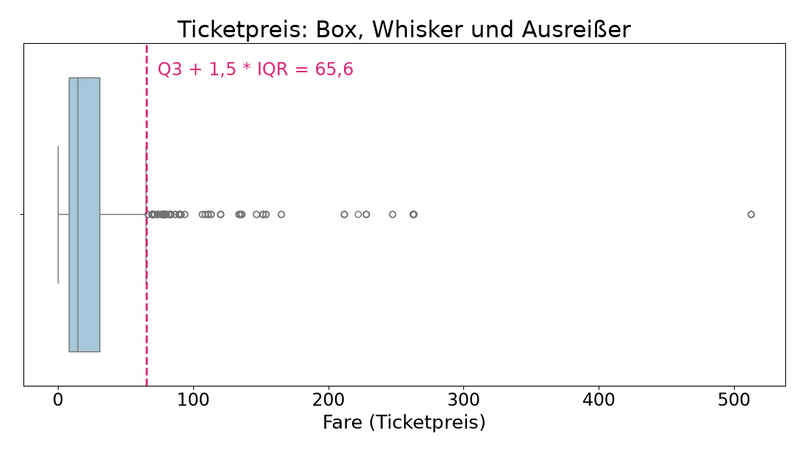

</div>

</div>
</div>

--

<!-- .slide: class="smaller" -->
## Ausreißer mit der IQR-Regel

```python
q1 = df["Fare"].quantile(0.25)          # -> 7.91
q3 = df["Fare"].quantile(0.75)          # -> 31.0
iqr = q3 - q1                           # -> 23.09   Interquartilsabstand

untergrenze = q1 - 1.5 * iqr            # -> -26.72
obergrenze = q3 + 1.5 * iqr             # -> 65.63

maske = (df["Fare"] < untergrenze) | (df["Fare"] > obergrenze)
maske.sum()                             # -> 116 Tickets
df[maske].sort_values("Fare", ascending=False).head()
```

+ Die Regel markiert 116 von 891 Tickets, also 13 % <!-- .element: class="fragment" data-fragment-index="1" -->
+ 104 davon sind teure Tickets der ersten Klasse, keine Messfehler <!-- .element: class="fragment" data-fragment-index="2" -->

<div class="fragment" data-fragment-index="3">

> [!warning]
> Die IQR-Regel liefert **Kandidaten**, keine Urteile. Erst ansehen, dann die Ursache verstehen, dann entscheiden.

</div>

--

<!-- .slide: class="smaller" -->
## Ausreißer behandeln

```python
# 1. Entfernen: nur bei nachweislich falschen Werten
ohne = df[~maske]

# 2. Begrenzen (Clipping) auf das 5-%- und 95-%-Quantil
low, high = df["Fare"].quantile([0.05, 0.95])     # -> 7.23, 112.08
df["Fare_clip"] = df["Fare"].clip(lower=low, upper=high)

# 3. Plausibilitätsregel aus dem Fachwissen
df = df[df["Age"].between(0, 110) | df["Age"].isna()]

# 4. Markieren und behalten
df["Fare_hoch"] = df["Fare"] > obergrenze
```

+ `clip` setzt Werte außerhalb der Grenzen **auf** die Grenze. Die Zeile bleibt erhalten <!-- .element: class="fragment" data-fragment-index="1" -->
+ Schreiben Sie das Ergebnis in eine **neue Spalte**, dann bleibt das Original zum Vergleich <!-- .element: class="fragment" data-fragment-index="2" -->

--

<!-- .slide: class="smaller" -->
## Korrelation

```python
df.corr(numeric_only=True)["Survived"].round(2)
```

```text
PassengerId   -0.01
Survived       1.00
Pclass        -0.34
Age           -0.08
SibSp         -0.04
Parch          0.08
Fare           0.26
```

+ Der Korrelationskoeffizient liegt zwischen -1 und +1. Nahe 0: kein **linearer** Zusammenhang <!-- .element: class="fragment" data-fragment-index="1" -->
+ `Pclass` -0,34: höhere Klassennummer (dritte Klasse), geringere Überlebensrate <!-- .element: class="fragment" data-fragment-index="2" -->
+ `Fare` +0,26: teurere Tickets, höhere Überlebensrate <!-- .element: class="fragment" data-fragment-index="3" -->
+ `numeric_only=True` lässt Textspalten aus. `Sex` fehlt deshalb hier, obwohl es das stärkste Merkmal ist <!-- .element: class="fragment" data-fragment-index="4" -->

--

<!-- .slide: class="smaller" -->
## Korrelation ist keine Kausalität

+ Korrelation misst einen Zusammenhang, keine Ursache <!-- .element: class="fragment" data-fragment-index="1" -->
+ Zwei Größen können gemeinsam schwanken, weil beide von einer **dritten** Größe abhängen <!-- .element: class="fragment" data-fragment-index="2" -->
+ Titanic: `Fare` und `Survived` korrelieren mit +0,26. Der Ticketpreis hat aber niemanden gerettet. Dahinter steht die Passagierklasse: `Fare` und `Pclass` korrelieren mit -0,55 <!-- .element: class="fragment" data-fragment-index="3" -->
+ Gedankenbeispiel: Gehen im Winter mehr Handschuhe verloren und steigt zugleich der Dieselpreis, laufen beide Kurven parallel. Die gemeinsame Ursache ist die Jahreszeit <!-- .element: class="fragment" data-fragment-index="4" -->

<div class="fragment" data-fragment-index="5">

> [!important]
> Korrelationen sind gute Ausgangspunkte für Hypothesen, aber kein Beweis. Für „A verursacht B" brauchen Sie Fachwissen oder ein Experiment.

</div>

--

<!-- .slide: class="smaller" -->
## Warum visualisieren?

+ Ein Diagramm macht sichtbar, was eine Tabelle mit 891 Zeilen versteckt: Trends, Ausreißer, Gruppenunterschiede <!-- .element: class="fragment" data-fragment-index="1" -->
+ Kennzahlen allein können täuschen: Derselbe Mittelwert passt zu völlig verschiedenen Verteilungen <!-- .element: class="fragment" data-fragment-index="2" -->
+ Ein gutes Diagramm verhindert falsche Schlüsse, ein schlechtes erzeugt sie <!-- .element: class="fragment" data-fragment-index="3" -->

<div class="fragment" data-fragment-index="4">

| Frage | Diagramm |
|-------|----------|
| Wie ist eine Zahlenspalte verteilt, ist sie schief? | Histogramm |
| Gibt es Ausreißer, wie unterscheiden sich Gruppen? | Boxplot |
| Wie oft kommt jede Kategorie vor? | Countplot (Balken) |
| Wie hängen zwei Zahlenspalten zusammen? | Scatterplot |
| Wie hängen viele Spalten zusammen? | Heatmap der Korrelationsmatrix |
| Wie entwickelt sich ein Wert über die Zeit? | Linienplot |

</div>

--

<!-- .slide: class="smaller" -->
## matplotlib: das Grundgerüst

```python
import matplotlib.pyplot as plt

fig, ax = plt.subplots(figsize=(8, 5))   # Figure = Blatt, Axes = Diagramm

ax.hist(df["Age"].dropna(), bins=30)

ax.set_title("Altersverteilung der Passagiere")
ax.set_xlabel("Alter in Jahren")
ax.set_ylabel("Anzahl")

fig.tight_layout()
fig.savefig("alter_histogramm.png", dpi=150)
plt.show()
```

+ `fig` ist das ganze Bild, `ax` ein einzelnes Koordinatensystem darin <!-- .element: class="fragment" data-fragment-index="1" -->
+ Alles, was Sie beschriften oder zeichnen, läuft über `ax` <!-- .element: class="fragment" data-fragment-index="2" -->
+ `savefig` vor `plt.show()` aufrufen <!-- .element: class="fragment" data-fragment-index="3" -->

--

<!-- .slide: class="smaller" -->
## Mehrere Achsen in einer Figure

<div class="two-col">
<div style="flex: 46">

```python
fig, axes = plt.subplots(
    1, 2, figsize=(11, 6.2))

axes[0].hist(df["Age"].dropna(),
             bins=30)
axes[0].set_title("Alter")
axes[0].set_xlabel("Jahre")
axes[0].set_ylabel("Anzahl")

axes[1].hist(df["Fare"], bins=30,
             color="#ff7f0e")
axes[1].set_title("Ticketpreis")
axes[1].set_xlabel("Fare")

fig.suptitle("Zwei Verteilungen")
fig.tight_layout()
```

</div>
<div style="flex: 54">

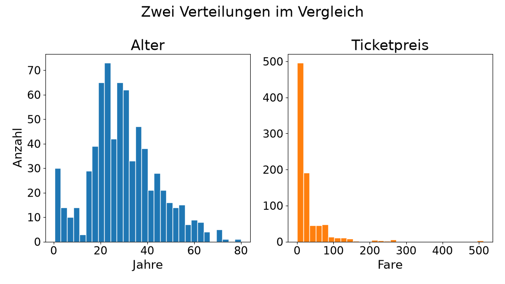

`plt.subplots(zeilen, spalten)` liefert ein Array von Achsen. `axes[0]` ist das linke, `axes[1]` das rechte Diagramm.

</div>
</div>

--

<!-- .slide: class="smaller" -->
## seaborn: Histogramm mit `histplot`

<div class="two-col">
<div style="flex: 44">

```python
import seaborn as sns

fig, ax = plt.subplots()
sns.histplot(data=df, x="Age",
             bins=30, kde=True,
             ax=ax)
ax.set_title("Altersverteilung")
ax.set_xlabel("Alter in Jahren")
ax.set_ylabel("Anzahl")
```

+ `data=` nimmt den DataFrame, `x=` den Spaltennamen <!-- .element: class="fragment" data-fragment-index="1" -->
+ `kde=True` legt eine geglättete Dichtekurve über die Balken <!-- .element: class="fragment" data-fragment-index="2" -->
+ `ax=ax` zeichnet in unser matplotlib-Gerüst <!-- .element: class="fragment" data-fragment-index="3" -->

</div>
<div style="flex: 56">

<div class="fragment" data-fragment-index="4">

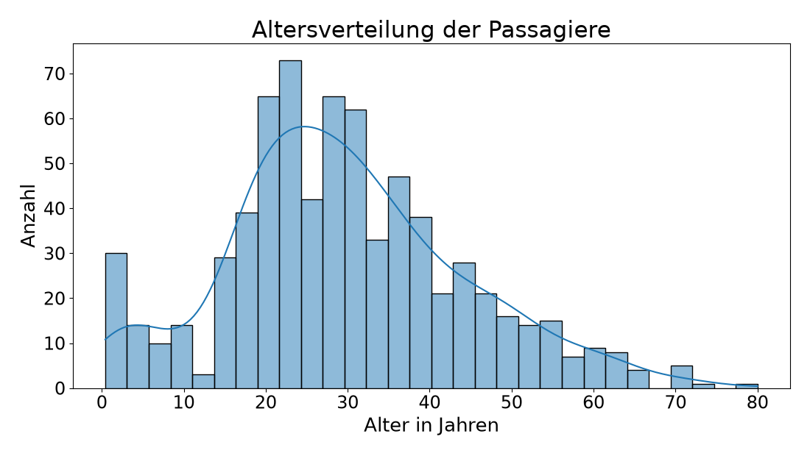

</div>

</div>
</div>

--

<!-- .slide: class="smaller" -->
## Kategorien zählen mit `countplot` und `hue`

<div class="two-col">
<div style="flex: 44">

```python
df["Überlebt"] = df["Survived"].map(
    {0: "nein", 1: "ja"})

fig, ax = plt.subplots()
sns.countplot(data=df, x="Sex",
              hue="Überlebt", ax=ax)
ax.set_title(
    "Überlebende nach Geschlecht")
ax.set_xlabel("Geschlecht")
ax.set_ylabel("Anzahl")
```

+ `countplot` zählt selbst, ein `value_counts` vorab ist nicht nötig <!-- .element: class="fragment" data-fragment-index="1" -->
+ `hue=` teilt jeden Balken nach einer zweiten Spalte auf und erzeugt die Legende <!-- .element: class="fragment" data-fragment-index="2" -->

</div>
<div style="flex: 56">

<div class="fragment" data-fragment-index="3">

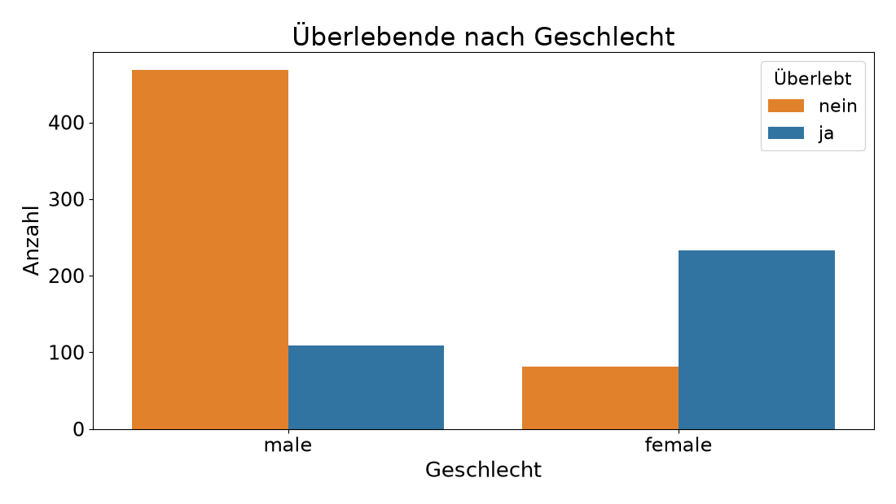

</div>

</div>
</div>

--

<!-- .slide: class="smaller" -->
## Gruppen vergleichen mit `boxplot`

<div class="two-col">
<div style="flex: 44">

```python
fig, ax = plt.subplots()
sns.boxplot(data=df, x="Pclass",
            y="Fare", ax=ax)
ax.set_title(
    "Ticketpreis nach Klasse")
ax.set_xlabel("Passagierklasse")
ax.set_ylabel("Fare")
```

+ `x=` Kategorie, `y=` Zahlenspalte: ein Boxplot je Gruppe <!-- .element: class="fragment" data-fragment-index="1" -->
+ Median, Streuung und Ausreißer aller Gruppen stehen direkt nebeneinander <!-- .element: class="fragment" data-fragment-index="2" -->
+ 104 der 116 IQR-Ausreißer gehören zur ersten Klasse <!-- .element: class="fragment" data-fragment-index="3" -->

</div>
<div style="flex: 56">

<div class="fragment" data-fragment-index="4">

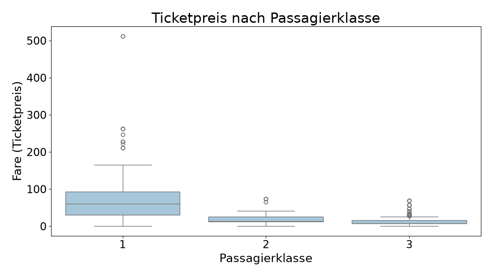

</div>

</div>
</div>

--

<!-- .slide: class="smaller" -->
## Zwei Zahlenspalten: `scatterplot` mit `hue`

<div class="two-col">
<div style="flex: 44">

```python
fig, ax = plt.subplots()
sns.scatterplot(data=df, x="Age",
                y="Fare",
                hue="Überlebt",
                alpha=0.7, ax=ax)
ax.set_title("Alter und Ticketpreis")
ax.set_xlabel("Alter in Jahren")
ax.set_ylabel("Fare")
```

+ Ein Punkt je Passagier <!-- .element: class="fragment" data-fragment-index="1" -->
+ `hue=` färbt nach einer dritten Spalte <!-- .element: class="fragment" data-fragment-index="2" -->
+ `alpha=0.7` macht Punkte durchscheinend, damit Häufungen sichtbar bleiben <!-- .element: class="fragment" data-fragment-index="3" -->

</div>
<div style="flex: 56">

<div class="fragment" data-fragment-index="4">

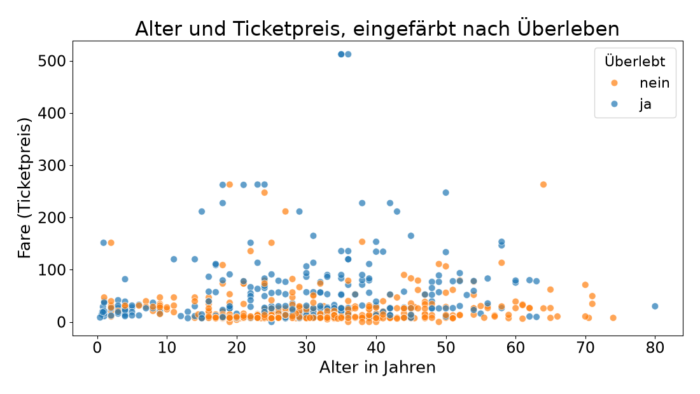

</div>

</div>
</div>

--

<!-- .slide: class="smaller" -->
## Heatmap der Korrelationsmatrix

<div class="two-col">
<div style="flex: 44">

```python
spalten = ["Survived", "Pclass", "Age",
           "SibSp", "Parch", "Fare"]
corr = df[spalten].corr()

fig, ax = plt.subplots()
sns.heatmap(corr, annot=True,
            fmt=".2f",
            cmap="coolwarm",
            vmin=-1, vmax=1, ax=ax)
ax.set_title("Korrelationsmatrix")
```

+ `annot=True` schreibt die Werte in die Felder, `fmt=".2f"` rundet auf zwei Stellen <!-- .element: class="fragment" data-fragment-index="1" -->
+ `vmin=-1, vmax=1` verankert die Farbskala: Weiß bedeutet 0 <!-- .element: class="fragment" data-fragment-index="2" -->

</div>
<div style="flex: 56">

<div class="fragment" data-fragment-index="3">

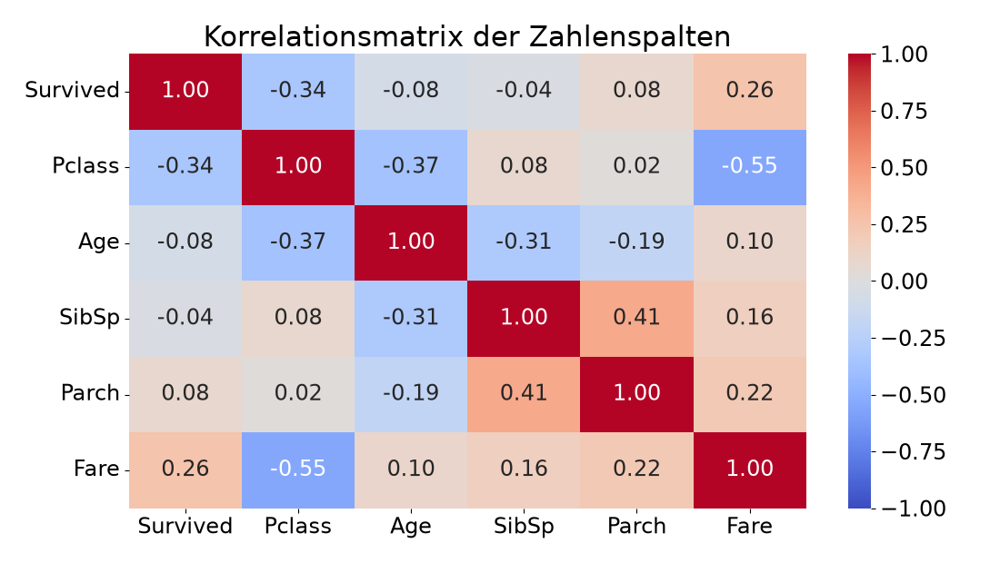

</div>

</div>
</div>

--

<!-- .slide: class="smaller" -->
## Überblick mit `pairplot`

<div class="two-col">
<div style="flex: 40">

```python
sns.pairplot(
    df,
    vars=["Age", "Fare", "SibSp"],
    hue="Überlebt",
)
```

+ Jede Zahlenspalte gegen jede: Scatterplots außerhalb, Verteilungen auf der Diagonale <!-- .element: class="fragment" data-fragment-index="1" -->
+ Guter erster Blick auf einen neuen Datensatz <!-- .element: class="fragment" data-fragment-index="2" -->
+ Bei mehr als fünf, sechs Spalten wird das Raster unlesbar und langsam: Spalten mit `vars=` auswählen <!-- .element: class="fragment" data-fragment-index="3" -->

</div>
<div style="flex: 60">

<div class="fragment" data-fragment-index="4">

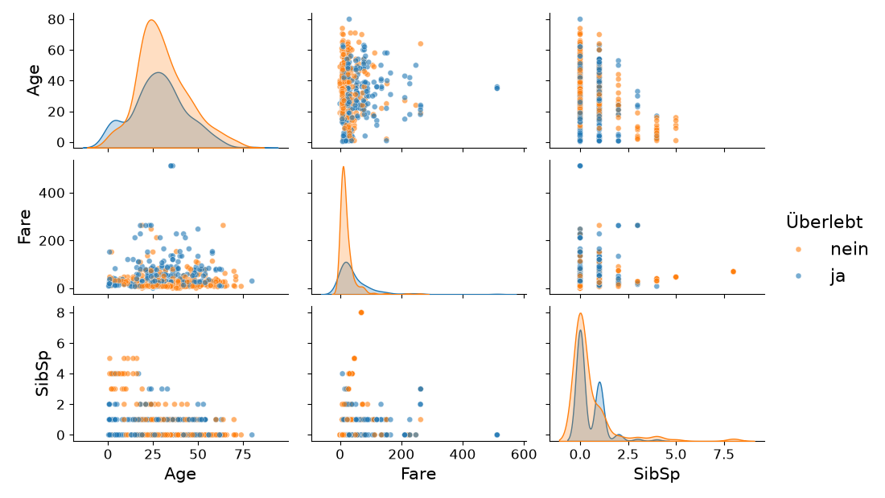

</div>

</div>
</div>

--

<!-- .slide: class="smaller" -->
## Regeln für gute Diagramme

+ **Eine Aussage je Diagramm.** Formulieren Sie die Aussage vorher als Satz und schreiben Sie sie in den Titel <!-- .element: class="fragment" data-fragment-index="1" -->
+ **Diagrammtyp nach Frage wählen:** Verteilung, Vergleich, Zusammenhang oder Verlauf <!-- .element: class="fragment" data-fragment-index="2" -->
+ **Achsen beschriften**, mit Einheit. Spaltennamen wie `Fare` sind keine Beschriftung für Dritte <!-- .element: class="fragment" data-fragment-index="3" -->
+ **Farbe nur mit Bedeutung:** Farbe kodiert eine Gruppe oder einen Wert, keine Dekoration <!-- .element: class="fragment" data-fragment-index="4" -->
+ **Achsen ehrlich wählen:** Balkendiagramme beginnen bei 0 <!-- .element: class="fragment" data-fragment-index="5" -->
+ **Lesbarkeit prüfen:** Schriftgröße, gedrehte Achsenbeschriftungen bei langen Kategorien (`ax.tick_params(axis="x", rotation=45)`) <!-- .element: class="fragment" data-fragment-index="6" -->

<div class="fragment" data-fragment-index="7">

> [!tip]
> Test vor dem Weitergeben: Versteht eine Kollegin das Diagramm auf den ersten Blick, ohne Ihre Erklärung?

</div>

--

<!-- .slide: class="smaller" -->
## Zusammenfassung

- Nach jedem Einlesen prüfen: `shape`, `head()`, `info()`. Falsches Trennzeichen, falsche Kodierung und Dezimalkomma fallen dort sofort auf
- Fehlende Werte erst zählen (`isna().sum()`, Anteil mit `isna().mean()`), dann je Spalte entscheiden: löschen, mit dem Median füllen, markieren
- Ausreißer liefert die IQR-Regel als Kandidaten. Entfernen nur bei nachweislichen Fehlern, sonst begrenzen (`clip`) oder behalten
- Diagramme bauen Sie auf dem Gerüst `fig, ax = plt.subplots()`, seaborn zeichnet mit `data=`, `x=`, `y=`, `hue=`, `ax=` hinein
- Korrelation zeigt Zusammenhänge, keine Ursachen

---

<!-- .slide: data-background-color="#183b66" -->
# Teil 4: Grundlagen von Machine Learning und KI

Was KI und Machine Learning sind, wie ein Modell aus Daten lernt und wie Sie Ihr erstes Modell trainieren.

--

## Was Sie in diesem Teil lernen

- KI, Machine Learning und Deep Learning voneinander abgrenzen
- Die drei Lernarten mit je einem Beispiel benennen
- Entscheiden, wann sich ML gegenüber festen Regeln lohnt
- Die Begriffe Merkmal, Zielgröße, Trainings- und Testdaten sicher verwenden
- Ein erstes Modell mit scikit-learn trainieren: `fit`, `predict`, `score`

--

## Was ist Künstliche Intelligenz?

Künstliche Intelligenz (KI) bezeichnet Systeme oder Maschinen, die Aufgaben ausführen, für die normalerweise menschliche Intelligenz erforderlich ist.

+ **Lernen:** aus Beispielen besser werden <!-- .element: class="fragment" data-fragment-index="1" -->
+ **Problemlösen:** einen Weg zu einem Ziel finden <!-- .element: class="fragment" data-fragment-index="2" -->
+ **Wahrnehmung:** Bilder und Signale auswerten <!-- .element: class="fragment" data-fragment-index="3" -->
+ **Sprachverstehen:** Texte lesen und erzeugen <!-- .element: class="fragment" data-fragment-index="4" -->

--

## KI, Machine Learning und Deep Learning

| Begriff | Bedeutung |
|---|---|
| **Künstliche Intelligenz (KI)** | Oberbegriff für Maschinen, die „intelligent" handeln |
| **Machine Learning (ML)** | Teilgebiet der KI: Systeme lernen aus Daten, ohne dass jede Regel von Hand programmiert wird |
| **Deep Learning** | Teilgebiet des ML, das mit künstlichen neuronalen Netzen arbeitet |


--

<!-- .slide: class="smaller" -->
## Kurze Geschichte der KI

| Zeit | Was passiert |
|---|---|
| 1956 | Dartmouth Conference (John McCarthy u. a.) prägt den Begriff „Artificial Intelligence" |
| 1950er bis 1970er | Erste KI-Programme: Schachprogramme, Theorembeweiser. Viel Optimismus, dann Rückschläge („KI-Winter") |
| 1980er | Expertensysteme (Vorbild: MYCIN, 1970er, medizinische Diagnosen). Grenze: Wissen muss von Hand eingepflegt werden |
| 2000er | Durchbrüche im Machine Learning: mehr Daten, bessere Algorithmen, leistungsfähige Hardware |
| 2010er bis heute | KI im Alltag: Sprachassistenten, Bildanalyse, Produktempfehlungen. Deep Learning spielt die zentrale Rolle |
| heute | Große Sprachmodelle (LLMs, z. B. GPT, BERT) verarbeiten und erzeugen natürliche Sprache |

--

## Wie lernt ein Modell aus Daten?

+ Ein Algorithmus sucht **Muster** in vielen Beispielen <!-- .element: class="fragment" data-fragment-index="1" -->
+ Das Modell lernt Zusammenhänge aus Beispieldaten, statt nur fest programmierte Regeln auszuführen <!-- .element: class="fragment" data-fragment-index="2" -->
+ Ziel ist **Generalisierung**: Das Modell soll auf neuen Daten funktionieren, bekannte Fälle nachzurechnen genügt nicht <!-- .element: class="fragment" data-fragment-index="3" -->
+ In der Praxis: aus Vergangenheitsdaten Vorhersagen für neue Fälle ableiten <!-- .element: class="fragment" data-fragment-index="4" -->

<div class="fragment" data-fragment-index="5">

> [!important]
> Ein Modell ist nur dann gut, wenn es auf Daten funktioniert, die es beim Lernen nicht gesehen hat.

</div>

--

## Lernarten im Überblick

| Lernart | Daten | Beispiel |
|---|---|---|
| **Überwachtes Lernen** | Beispiele mit bekannter Lösung (gelabelt) | Spam-Erkennung |
| **Unüberwachtes Lernen** | Beispiele ohne Lösung, das Verfahren sucht Strukturen | Kundensegmentierung |
| **Bestärkendes Lernen** | Belohnung und Bestrafung für Aktionen | AlphaGo |

+ Überwacht mit Zahl als Ziel: **Regression**. Mit Klasse als Ziel: **Klassifikation** <!-- .element: class="fragment" data-fragment-index="1" -->
+ Unüberwacht: **Clustering** gruppiert ähnliche Datenpunkte <!-- .element: class="fragment" data-fragment-index="2" -->

--

<!-- .slide: class="smaller" -->
## Beispiel Spam-Erkennung: Daten und Merkmale

Ein ML-Modell sortiert unerwünschte E-Mails aus, indem es Muster in den Nachrichten auswertet.

**Schritt 1: Daten sammeln und vorbereiten**

+ Datenquelle: E-Mails mit dem Label „Spam" oder „Kein Spam" <!-- .element: class="fragment" data-fragment-index="1" -->
+ Merkmale, die das Modell zu sehen bekommt: <!-- .element: class="fragment" data-fragment-index="2" -->
  + bestimmte Wörter („Won", „Free", „Quick money")
  + Anzahl der Links, Anteil an Großbuchstaben
  + Absenderadresse, Länge und Struktur der E-Mail

<div class="fragment" data-fragment-index="3">

**Schritt 2: Modell trainieren (überwachtes Lernen)**

</div>

+ Das System wird mit vielen gelabelten E-Mails trainiert <!-- .element: class="fragment" data-fragment-index="4" -->
+ Es gewichtet die Merkmale: Welche Eigenschaften deuten am stärksten auf Spam hin? <!-- .element: class="fragment" data-fragment-index="5" -->

--

<!-- .slide: class="smaller" -->
## Beispiel Spam-Erkennung: Anwendung und Fehler

**Schritt 3: neue E-Mails klassifizieren**

+ Eine neue E-Mail trifft ein, das Modell wertet die Merkmale aus und entscheidet: Spam oder nicht <!-- .element: class="fragment" data-fragment-index="1" -->
+ Viele spam-typische Wörter: hohe Spam-Wahrscheinlichkeit <!-- .element: class="fragment" data-fragment-index="2" -->
+ Legitime Muster erkannt: die E-Mail bleibt im Posteingang <!-- .element: class="fragment" data-fragment-index="3" -->

<div class="fragment" data-fragment-index="4">

**Schritt 4: Modell verbessern**

</div>

+ **False Positive:** eine legitime E-Mail wird fälschlich als Spam markiert <!-- .element: class="fragment" data-fragment-index="5" -->
+ **False Negative:** Spam wird nicht erkannt und landet im Posteingang <!-- .element: class="fragment" data-fragment-index="6" -->
+ Rückmeldungen der Nutzer („Kein Spam", „Spam melden") fließen als neue Trainingsdaten ein <!-- .element: class="fragment" data-fragment-index="7" -->

--

## ML gegenüber festen Regeln

<div class="two-col">
<div style="flex: 50">

**Regelbasiert**

- „wenn Wert > Schwelle, dann Alarm"
- gut bei einfachen, stabilen Situationen
- transparent, aber oft unflexibel
- Menschen müssen die Regeln laufend nachpflegen

</div>
<div style="flex: 50">

**Machine Learning**

- lernt Muster aus mehreren Merkmalen gleichzeitig
- erkennt komplexere Wechselwirkungen
- passt sich mit neuen Daten an
- braucht Daten, Evaluation und Monitoring

</div>
</div>

> [!tip]
> ML ersetzt Fachlogik nicht. Es ergänzt sie dort, wo Muster für feste Regeln zu komplex werden.

--

<!-- .slide: class="smaller" -->
## Wo feste Regeln an Grenzen stoßen

| Problem | Regelbasiert | ML-Ansatz |
|---|---|---|
| **Veränderung** | „Free" war ein typisches Spam-Wort, heute steht dort „Fr33" oder „F.r.e.e.". Jede Variante braucht eine neue Regel | lernt neue Schreibweisen aus neuen Beispielen |
| **Versteckte Muster** | prüft nur offensichtliche Kriterien („enthält das Wort casino?") | nutzt auch Satzstruktur, Absenderverhalten, Ähnlichkeit zu bekanntem Spam |
| **Kontext** | Hotelbestätigung mit „Free WiFi" landet im Spam (False Positive) | lernt, den Kontext mit auszuwerten |
| **Menge** | Experten schreiben und testen laufend neue Regeln | skaliert mit den Daten: Nachtrainieren statt neuer Regeln von Hand |

--

## Wann sich ML lohnt und wann nicht

<div class="two-col">
<div style="flex: 50">

**ML lohnt sich, wenn**

+ ausreichend historische Daten vorliegen <!-- .element: class="fragment" data-fragment-index="1" -->
+ eine wiederkehrende Vorhersage oder Klassifikation Nutzen stiftet <!-- .element: class="fragment" data-fragment-index="2" -->
+ einfache Heuristiken die Zusammenhänge nicht mehr sauber beschreiben <!-- .element: class="fragment" data-fragment-index="3" -->
+ Fehlentscheidungen messbar bewertet werden können <!-- .element: class="fragment" data-fragment-index="4" -->

</div>
<div style="flex: 50">

<div class="fragment" data-fragment-index="5">

**ML lohnt sich eher nicht, wenn**

</div>

+ es kaum Daten, aber viele Sonderfälle gibt <!-- .element: class="fragment" data-fragment-index="6" -->
+ die Entscheidung fachlich noch nicht klar formuliert ist <!-- .element: class="fragment" data-fragment-index="7" -->
+ eine bekannte Regel das Problem bereits zuverlässig löst <!-- .element: class="fragment" data-fragment-index="8" -->
+ weder Nutzen noch Fehlerkosten bewertet werden können <!-- .element: class="fragment" data-fragment-index="9" -->

</div>
</div>

--

<!-- .slide: class="smaller" -->
## Grenzen von ML

+ **Die Vergangenheit sagt die Zukunft nicht immer voraus.** Historische Daten setzen stabile Bedingungen voraus. Sind Menschen Teil des Systems, gilt das oft nicht. Beispiel: Finanzkrisen lassen sich nicht allein aus historischen Daten vorhersagen. <!-- .element: class="fragment" data-fragment-index="1" -->
+ **Unbekannte Merkmale.** Wer Daten erhebt, legt vorher fest, welche Variablen gesammelt werden. Kritische Größen können fehlen. Beispiel Medizin: unbekannte genetische Faktoren oder Umweltbedingungen beeinflussen den Behandlungserfolg, stehen aber nicht in den Daten. <!-- .element: class="fragment" data-fragment-index="2" -->
+ **Ein bekanntes Verfahren wird ausgenutzt.** Wird ein Algorithmus zum Standard, können Beteiligte die Eingaben gezielt manipulieren. Beispiel: CDO-Ratings vor der Finanzkrise 2008. <!-- .element: class="fragment" data-fragment-index="3" -->

--

## Merkmale und Zielgröße

+ **Merkmal (engl. Feature):** eine Eingabespalte, aus der das Modell lernt. Alle Merkmale zusammen bilden `X` <!-- .element: class="fragment" data-fragment-index="1" -->
+ **Zielgröße (Target, Label):** die Spalte, die das Modell vorhersagen soll. Sie heißt `y` <!-- .element: class="fragment" data-fragment-index="2" -->
+ Jede Zeile ist ein Beispiel: Merkmale plus bekannte Lösung <!-- .element: class="fragment" data-fragment-index="3" -->

<div class="fragment" data-fragment-index="4">

| | Pclass | Sex | Age | Fare | Survived |
|---|---|---|---|---|---|
| Rolle | Merkmal | Merkmal | Merkmal | Merkmal | **Zielgröße** |

</div>

<div class="fragment" data-fragment-index="5">

> [!important]
> Ohne klar definierte Zielgröße gibt es kein sauberes ML-Problem. Eine unscharfe Zielgröße ergibt meist ein unscharfes Modell.

</div>

--

## Was ein gutes Merkmal ausmacht

+ fachlich plausibel <!-- .element: class="fragment" data-fragment-index="1" -->
+ zum Zeitpunkt der Vorhersage **rechtzeitig verfügbar** <!-- .element: class="fragment" data-fragment-index="2" -->
+ stabil und reproduzierbar berechenbar <!-- .element: class="fragment" data-fragment-index="3" -->
+ nicht aus der Zielgröße abgeleitet <!-- .element: class="fragment" data-fragment-index="4" -->
+ verständlich genug, um es mit dem Fachbereich zu besprechen <!-- .element: class="fragment" data-fragment-index="5" -->

--

## Trainings- und Testdaten

+ **Trainingsdaten:** daraus lernt das Modell seine Parameter <!-- .element: class="fragment" data-fragment-index="1" -->
+ **Testdaten:** zurückgehaltene Beispiele für die neutrale Endbewertung <!-- .element: class="fragment" data-fragment-index="2" -->
+ Das Modell sieht die Testdaten beim Lernen nie <!-- .element: class="fragment" data-fragment-index="3" -->

<div class="fragment" data-fragment-index="4">

```python
from sklearn.datasets import load_iris
from sklearn.model_selection import train_test_split

X, y = load_iris(return_X_y=True)
X_train, X_test, y_train, y_test = train_test_split(
    X, y, test_size=0.2, random_state=1
)
# 80 % der Zeilen zum Lernen, 20 % zum Prüfen
```

</div>

<div class="fragment" data-fragment-index="5">

> [!warning]
> Wer auf den Trainingsdaten bewertet, misst Auswendiglernen. Nur die Testdaten zeigen, ob das Modell generalisiert.

</div>

--

## Datenleck (Leakage)

Ein Datenleck liegt vor, wenn das Modell Informationen sieht, die im echten Einsatz zum Zeitpunkt der Vorhersage nicht verfügbar sind.

+ Beispiel: Ein Modell soll einen Geräteausfall vorhersagen und bekommt als Merkmal den Reparaturcode, der erst nach dem Ausfall vergeben wird <!-- .element: class="fragment" data-fragment-index="1" -->
+ Zweites Beispiel: Die Skalierung wird auf allen Daten berechnet, bevor Trainings- und Testdaten getrennt werden <!-- .element: class="fragment" data-fragment-index="2" -->
+ Folge: unrealistisch gute Ergebnisse im Test, schlechtes Modell im Einsatz <!-- .element: class="fragment" data-fragment-index="3" -->

<div class="fragment" data-fragment-index="4">

> [!tip]
> Bewerten Sie jedes Merkmal aus Sicht des Einsatzzeitpunkts: Liegt dieser Wert dann schon vor?

</div>

--

## Der ML-Workflow in sechs Schritten

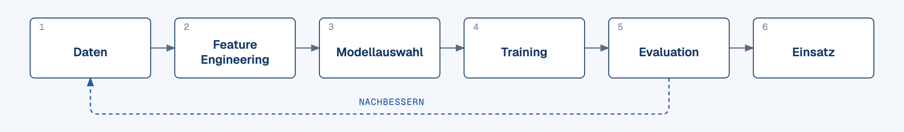

Der Ablauf ist iterativ und führt oft wieder zur Datenphase zurück.

--

<!-- .slide: class="smaller" -->
## Die sechs Schritte im Einzelnen

| Schritt | Was passiert | Werkzeug im Kurs |
|---|---|---|
| **1 Daten** | beschaffen, explorieren, bereinigen, Qualität prüfen | pandas, seaborn |
| **2 Feature Engineering** | fachlich sinnvolle Merkmale bauen, skalieren, kodieren | pandas, `sklearn.preprocessing` |
| **3 Modellauswahl** | ein zum Problem passendes Verfahren wählen | scikit-learn |
| **4 Training** | Modell auf den Trainingsdaten anpassen | `fit` |
| **5 Evaluation** | Kennzahlen auf den Testdaten, Cross-Validation | `score`, `sklearn.metrics` |
| **6 Einsatz** | Modell bereitstellen, überwachen, bei Bedarf neu trainieren | Modell speichern und laden |

> [!tip]
> Gute Merkmale verbessern ein Modell meist mehr als ein Wechsel des Verfahrens.

--

## Das erste Modell in zehn Zeilen

```python
from sklearn.datasets import load_iris
from sklearn.model_selection import train_test_split
from sklearn.neighbors import KNeighborsClassifier

X, y = load_iris(return_X_y=True)          # 150 Blüten, 4 Merkmale
X_train, X_test, y_train, y_test = train_test_split(
    X, y, test_size=0.2, random_state=1
)
model = KNeighborsClassifier(n_neighbors=5)
model.fit(X_train, y_train)                # lernen
print(model.predict(X_test[:5]))           # -> [0 1 1 0 2]
print(y_test[:5])                          # -> [0 1 1 0 2]
print(model.score(X_test, y_test))         # -> 1.0
```

--

## Estimator-Schnittstelle: `fit`, `predict`, `score`

Die Modelle für überwachtes Lernen folgen demselben Muster:

| Methode | Aufgabe |
|---|---|
| `model = Verfahren(...)` | Modell mit Einstellungen anlegen |
| `model.fit(X_train, y_train)` | aus den Trainingsdaten lernen |
| `model.predict(X_neu)` | Vorhersagen für neue Zeilen liefern |
| `model.score(X_test, y_test)` | Güte auf den Testdaten messen |

```python
from sklearn.linear_model import LogisticRegression

model = LogisticRegression(max_iter=1000)  # nur diese Zeile ändert sich
model.fit(X_train, y_train)
print(model.score(X_test, y_test))         # -> 0.9666...
```

--

<!-- .slide: class="smaller" -->
## Typische Anwendungsfelder

| Feld | Beispiele |
|---|---|
| **Alltag** | Sprachassistenten, automatische Übersetzung, Produktempfehlungen |
| **Medizin und Gesundheitswesen** | Unterstützung bei Diagnosen und Behandlungsentscheidungen |
| **Marketing** | personalisierte Werbung, Kundensegmentierung |
| **Prognosen** | Nachfrageprognosen, Ausfallwahrscheinlichkeiten, Risikobewertungen |
| **Texte, Bilder, Audio** | unstrukturierte Daten auswerten, z. B. mit Natural Language Processing oder Bildverarbeitung |

--

## Zusammenfassung

- KI ist der Oberbegriff, ML lernt aus Daten, Deep Learning nutzt neuronale Netze
- Überwachtes Lernen braucht gelabelte Beispiele, unüberwachtes Lernen sucht Strukturen ohne Lösung
- ML lohnt sich bei genug Daten, wiederkehrenden Entscheidungen und messbaren Fehlerkosten
- Merkmale bilden `X`, die Zielgröße ist `y`. Testdaten bleiben beim Training unter Verschluss
- Modelle für überwachtes Lernen folgen dem Muster `fit`, `predict`, `score`

---

<!-- .slide: data-background-color="#183b66" -->
# Teil 5: Überwachtes Lernen: Regression und Klassifikation

Zahlen vorhersagen mit linearer Regression, Klassen vorhersagen mit logistischer Regression, Bäumen, Random Forest, SVM und k-nächsten Nachbarn.

--

## Was Sie in diesem Teil lernen

- Eine lineare Regression trainieren und ihre Koeffizienten lesen
- Erklären, was Verlust, Gradientenabstieg und Regularisierung bedeuten
- Fünf Klassifikationsverfahren in ihrer Grundidee unterscheiden
- Daten korrekt skalieren: erst teilen, dann `StandardScaler`
- Modelle mit `classification_report` nebeneinanderstellen

--

## Regression und Klassifikation im Vergleich

| | Regression | Klassifikation |
|---|---|---|
| **Zielgröße** | eine Zahl | eine Klasse |
| **Beispiel im Kurs** | mittlerer Hauswert eines Bezirks | Tumor gutartig oder bösartig |
| **Einfachstes Verfahren** | lineare Regression | logistische Regression |
| **scikit-learn** | `LinearRegression`, `Lasso` | `LogisticRegression`, `DecisionTreeClassifier`, `RandomForestClassifier`, `SVC`, `KNeighborsClassifier` |

Beides ist überwachtes Lernen: Für jedes Trainingsbeispiel ist die richtige Antwort bekannt.

--

## Idee der linearen Regression

Eine Gerade durch die Datenpunkte, die den Zusammenhang möglichst gut beschreibt.

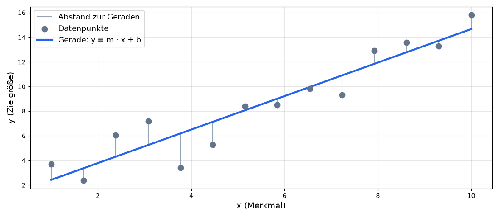

+ einfach und gut interpretierbar <!-- .element: class="fragment" data-fragment-index="1" -->
+ schnell zu trainieren <!-- .element: class="fragment" data-fragment-index="2" -->
+ Grundlage für komplexere Modelle <!-- .element: class="fragment" data-fragment-index="3" -->

--

<!-- .slide: class="smaller" -->
## Modellgleichung

Ein Merkmal:

$$y = m \cdot x + b$$

+ $x$: Eingangsvariable, z. B. Werbebudget <!-- .element: class="fragment" data-fragment-index="1" -->
+ $y$: vorhergesagte Zielgröße, z. B. Umsatz <!-- .element: class="fragment" data-fragment-index="2" -->
+ $m$: Steigung der Geraden, zeigt den Einfluss von $x$ auf $y$ <!-- .element: class="fragment" data-fragment-index="3" -->
+ $b$: Achsenabschnitt, der Wert von $y$ bei $x = 0$ <!-- .element: class="fragment" data-fragment-index="4" -->

<div class="fragment" data-fragment-index="5">

Mehrere Merkmale (multiple lineare Regression):

</div>

<div class="fragment" data-fragment-index="6">

$$y = b + m_1 x_1 + m_2 x_2 + \dots + m_n x_n$$

</div>

--

<!-- .slide: class="smaller" -->
## Verlust (MSE) und Gradientenabstieg

Gesucht sind die Werte für $m$ und $b$ mit dem kleinsten mittleren quadratischen Fehler:

$$MSE = \frac{1}{n} \sum_{i=1}^{n} (y_i - \hat{y}_i)^2$$

+ $y_i$: tatsächlicher Wert, $\hat{y}_i$: vorhergesagter Wert, $n$: Anzahl der Datenpunkte <!-- .element: class="fragment" data-fragment-index="1" -->
+ Große Abweichungen zählen durch das Quadrat besonders stark <!-- .element: class="fragment" data-fragment-index="2" -->

<div class="fragment" data-fragment-index="3">

Gradientenabstieg verbessert $m$ und $b$ schrittweise, $\alpha$ ist die Lernrate:

</div>

<div class="fragment" data-fragment-index="4">

$$m := m - \alpha \cdot \frac{\partial MSE}{\partial m} \qquad b := b - \alpha \cdot \frac{\partial MSE}{\partial b}$$

</div>

--

<!-- .slide: class="smaller" -->
## Gradientenabstieg als Idee

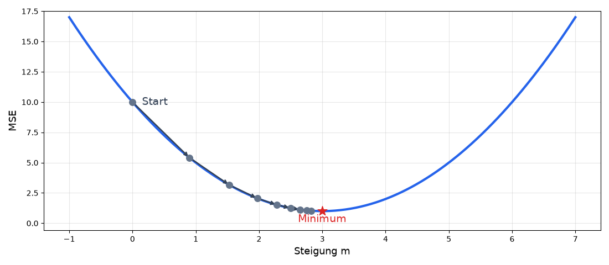

+ Start mit zufälligen oder grob gewählten Parametern <!-- .element: class="fragment" data-fragment-index="1" -->
+ Der Gradient zeigt in die Richtung des stärksten Anstiegs, also gehen wir in die Gegenrichtung <!-- .element: class="fragment" data-fragment-index="2" -->
+ Lernrate zu groß: die Schritte springen über das Minimum. Zu klein: das Lernen dauert sehr lange <!-- .element: class="fragment" data-fragment-index="3" -->
+ Wiederholen, bis sich kaum noch etwas ändert (Konvergenz) <!-- .element: class="fragment" data-fragment-index="4" -->

--

## Lernrate: zu klein und zu groß

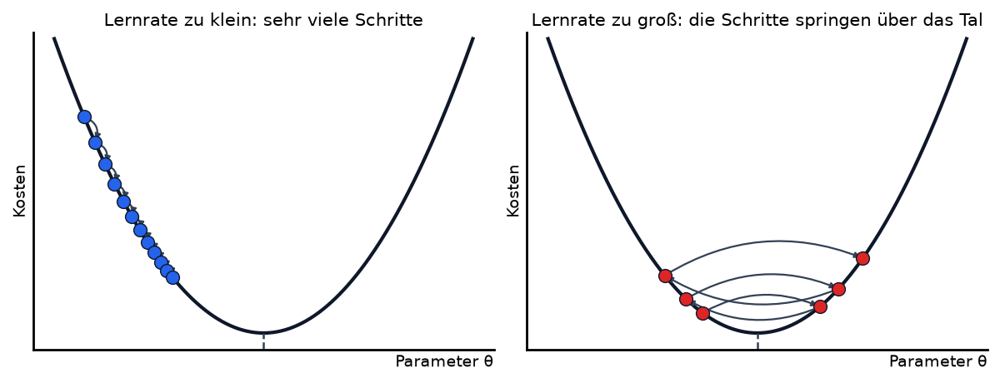

--

## Lokales Minimum und Plateau

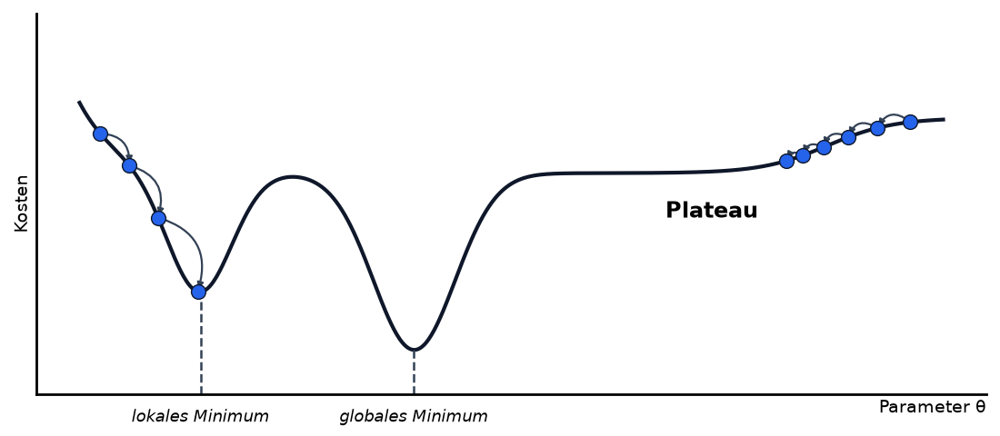

--

<!-- .slide: class="smaller" -->
## Gradientenabstieg in NumPy

```python
import numpy as np

rng = np.random.default_rng(42)
x = rng.uniform(0, 10, 100)
y = 2.5 * x + 1.0 + rng.normal(0, 1, 100)   # wahre Werte: m=2.5, b=1.0

m, b, alpha = 0.0, 0.0, 0.01
for schritt in range(1000):
    y_hat = m * x + b
    dm = -2 * np.mean(x * (y - y_hat))      # Ableitung nach m
    db = -2 * np.mean(y - y_hat)            # Ableitung nach b
    m = m - alpha * dm
    b = b - alpha * db
print(round(m, 3), round(b, 3))             # -> 2.508 0.944
```

| Schritt | m | b | MSE |
|---|---|---|---|
| 1 | 1.652 | 0.263 | 29.9 |
| 10 | 2.589 | 0.433 | 1.022 |
| 1000 | 2.508 | 0.944 | 0.959 |

--

## Lernraten im Vergleich

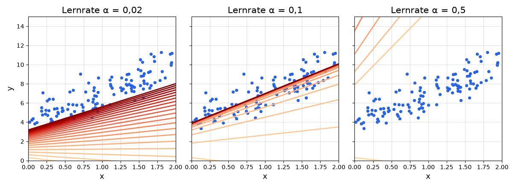

--

<!-- .slide: class="smaller" -->
## Exakte Lösung und Varianten des Gradientenabstiegs

+ Für die lineare Regression lässt sich das Minimum des MSE auch direkt berechnen: exakt, ohne Lernrate, schnell bei kleinen bis mittleren Datensätzen <!-- .element: class="fragment" data-fragment-index="1" -->
+ Bei sehr großen Datensätzen wird die direkte Berechnung teuer. Dann rechnet man schrittweise <!-- .element: class="fragment" data-fragment-index="2" -->

<div class="fragment" data-fragment-index="3">

| Methode | Gradient aus | Vorteil | Nachteil |
|---|---|---|---|
| **Batch Gradient Descent** | allen Datenpunkten | stabile Konvergenz | rechenintensiv bei großen Datensätzen |
| **Stochastic Gradient Descent (SGD)** | einem zufälligen Datenpunkt pro Schritt | sehr effizient bei großen Datensätzen | schwankt stark |
| **Mini-Batch Gradient Descent** | kleiner Gruppe (z. B. 32 oder 64 Punkte) | Kompromiss: stabil und effizient | Batch-Größe muss passen |

</div>

--

## SGD: die ersten Schritte

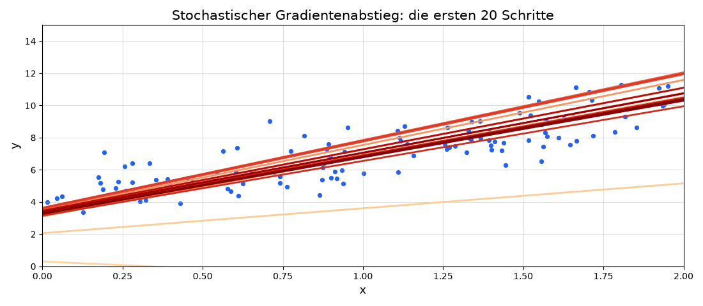

--

## Batch, Mini-Batch und SGD im Parameterraum

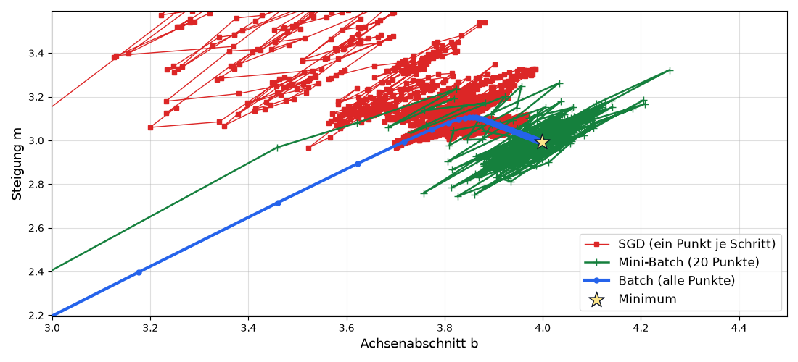

--

## Datensatz California Housing

```python
import pandas as pd

df = pd.read_csv("data/california_housing.csv")
print(df.shape)                 # -> (20640, 9)

X = df.drop(columns="MedHouseVal")
y = df["MedHouseVal"]           # mittlerer Hauswert in 100.000 USD
print(X.columns.tolist())
```

```text
['MedInc', 'HouseAge', 'AveRooms', 'AveBedrms',
 'Population', 'AveOccup', 'Latitude', 'Longitude']
```

Jede Zeile ist ein Bezirk in Kalifornien: mittleres Einkommen, Alter der Häuser, Zimmer und Schlafzimmer pro Haushalt, Einwohner, Belegung, Lage.

--

## `LinearRegression` trainieren

```python
from sklearn.model_selection import train_test_split
from sklearn.linear_model import LinearRegression
from sklearn.metrics import mean_squared_error, r2_score

X_train, X_test, y_train, y_test = train_test_split(
    X, y, test_size=0.2, random_state=1
)
model = LinearRegression()
model.fit(X_train, y_train)
y_pred = model.predict(X_test)

print(y_pred[:3].round(2))                         # -> [2.13 0.94 2.71]
print(y_test[:3].values)                 # -> [3.55  0.707 2.294]
print(round(mean_squared_error(y_test, y_pred), 3))  # -> 0.529
print(round(r2_score(y_test, y_pred), 3))            # -> 0.597
```

--

<!-- .slide: class="smaller" -->
## Koeffizienten lesen

```python
koef = pd.Series(model.coef_, index=X.columns).round(3)
print(koef)
print(round(model.intercept_, 2))      # -> -37.52
```

```text
MedInc        0.439
HouseAge      0.010
AveRooms     -0.105
AveBedrms     0.632
Population   -0.000
AveOccup     -0.003
Latitude     -0.426
Longitude    -0.441
```

+ `MedInc` = 0.439: Steigt das mittlere Einkommen um eine Einheit (10.000 USD), steigt der vorhergesagte Hauswert um 0.439 Einheiten (rund 44.000 USD), wenn alle anderen Merkmale gleich bleiben <!-- .element: class="fragment" data-fragment-index="1" -->
+ Das Vorzeichen zeigt die Richtung, der Betrag die Stärke pro Einheit des Merkmals <!-- .element: class="fragment" data-fragment-index="2" -->

<div class="fragment" data-fragment-index="3">

> [!warning]
> Koeffizienten verschiedener Merkmale sind nur vergleichbar, wenn die Merkmale dieselbe Skala haben. `Population` (Tausende) und `AveBedrms` (um 1) haben sie nicht.

</div>

--

## Regularisierung als Idee

+ Ein Modell mit vielen Merkmalen kann sich zu stark an die Trainingsdaten anpassen <!-- .element: class="fragment" data-fragment-index="1" -->
+ **Regularisierung** bestraft große Koeffizienten: Das Training minimiert den MSE plus eine Strafe <!-- .element: class="fragment" data-fragment-index="2" -->
+ **Lasso:** Strafe = `alpha` mal die Summe der Beträge aller Koeffizienten <!-- .element: class="fragment" data-fragment-index="3" -->
+ Wirkung: Koeffizienten unwichtiger Merkmale werden **genau null**. Lasso wählt damit Merkmale aus <!-- .element: class="fragment" data-fragment-index="4" -->
+ `alpha` ist ein Hyperparameter: `alpha = 0` ist die normale lineare Regression, großes `alpha` lässt kaum Merkmale übrig <!-- .element: class="fragment" data-fragment-index="5" -->

--

<!-- .slide: class="smaller" -->
## Lasso in scikit-learn

<div class="two-col">
<div style="flex: 58">

```python
from sklearn.linear_model import Lasso

lasso = Lasso(alpha=0.1)
lasso.fit(X_train, y_train)

koef = pd.Series(lasso.coef_, index=X.columns)
print(koef.round(3))
print((koef != 0).sum())      # -> 6
print(round(lasso.score(X_test, y_test), 3))
# -> 0.542
```

</div>
<div style="flex: 42">

```text
MedInc        0.394
HouseAge      0.015
AveRooms     -0.000
AveBedrms     0.000
Population    0.000
AveOccup     -0.003
Latitude     -0.114
Longitude    -0.101
```

</div>
</div>

+ `AveRooms` und `AveBedrms` sind genau null und fallen heraus. `Population` ist nur gerundet null (0.000018) <!-- .element: class="fragment" data-fragment-index="1" -->
+ R² sinkt leicht von 0.597 auf 0.542, dafür ist das Modell einfacher <!-- .element: class="fragment" data-fragment-index="2" -->

--

## Klassifikation: Problemstellung

+ Gegeben: Trainingsbeispiele mit Merkmalsvektor $\mathbf{x}$ und bekannter Klasse $y$ <!-- .element: class="fragment" data-fragment-index="1" -->
+ Gesucht: eine Funktion, die neue Eingaben einer von $k$ vordefinierten Klassen zuordnet <!-- .element: class="fragment" data-fragment-index="2" -->
+ Viele Modelle schätzen dazu eine Wahrscheinlichkeit je Klasse, $P(y = C_k \mid \mathbf{x})$, und geben die Klasse mit der höchsten Wahrscheinlichkeit aus <!-- .element: class="fragment" data-fragment-index="3" -->
+ Zwei Klassen: **binäre** Klassifikation (Spam oder nicht, gutartig oder bösartig) <!-- .element: class="fragment" data-fragment-index="4" -->

--

<!-- .slide: class="smaller" -->
## Datensatz Brustkrebs

```python
from sklearn.datasets import load_breast_cancer

data = load_breast_cancer()
X = pd.DataFrame(data.data, columns=data.feature_names)
y = data.target

print(X.shape)               # -> (569, 30)
print(data.target_names)     # -> ['malignant' 'benign']
print(np.bincount(y))        # -> [212 357]
```

+ 569 Gewebeproben, 30 Messwerte je Probe (Radius, Textur, Fläche, Konkavität der Zellkerne) <!-- .element: class="fragment" data-fragment-index="1" -->
+ Zielgröße: `0` = bösartig (malignant), `1` = gutartig (benign) <!-- .element: class="fragment" data-fragment-index="2" -->

<div class="fragment" data-fragment-index="3">

> [!warning]
> Die Kodierung ist andersherum, als man erwartet: Die `1` steht hier für gutartig. Prüfen Sie immer `target_names`.

</div>

--

<!-- .slide: class="smaller" -->
## Vorbereitung: teilen, dann skalieren

```python
from sklearn.model_selection import train_test_split
from sklearn.preprocessing import StandardScaler

X_train, X_test, y_train, y_test = train_test_split(
    X, y, test_size=0.2, random_state=1
)
scaler = StandardScaler()
X_train_s = scaler.fit_transform(X_train)   # lernt Mittelwert und Streuung
X_test_s = scaler.transform(X_test)         # wendet sie nur an
```

+ `StandardScaler` bringt jedes Merkmal auf Mittelwert 0 und Standardabweichung 1 <!-- .element: class="fragment" data-fragment-index="1" -->
+ Logistische Regression, SVM und k-nächste Nachbarn reagieren empfindlich auf unterschiedliche Skalen <!-- .element: class="fragment" data-fragment-index="2" -->

<div class="fragment" data-fragment-index="3">

> [!warning]
> `fit_transform` nur auf den Trainingsdaten. Wer vor dem Split skaliert, lässt Information aus den Testdaten ins Training: ein Datenleck.

</div>

--

<!-- .slide: class="smaller" -->
## Logistische Regression: Idee

+ Trotz des Namens ein Verfahren für **Klassifikation** <!-- .element: class="fragment" data-fragment-index="1" -->
+ Schritt 1: ein linearer Score wie bei der Regression, $z = \mathbf{w}^\top \mathbf{x} + b$ <!-- .element: class="fragment" data-fragment-index="2" -->
+ Schritt 2: die Sigmoid-Funktion macht aus dem Score eine Wahrscheinlichkeit zwischen 0 und 1 <!-- .element: class="fragment" data-fragment-index="3" -->
+ Schritt 3: eine Schwelle (Standard 0,5) macht aus der Wahrscheinlichkeit eine Klasse <!-- .element: class="fragment" data-fragment-index="4" -->

<div class="fragment" data-fragment-index="5">

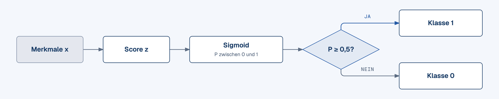

</div>

--

<!-- .slide: class="smaller" -->
## Sigmoid und Schwelle

$$\sigma(z) = \frac{1}{1 + e^{-z}}$$

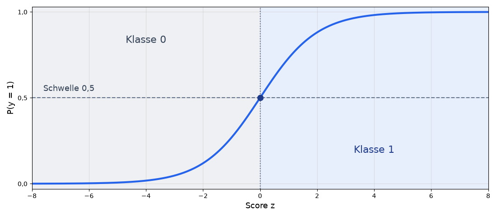

+ Stark negativer Score: Wahrscheinlichkeit nahe 0. Stark positiver Score: nahe 1 <!-- .element: class="fragment" data-fragment-index="1" -->
+ Bei $z = 0$ ist die Wahrscheinlichkeit genau 0,5 <!-- .element: class="fragment" data-fragment-index="2" -->

--

<!-- .slide: class="smaller" -->
## Logistische Regression in scikit-learn

```python
from sklearn.linear_model import LogisticRegression
from sklearn.metrics import classification_report

logreg = LogisticRegression(max_iter=1000)
logreg.fit(X_train_s, y_train)
y_pred = logreg.predict(X_test_s)
print(classification_report(y_test, y_pred,
                            target_names=data.target_names))
```

```text
              precision    recall  f1-score   support

   malignant       0.98      0.95      0.96        42
      benign       0.97      0.99      0.98        72

    accuracy                           0.97       114
```

--

<!-- .slide: class="smaller" -->
## Wahrscheinlichkeiten und Schwelle verschieben

```python
from sklearn.metrics import confusion_matrix

proba = logreg.predict_proba(X_test_s)[:, 1]    # P(gutartig)
print(proba[:4].round(3))              # -> [0.862 0.01  0.99  0.006]

y_streng = (proba >= 0.7).astype(int)           # gutartig erst ab 70 %
print(confusion_matrix(y_test, y_streng))
# -> [ [40  2]
#      [ 1 71] ]
```

| Schwelle für „gutartig" | bösartig übersehen | gutartig fälschlich als bösartig |
|---|---|---|
| 0,3 | 3 | 0 |
| 0,5 (Standard) | 2 | 1 |
| 0,7 | 2 | 1 |
| 0,9 | 1 | 7 |

> [!tip]
> `predict` rechnet immer mit 0,5. Für eine andere Schwelle nehmen Sie `predict_proba` und vergleichen selbst.

--

## Entscheidungsbaum: Idee

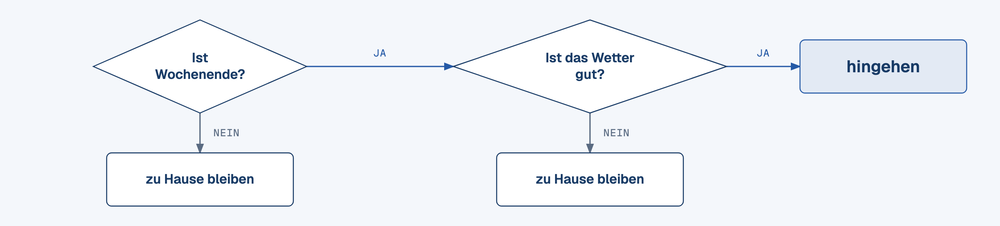

+ **Wurzelknoten:** Startpunkt mit allen Daten <!-- .element: class="fragment" data-fragment-index="1" -->
+ **Entscheidungsknoten:** stellt eine Bedingung, z. B. „Merkmal > 5?" <!-- .element: class="fragment" data-fragment-index="2" -->
+ **Blatt:** Endpunkt, gibt eine Klasse aus <!-- .element: class="fragment" data-fragment-index="3" -->
+ Training: am besten Split-Punkt teilen, dann für jede Teilmenge wiederholen <!-- .element: class="fragment" data-fragment-index="4" -->

--

<!-- .slide: class="smaller" -->
## Entscheidungsbaum in scikit-learn

```python
from sklearn.tree import DecisionTreeClassifier, export_text

baum = DecisionTreeClassifier(max_depth=2, random_state=1)
baum.fit(X_train, y_train)               # Bäume brauchen keine Skalierung
print(export_text(baum, feature_names=list(X.columns)))
print(round(baum.score(X_test, y_test), 3))   # -> 0.886
```

```text
|--- worst perimeter <= 106.05
|   |--- worst concave points <= 0.16
|   |   |--- class: 1
|   |--- worst concave points >  0.16
|   |   |--- class: 0
|--- worst perimeter >  106.05
|   |--- worst texture <= 20.65
|   |   |--- class: 1
|   |--- worst texture >  20.65
|   |   |--- class: 0
```

--

<!-- .slide: class="smaller" -->
## Baumtiefe

| `max_depth` | Accuracy Training | Accuracy Test |
|---|---|---|
| 1 | 0.930 | 0.877 |
| 2 | 0.958 | 0.886 |
| 3 | 0.969 | 0.912 |
| 5 | 1.000 | 0.947 |
| ohne Grenze (Tiefe 5) | 1.000 | 0.947 |

+ Ein tiefer Baum lernt die Trainingsdaten auswendig: 100 % im Training <!-- .element: class="fragment" data-fragment-index="1" -->
+ Auf den Testdaten bleibt derselbe Baum bei 0.947 stehen <!-- .element: class="fragment" data-fragment-index="2" -->
+ `max_depth` ist der wichtigste Hyperparameter eines Baums <!-- .element: class="fragment" data-fragment-index="3" -->

<div class="fragment" data-fragment-index="4">

> [!warning]
> Einzelne Entscheidungsbäume neigen zu Overfitting. Begrenzen Sie die Tiefe oder kombinieren Sie viele Bäume.

</div>

--

<!-- .slide: class="smaller" -->
## Random Forest: Idee

+ **Ensemble-Verfahren:** kombiniert viele Entscheidungsbäume <!-- .element: class="fragment" data-fragment-index="1" -->
+ **Bootstrapping:** jeder Baum bekommt eine eigene Zufallsstichprobe der Trainingsdaten, gezogen mit Zurücklegen <!-- .element: class="fragment" data-fragment-index="2" -->
+ **Bagging** (Bootstrap Aggregation): viele Bäume auf unterschiedlichen Stichproben trainieren, Ergebnisse zusammenführen <!-- .element: class="fragment" data-fragment-index="3" -->
+ Klassifikation: **Mehrheitsentscheid** der Bäume. Regression: Durchschnitt <!-- .element: class="fragment" data-fragment-index="4" -->

<div class="fragment" data-fragment-index="5">

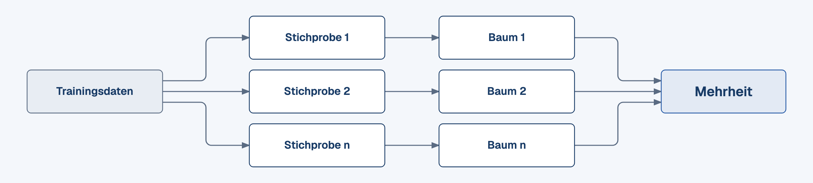

</div>

--

<!-- .slide: class="smaller" -->
## Random Forest in scikit-learn

```python
from sklearn.ensemble import RandomForestClassifier

rf = RandomForestClassifier(n_estimators=100, random_state=1)
rf.fit(X_train_s, y_train)
print(round(rf.score(X_test_s, y_test), 3))        # -> 0.956

wichtig = pd.Series(rf.feature_importances_, index=X.columns)
print(wichtig.sort_values(ascending=False).head(3).round(3))
# -> worst perimeter 0.131, worst concave points 0.130,
#    worst area 0.118
```

<div class="two-col">
<div style="flex: 50">

**Vorteile**

- meist genauer als ein Einzelbaum
- weniger anfällig für Overfitting
- bewertet die Wichtigkeit der Merkmale

</div>
<div style="flex: 50">

**Nachteile**

- langsamer als ein einzelner Baum
- speicher- und rechenintensiv bei großen Datenmengen
- nicht mehr als Ganzes vorlesbar

</div>
</div>

--

<!-- .slide: class="smaller" -->
## SVM: Trennlinie und Margin

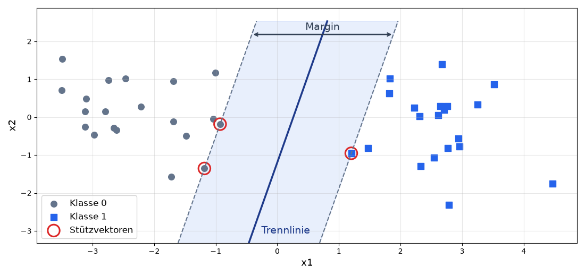

+ Eine Support Vector Machine sucht die Trennlinie mit dem **größten Abstand** (Margin) zu beiden Klassen <!-- .element: class="fragment" data-fragment-index="1" -->
+ Nur die Punkte am Rand bestimmen die Linie: die **Stützvektoren** (Support Vectors) <!-- .element: class="fragment" data-fragment-index="2" -->
+ Bei mehr als zwei Merkmalen wird aus der Linie eine Hyperebene <!-- .element: class="fragment" data-fragment-index="3" -->
+ Eignet sich auch für kleine Datensätze mit vielen Merkmalen <!-- .element: class="fragment" data-fragment-index="4" -->

--

<!-- .slide: class="smaller" -->
## SVM: Soft Margin und Kernel

+ **Hard Margin:** perfekte Trennung ohne Fehler. Funktioniert nur bei sauber trennbaren Daten und neigt zu Overfitting <!-- .element: class="fragment" data-fragment-index="1" -->
+ **Soft Margin:** lässt einzelne falsch liegende Punkte zu und generalisiert besser <!-- .element: class="fragment" data-fragment-index="2" -->
+ Der Parameter `C` steuert den Kompromiss: großes `C` duldet wenige Fehler (schmale Margin), kleines `C` duldet mehr (breite Margin) <!-- .element: class="fragment" data-fragment-index="3" -->
+ **Kernel:** Sind die Klassen nicht mit einer Geraden trennbar, vergleicht die SVM die Punkte über eine Ähnlichkeitsfunktion, als lägen sie in einem höherdimensionalen Raum <!-- .element: class="fragment" data-fragment-index="4" -->

<div class="fragment" data-fragment-index="5">

| Kernel | Geeignet für |
|---|---|
| `linear` | linear trennbare Daten |
| `poly` | gekrümmte Entscheidungsgrenzen |
| `rbf` (Standard) | beliebig geformte Grenzen, misst die Ähnlichkeit zweier Punkte über ihren Abstand |

</div>

--

<!-- .slide: class="smaller" -->
## SVM und k-nächste Nachbarn in scikit-learn

<div class="two-col">
<div style="flex: 50">

**SVM**

```python
from sklearn.svm import SVC

svm = SVC(kernel="rbf", C=1.0, gamma="scale")
svm.fit(X_train_s, y_train)
print(round(svm.score(X_test_s, y_test), 3))
# -> 0.974
```

</div>
<div style="flex: 50">

**k-nächste Nachbarn (kNN)**

```python
from sklearn.neighbors import KNeighborsClassifier

knn = KNeighborsClassifier(n_neighbors=5)
knn.fit(X_train_s, y_train)
print(round(knn.score(X_test_s, y_test), 3))
# -> 0.956
```

</div>
</div>

+ kNN sucht zu einem neuen Punkt die `k` ähnlichsten Trainingspunkte und nimmt deren häufigste Klasse <!-- .element: class="fragment" data-fragment-index="1" -->
+ kNN lernt beim `fit` nichts: Es merkt sich die Trainingsdaten und rechnet erst bei `predict` <!-- .element: class="fragment" data-fragment-index="2" -->
+ Beide Verfahren rechnen mit Abständen. Ohne Skalierung dominiert das Merkmal mit den größten Zahlen <!-- .element: class="fragment" data-fragment-index="3" -->

--

<!-- .slide: class="smaller" -->
## Modellvergleich in einer Schleife

```python
from sklearn.metrics import accuracy_score

modelle = {
    "Logistische Regression": LogisticRegression(max_iter=1000),
    "Entscheidungsbaum": DecisionTreeClassifier(max_depth=3,
                                                random_state=1),
    "Random Forest": RandomForestClassifier(n_estimators=100,
                                            random_state=1),
    "SVM (RBF)": SVC(kernel="rbf", C=1.0, gamma="scale"),
    "kNN (k=5)": KNeighborsClassifier(n_neighbors=5),
}
for name, modell in modelle.items():
    modell.fit(X_train_s, y_train)
    acc_train = modell.score(X_train_s, y_train)
    acc_test = accuracy_score(y_test, modell.predict(X_test_s))
    print(f"{name:24s} {acc_train:.3f} {acc_test:.3f}")
```

--

<!-- .slide: class="smaller" -->
## Modellvergleich als Tabelle

| Verfahren | Accuracy Training | Accuracy Test | Skalierung nötig | Nachvollziehbar | Wichtigste Stellschraube |
|---|---|---|---|---|---|
| Logistische Regression | 0.991 | 0.974 | ja | gut (Koeffizienten) | `C` |
| Entscheidungsbaum (Tiefe 3) | 0.969 | 0.912 | nein | sehr gut (vorlesbar) | `max_depth` |
| Random Forest (100 Bäume) | 1.000 | 0.956 | nein | mittel (Merkmalswichtigkeit) | `n_estimators`, `max_depth` |
| SVM (RBF) | 0.987 | 0.974 | ja | gering | `C`, `gamma`, `kernel` |
| kNN (k = 5) | 0.982 | 0.956 | ja | mittel (Nachbarn zeigen) | `n_neighbors` |

> [!important]
> 114 Testfälle: Ein einziger Fall macht knapp einen Prozentpunkt aus. Aus dieser Tabelle folgt keine Rangliste.

--

## Zusammenfassung

- Lineare Regression legt eine Gerade (oder Ebene) durch die Daten. Training heißt: den MSE minimieren
- Gradientenabstieg geht schrittweise bergab, die Lernrate bestimmt die Schrittweite
- Lasso bestraft große Koeffizienten und setzt unwichtige Merkmale auf null
- Logistische Regression liefert Wahrscheinlichkeiten. Die Schwelle ist eine fachliche Entscheidung
- Erst teilen, dann skalieren. Bäume und Random Forest kommen ohne Skalierung aus, SVM und kNN nicht

---

<!-- .slide: data-background-color="#183b66" -->
# Teil 6: Modelltraining, Feature Engineering, Hyperparameter und Evaluation

Wie Sie Merkmale aufbereiten, Modelle ehrlich prüfen, Einstellungen systematisch suchen und Ergebnisse mit den passenden Kennzahlen bewerten.

--

## Was Sie in diesem Teil lernen

+ Merkmale skalieren, kodieren, transformieren und neue Merkmale aus vorhandenen bilden <!-- .element: class="fragment" data-fragment-index="1" -->
+ Overfitting und Underfitting erkennen und mit Cross-Validation ehrlich messen <!-- .element: class="fragment" data-fragment-index="2" -->
+ Hyperparameter mit `GridSearchCV` systematisch suchen <!-- .element: class="fragment" data-fragment-index="3" -->
+ Regressionsmodelle mit MAE, MSE, RMSE und R² bewerten <!-- .element: class="fragment" data-fragment-index="4" -->
+ Klassifikationsmodelle mit Konfusionsmatrix, Precision, Recall, F1 und ROC bewerten, auch bei ungleichen Klassen <!-- .element: class="fragment" data-fragment-index="5" -->

--

<!-- .slide: class="smaller" -->
## Feature Engineering im Überblick

Feature Engineering heißt: aus Rohdaten Merkmale machen, mit denen ein Modell gut lernen kann.

| Schritt | Was passiert | Beispiel |
|---------|--------------|----------|
| **Skalieren** | Zahlen auf vergleichbare Größenordnung bringen | `Age` und `Fare` standardisieren |
| **Kodieren** | Kategorien in Zahlen umwandeln | `Sex`, `Embarked` als 0/1-Spalten |
| **Transformieren** | schiefe Verteilungen glätten | `log(1 + Fare)` |
| **Neu bilden** | Merkmale kombinieren oder gruppieren | Familiengröße, Altersgruppe |
| **Auswählen** | überflüssige Merkmale weglassen | Korrelation prüfen, Lasso |

> [!tip]
> Ein gut gebautes Merkmal bringt oft mehr als der Wechsel auf ein komplizierteres Modell.

--

<!-- .slide: class="smaller" -->
## Skalierung: wann sie nötig ist

`Age` liegt zwischen 0 und 80, `Fare` zwischen 0 und 512. Ohne Skalierung dominiert bei vielen Verfahren das Merkmal mit den größeren Zahlen.

| Verfahren | Skalierung nötig? | Grund |
|-----------|-------------------|-------|
| Lasso und logistische Regression | ja | Strafterm und Gradientenabstieg hängen von der Größenordnung ab |
| k-NN, SVM, k-Means | ja | rechnen mit Abständen |
| PCA | ja | sucht Richtungen mit großer Varianz |
| Neuronale Netze | ja | Training läuft stabiler und schneller |
| Entscheidungsbaum, Random Forest | nein | vergleichen nur Schwellen je Merkmal |

--

<!-- .slide: class="smaller" -->
## StandardScaler und MinMaxScaler

| Scaler | Formel | Ergebnis | Einsatz |
|--------|--------|----------|---------|
| `StandardScaler` | $z = \frac{x - \mu}{\sigma}$ | Mittelwert 0, Standardabweichung 1 | Standardwahl |
| `MinMaxScaler` | $x' = \frac{x - x_{min}}{x_{max} - x_{min}}$ | Werte zwischen 0 und 1 | begrenzte Wertebereiche, neuronale Netze |

```python
from sklearn.model_selection import train_test_split
from sklearn.preprocessing import StandardScaler

X_train, X_test, y_train, y_test = train_test_split(
    X, y, test_size=0.2, random_state=1)

scaler = StandardScaler()
X_train_scaled = scaler.fit_transform(X_train)  # lernt Mittelwert, Streuung
X_test_scaled = scaler.transform(X_test)        # wendet sie nur an
```

> [!warning]
> Erst teilen, dann skalieren. `fit_transform` nur auf den Trainingsdaten, auf den Testdaten nur `transform`. Sonst fließt Wissen aus den Testdaten ins Training.

--

<!-- .slide: class="smaller" -->
## One-Hot- gegenüber Label-Encoding

<div class="two-col">
<div style="flex: 50">

**One-Hot-Encoding:** eine 0/1-Spalte je Kategorie

| ID | Farbe | Farbe_Rot | Farbe_Blau | Farbe_Grün |
|----|-------|-----------|------------|------------|
| 1 | Rot | 1 | 0 | 0 |
| 2 | Blau | 0 | 1 | 0 |
| 3 | Grün | 0 | 0 | 1 |
| 4 | Rot | 1 | 0 | 0 |

</div>
<div style="flex: 50">

**Label-Encoding:** eine Zahl je Kategorie

| ID | Farbe | Farbe_Label |
|----|-------|-------------|
| 1 | Rot | 2 |
| 2 | Blau | 0 |
| 3 | Grün | 1 |
| 4 | Rot | 2 |

</div>
</div>

+ Label-Encoding behauptet eine Reihenfolge: Blau (0) kleiner als Grün (1) kleiner als Rot (2). Bei Farben ist das falsch. <!-- .element: class="fragment" data-fragment-index="1" -->
+ Für Kategorien ohne Rangfolge: One-Hot. Für echte Rangfolgen (Schulnote, Pflegegrad): Zahlen in der richtigen Reihenfolge. <!-- .element: class="fragment" data-fragment-index="2" -->

--

<!-- .slide: class="smaller" -->
## Encoding in pandas und scikit-learn

```python
import pandas as pd
from sklearn.preprocessing import LabelEncoder, OneHotEncoder

df = pd.read_csv("data/titanic.csv")
# One-Hot mit pandas: schnell für die Analyse
encoded = pd.get_dummies(df, columns=["Sex", "Embarked"], drop_first=True)

# One-Hot mit scikit-learn: merkt sich die Kategorien für neue Daten
ohe = OneHotEncoder(handle_unknown="ignore", sparse_output=False)
X_cat = ohe.fit_transform(df[ ["Sex", "Pclass"] ])
print(ohe.get_feature_names_out())
# -> ['Sex_female' 'Sex_male' 'Pclass_1' 'Pclass_2' 'Pclass_3']

# Label-Encoding: eine Zahl je Kategorie
df["Sex_label"] = LabelEncoder().fit_transform(df["Sex"])
print(df[ ["Sex", "Sex_label"] ].head(3))   # female -> 0, male -> 1
```

+ `drop_first=True` lässt eine Spalte weg: aus `Sex_female = 0` folgt `Sex_male = 1` <!-- .element: class="fragment" data-fragment-index="1" -->
+ `handle_unknown="ignore"`: eine unbekannte Kategorie in neuen Daten führt nicht zum Abbruch <!-- .element: class="fragment" data-fragment-index="2" -->

--

<!-- .slide: class="smaller" -->
## Log-Transformation schiefer Größen

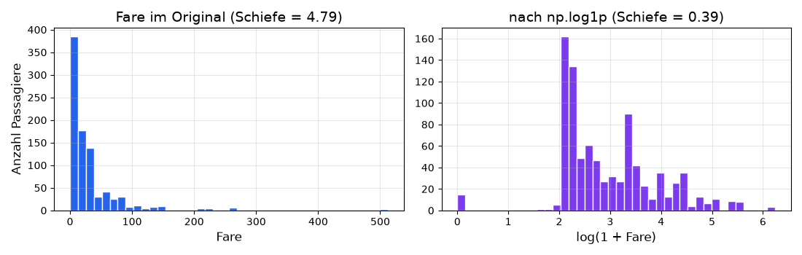

```python
import numpy as np
df["Fare_log"] = np.log1p(df["Fare"])   # log(1 + x), verträgt auch Fare = 0
```

+ Wenige sehr teure Tickets ziehen die Verteilung nach rechts. Der Logarithmus staucht große Werte stärker als kleine. <!-- .element: class="fragment" data-fragment-index="1" -->
+ Typische Kandidaten: Preise, Einkommen, Kosten, Wartezeiten <!-- .element: class="fragment" data-fragment-index="2" -->

--

<!-- .slide: class="smaller" -->
## Neue Merkmale aus vorhandenen

```python
# Familiengröße: Geschwister/Partner + Eltern/Kinder + die Person selbst
df["Familiengroesse"] = df["SibSp"] + df["Parch"] + 1
df["Allein"] = (df["Familiengroesse"] == 1).astype(int)

# Altersgruppe: aus einer Zahl wird eine Kategorie (Binning)
df["Altersgruppe"] = pd.cut(
    df["Age"], bins=[0, 12, 18, 30, 50, 80],
    labels=["Kind", "Jugendlich", "Jung", "Erwachsen", "Senior"])

print(df.groupby("Altersgruppe", observed=True)["Survived"].mean().round(2))
print(df.groupby("Familiengroesse")["Survived"].mean().round(2))
```

+ Fachwissen steckt im Merkmal: nicht `SibSp` und `Parch` einzeln zählen, sondern „reist allein oder mit Familie" <!-- .element: class="fragment" data-fragment-index="1" -->
+ Weitere Muster: Wochentag oder Monat aus einem Datum, Verhältnisse (Kosten je Arztbesuch), Summen je Gruppe <!-- .element: class="fragment" data-fragment-index="2" -->

<div class="fragment" data-fragment-index="3">

> [!warning]
> Ein neues Merkmal darf nur Informationen nutzen, die zum Zeitpunkt der Vorhersage bekannt sind.

</div>

--

<!-- .slide: class="smaller" -->
## Train, Validierung und Test

| Teil | Wofür | Wie oft ansehen |
|------|-------|-----------------|
| **Training** | Modell lernt seine Parameter | beliebig oft |
| **Validierung** | Modelle und Einstellungen vergleichen | beliebig oft |
| **Test** | einmalige Schlussprüfung | genau einmal, ganz am Ende |

```python
from sklearn.model_selection import train_test_split

# 1. Testteil abspalten (20 Prozent), 2. Rest in Training und Validierung
X_rest, X_test, y_rest, y_test = train_test_split(
    X, y, test_size=0.2, random_state=1, stratify=y)
X_train, X_val, y_train, y_val = train_test_split(
    X_rest, y_rest, test_size=0.25, random_state=1, stratify=y_rest)
# Ergebnis: 60 Prozent Training, 20 Prozent Validierung, 20 Prozent Test
```

> [!important]
> Wer Einstellungen so lange ändert, bis der Testwert gut aussieht, hat den Testteil zum Training benutzt. Die Zahl ist dann zu optimistisch.

--

## Overfitting und Underfitting

+ **Underfitting:** Das Modell ist zu einfach und verpasst das Muster. Schlecht auf Trainings- und auf neuen Daten. <!-- .element: class="fragment" data-fragment-index="1" -->
+ **Overfitting:** Das Modell ist zu flexibel und lernt das Rauschen der Trainingsdaten auswendig. Sehr gut im Training, schlecht auf neuen Daten. <!-- .element: class="fragment" data-fragment-index="2" -->
+ **Generalisierung:** Ziel ist ein niedriger Fehler auf Daten, die das Modell nie gesehen hat. <!-- .element: class="fragment" data-fragment-index="3" -->
+ Stellschrauben: Modellkomplexität (Kapazität), mehr Daten, bessere Merkmale, Regularisierung <!-- .element: class="fragment" data-fragment-index="4" -->

--

<!-- .slide: class="smaller" -->
## Polynombeispiel: Code

```python
import numpy as np
from numpy.polynomial import Polynomial

rng = np.random.default_rng(42)
X_train = np.linspace(-3, 3, 12)                      # 12 Messpunkte
y_train = np.sin(X_train) + rng.normal(0, 0.15, 12)   # Sinus plus Rauschen

X_neu = np.linspace(-2.9, 2.9, 50)                    # neue Punkte
y_neu = np.sin(X_neu)

for grad in [1, 4, 11]:
    p = Polynomial.fit(X_train, y_train, grad)
    mse_train = np.mean((p(X_train) - y_train) ** 2)
    mse_neu = np.mean((p(X_neu) - y_neu) ** 2)
    print(f"Grad {grad:2d}: Training {mse_train:.3f}, neu {mse_neu:.3f}")
```

```text
Grad  1: Training 0.222, neu 0.172
Grad  4: Training 0.020, neu 0.010
Grad 11: Training 0.000, neu 0.111
```

--

## Polynombeispiel: Grad 1, 4 und 11

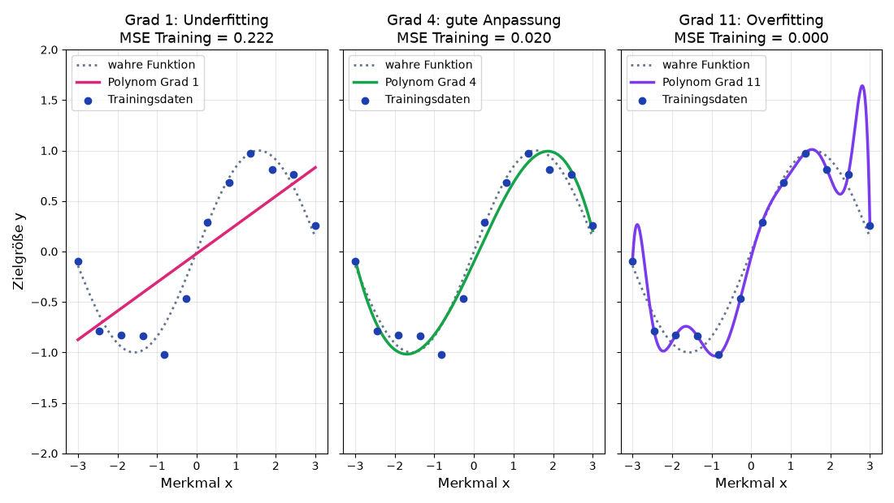

--

<!-- .slide: class="smaller" -->
## Bias und Varianz als Idee

| | Underfitting | Overfitting |
|---|--------------|-------------|
| Fachbegriff | hoher **Bias** | hohe **Varianz** |
| Bedeutung | Modell liegt systematisch daneben | Modell reagiert auf jede Zufallsschwankung der Trainingsdaten |
| Trainingsfehler | hoch | sehr niedrig |
| Fehler auf neuen Daten | hoch | deutlich höher als im Training |
| Im Polynombeispiel | Grad 1 | Grad 11 |
| Abhilfe | flexibleres Modell, bessere Merkmale | einfacheres Modell, mehr Daten, Regularisierung |

+ Mehr Komplexität senkt den Bias und erhöht die Varianz. Gesucht ist die Mitte. <!-- .element: class="fragment" data-fragment-index="1" -->
+ Diagnose: Trainings- und Validierungswert nebeneinander über die Modellkomplexität auftragen (zum Beispiel über `max_depth`) <!-- .element: class="fragment" data-fragment-index="2" -->

--

<!-- .slide: class="smaller" -->
## Cross-Validation: die Idee

Ein einzelner Split hängt vom Zufall ab. Cross-Validation teilt die Daten in k Blöcke (Folds) und lässt jeden Block einmal Prüfdaten sein.

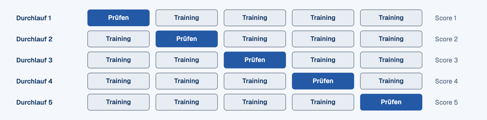

Ergebnis: Mittelwert und Streuung der 5 Scores

+ Jede Datenzeile wird genau einmal zum Prüfen benutzt, alle Daten werden genutzt <!-- .element: class="fragment" data-fragment-index="1" -->
+ Die Streuung zeigt, wie stabil das Ergebnis ist <!-- .element: class="fragment" data-fragment-index="2" -->
+ Preis: k Trainingsläufe statt einem <!-- .element: class="fragment" data-fragment-index="3" -->

--

<!-- .slide: class="smaller" -->
## `cross_val_score` und `StratifiedKFold`

```python
from sklearn.datasets import load_breast_cancer
from sklearn.ensemble import RandomForestClassifier
from sklearn.model_selection import StratifiedKFold, cross_val_score

X, y = load_breast_cancer(return_X_y=True)
model = RandomForestClassifier(random_state=1)

cv = StratifiedKFold(n_splits=5, shuffle=True, random_state=1)
scores = cross_val_score(model, X, y, cv=cv, scoring="roc_auc")

print(scores.round(3))
print(f"Mittel: {scores.mean():.3f}, Streuung: {scores.std():.3f}")
# -> [0.994 0.999 0.987 0.989 0.986]
# -> Mittel: 0.991, Streuung: 0.005
```

+ `StratifiedKFold` hält in jedem Fold das Klassenverhältnis des Gesamtdatensatzes. Ohne das kann ein Fold zufällig kaum Fälle der seltenen Klasse enthalten. <!-- .element: class="fragment" data-fragment-index="1" -->
+ `scoring` wählt die Kennzahl: `"accuracy"`, `"f1"`, `"roc_auc"`, bei Regression `"r2"` oder `"neg_mean_absolute_error"` <!-- .element: class="fragment" data-fragment-index="2" -->

--

<!-- .slide: class="smaller" -->
## Hyperparameter gegenüber Parametern

| | Parameter | Hyperparameter |
|---|-----------|----------------|
| Wer legt sie fest? | das Training (`fit`) | Sie, vor dem Training |
| Woraus? | aus den Daten gelernt | ausprobiert und verglichen |
| Beispiele | Koeffizienten `coef_` und `intercept_` der Regression, Schwellen im Baum | `alpha` bei Lasso, `max_depth` beim Baum, `n_estimators` beim Random Forest, `k` bei k-NN |
| Wo im Code? | Attribute mit Unterstrich nach `fit` | Argumente im Konstruktor |

+ Schlecht gewählte Hyperparameter führen zu Underfitting oder Overfitting <!-- .element: class="fragment" data-fragment-index="1" -->
+ Hyperparameter werden auf Validierungsdaten oder per Cross-Validation verglichen, nie auf dem Testteil <!-- .element: class="fragment" data-fragment-index="2" -->

--

<!-- .slide: class="smaller" -->
## GridSearchCV: bestes `alpha` für Lasso

```python
import numpy as np
import pandas as pd
from sklearn.linear_model import Lasso
from sklearn.model_selection import GridSearchCV, train_test_split

df = pd.read_csv("data/california_housing.csv")
X, y = df.drop(columns="MedHouseVal"), df["MedHouseVal"]
X_train, X_test, y_train, y_test = train_test_split(
    X, y, test_size=0.2, random_state=1)

alphas = np.logspace(-4, 1, 10)          # 10 Werte von 0.0001 bis 10
search = GridSearchCV(Lasso(), {"alpha": alphas}, cv=5, scoring="r2")
search.fit(X_train, y_train)

print(search.best_params_, round(search.best_score_, 3))
print(f"R² auf dem Testteil: {search.score(X_test, y_test):.2f}")
```

+ `np.logspace(-4, 1, 10)`: Werte gleichmäßig über Zehnerpotenzen verteilt, passend für Regularisierungsstärken <!-- .element: class="fragment" data-fragment-index="1" -->
+ 10 Kandidaten mal 5 Folds: 50 Trainingsläufe. Danach trainiert `GridSearchCV` das beste Modell auf allen Trainingsdaten neu. <!-- .element: class="fragment" data-fragment-index="2" -->

--

<!-- .slide: class="smaller" -->
## GridSearchCV: Tiefe eines Random Forest

```python
from sklearn.metrics import f1_score
X, y = load_breast_cancer(return_X_y=True)
X_train, X_test, y_train, y_test = train_test_split(
    X, y, test_size=0.2, stratify=y, random_state=1)

param_grid = {"max_depth": [2, 3, 4, 5, 10, 20, None],  # None: unbegrenzt
              "n_estimators": [50, 100, 200]}
search = GridSearchCV(RandomForestClassifier(random_state=1),
                      param_grid, cv=cv, scoring="f1", n_jobs=-1)
search.fit(X_train, y_train)

print(search.best_params_, round(search.best_score_, 3))
print(f"F1 auf dem Testteil: {f1_score(y_test, search.predict(X_test)):.3f}")
# -> {'max_depth': 10, 'n_estimators': 100} 0.965
# -> F1 auf dem Testteil: 0.966
```

+ 7 mal 3 Kombinationen mal 5 Folds: 105 Trainingsläufe. Jeder weitere Hyperparameter vervielfacht den Aufwand. <!-- .element: class="fragment" data-fragment-index="1" -->

--

<!-- .slide: class="smaller" -->
## RandomizedSearchCV und die Grenzen der Gittersuche

| Verfahren | Vorgehen | Geeignet, wenn |
|-----------|----------|----------------|
| **Grid Search** | probiert jede Kombination des Gitters | wenige Hyperparameter, wenige Werte |
| **Random Search** | zieht zufällig `n_iter` Kombinationen | viele Hyperparameter, begrenzte Rechenzeit |
| **Bayes-Optimierung** | schlägt aus bisherigen Ergebnissen neue Kandidaten vor | teure Trainingsläufe (Zusatzpakete nötig) |

```python
from sklearn.model_selection import RandomizedSearchCV

search = RandomizedSearchCV(
    RandomForestClassifier(random_state=1), param_distributions=param_grid,
    n_iter=8, cv=cv, scoring="f1", random_state=1, n_jobs=-1)
search.fit(X_train, y_train)
print(search.best_params_, round(search.best_score_, 3))
# -> {'n_estimators': 100, 'max_depth': 20} 0.965
```

+ 8 statt 21 Kombinationen, derselbe Wert: in diesem Beispiel reicht die Zufallssuche <!-- .element: class="fragment" data-fragment-index="1" -->

--

<!-- .slide: class="smaller" -->
## Evaluation Regression: MAE

**Mean Absolute Error:** mittlere absolute Abweichung

$MAE = \frac{1}{m} \sum_{i=1}^{m} \lvert y_i - \hat{y}_i \rvert$

+ Durchschnittlicher Abstand zwischen Vorhersage $\hat{y}$ und wahrem Wert $y$, in der Einheit der Zielgröße <!-- .element: class="fragment" data-fragment-index="1" -->
+ Je kleiner, desto besser. MAE = 1000 bei Kosten in Euro heißt: Die Vorhersage liegt im Mittel 1000 Euro daneben. <!-- .element: class="fragment" data-fragment-index="2" -->
+ Jeder Fehler zählt mit seinem Betrag, einzelne Ausreißer fallen wenig ins Gewicht <!-- .element: class="fragment" data-fragment-index="3" -->

<div class="fragment" data-fragment-index="4">

```python
from sklearn.metrics import mean_absolute_error

y_true = [3, 5, 8]
y_pred = [2, 5, 11]
print(mean_absolute_error(y_true, y_pred))   # -> 1.33 = (1 + 0 + 3) / 3
```

</div>

--

<!-- .slide: class="smaller" -->
## Evaluation Regression: MSE und RMSE

**Mean Squared Error:** mittlerer quadratischer Fehler

$MSE = \frac{1}{m} \sum_{i=1}^{m} (y_i - \hat{y}_i)^2$

**Root Mean Squared Error:** Wurzel daraus

$RMSE = \sqrt{MSE}$

+ Das Quadrat bestraft große Fehler stärker: ein Fehler von 3 zählt neunfach, nicht dreifach <!-- .element: class="fragment" data-fragment-index="1" -->
+ MSE hat die quadrierte Einheit (Euro²) und ist schwer zu deuten. RMSE hat wieder die Einheit der Zielgröße. <!-- .element: class="fragment" data-fragment-index="2" -->
+ RMSE deutlich größer als MAE: Es gibt einzelne große Ausreißer in den Fehlern. <!-- .element: class="fragment" data-fragment-index="3" -->

<div class="fragment" data-fragment-index="4">

```python
import numpy as np
from sklearn.metrics import mean_squared_error

mse = mean_squared_error(y_true, y_pred)     # -> 3.33 = (1 + 0 + 9) / 3
rmse = np.sqrt(mse)                          # -> 1.83
```

</div>

--

<!-- .slide: class="smaller" -->
## Evaluation Regression: R²

**Bestimmtheitsmaß**

$R^2 = 1 - \frac{\sum (y_i - \hat{y}_i)^2}{\sum (y_i - \bar{y})^2}$

Vergleicht das Modell mit der einfachsten Alternative: immer den Mittelwert $\bar{y}$ vorhersagen.

| Wert | Bedeutung |
|------|-----------|
| $R^2 = 1$ | perfekte Vorhersage |
| $R^2 = 0.75$ | das Modell erklärt 75 Prozent der Streuung der Zielgröße |
| $R^2 \approx 0$ | nicht besser als der Mittelwert |
| $R^2 < 0$ | schlechter als der Mittelwert |

```python
from sklearn.metrics import r2_score
print(r2_score(y_true, y_pred))   # -> 0.21 = 1 - 10 / 12.67
```

--

<!-- .slide: class="smaller" -->
## Regressionskennzahlen im Zusammenhang

```python
from sklearn.linear_model import LinearRegression
from sklearn.metrics import mean_absolute_error, mean_squared_error, r2_score

model = LinearRegression().fit(X_train, y_train)   # Hauspreisdaten
y_pred = model.predict(X_test)

mae = mean_absolute_error(y_test, y_pred)
mse = mean_squared_error(y_test, y_pred)
print(f"MAE:  {mae:.2f}")                 # -> 0.53
print(f"MSE:  {mse:.2f}")                 # -> 0.53
print(f"RMSE: {np.sqrt(mse):.2f}")        # -> 0.73
print(f"R²:   {r2_score(y_test, y_pred):.2f}")  # -> 0.60
```

+ Zielgröße `MedHouseVal` zählt in 100.000 Dollar: MAE 0.53 heißt rund 53.000 Dollar mittlerer Fehler <!-- .element: class="fragment" data-fragment-index="1" -->
+ Lesen Sie mehrere Kennzahlen nebeneinander: MAE für den typischen Fehler, RMSE für Ausreißer, R² für den Vergleich mit dem Mittelwert <!-- .element: class="fragment" data-fragment-index="2" -->
+ Ein sehr hohes R² im Training und ein niedriges auf neuen Daten zeigt Overfitting <!-- .element: class="fragment" data-fragment-index="3" -->

--

<!-- .slide: class="smaller" -->
## Konfusionsmatrix am Zahlenbeispiel

Zehn Fälle, Klasse 1 = „krank", Klasse 0 = „gesund":

```python
y_true = [0, 1, 1, 0, 1, 0, 0, 1, 1, 0]   # Wahrheit
y_pred = [0, 1, 1, 1, 0, 1, 0, 1, 1, 0]   # Vorhersage des Modells
```

| | vorhergesagt 0 (gesund) | vorhergesagt 1 (krank) |
|---|---|---|
| **wirklich 0 (gesund)** | **TN = 3** richtig entwarnt | **FP = 2** Fehlalarm |
| **wirklich 1 (krank)** | **FN = 1** übersehen | **TP = 4** richtig erkannt |

+ **T**rue/**F**alse: Lag das Modell richtig? **P**ositive/**N**egative: Was hat es vorhergesagt? <!-- .element: class="fragment" data-fragment-index="1" -->
+ Die Diagonale (TN und TP) zählt die richtigen Vorhersagen: 7 von 10 <!-- .element: class="fragment" data-fragment-index="2" -->

--

<!-- .slide: class="smaller" -->
## Accuracy, Precision, Recall und F1 von Hand

Aus der Matrix: TP = 4, FP = 2, FN = 1, TN = 3

| Kennzahl | Frage | Formel | Rechnung |
|----------|-------|--------|----------|
| **Accuracy** | Wie viele Vorhersagen stimmen? | $\frac{TP + TN}{TP + TN + FP + FN}$ | (4 + 3) / 10 = **0.70** |
| **Precision** | Wie viele Alarme sind echt? | $\frac{TP}{TP + FP}$ | 4 / 6 = **0.67** |
| **Recall** | Wie viele Kranke werden gefunden? | $\frac{TP}{TP + FN}$ | 4 / 5 = **0.80** |
| **F1** | Mittel aus Precision und Recall | $2 \cdot \frac{Precision \cdot Recall}{Precision + Recall}$ | 2 · 0.67 · 0.80 / 1.47 = **0.73** |

+ Precision schaut auf die Spalte „vorhergesagt 1", Recall auf die Zeile „wirklich 1" <!-- .element: class="fragment" data-fragment-index="1" -->
+ F1 ist das harmonische Mittel: Es wird nur hoch, wenn beide Werte hoch sind <!-- .element: class="fragment" data-fragment-index="2" -->

--

<!-- .slide: class="smaller" -->
## Kennzahlen mit scikit-learn

```python
from sklearn.metrics import (accuracy_score, confusion_matrix, f1_score,
                             precision_score, recall_score)

cm = confusion_matrix(y_true, y_pred)
print(cm)
# -> [ [3 2]
#      [1 4] ]
tn, fp, fn, tp = cm.ravel()          # Reihenfolge: TN, FP, FN, TP

print(accuracy_score(y_true, y_pred))              # -> 0.7
print(round(precision_score(y_true, y_pred), 2))   # -> 0.67
print(round(recall_score(y_true, y_pred), 2))      # -> 0.8
print(round(f1_score(y_true, y_pred), 2))          # -> 0.73
```

+ Reihenfolge der Argumente: erst die Wahrheit, dann die Vorhersage <!-- .element: class="fragment" data-fragment-index="1" -->
+ Als Bild: `ConfusionMatrixDisplay.from_predictions(y_true, y_pred)` <!-- .element: class="fragment" data-fragment-index="2" -->

--

<!-- .slide: class="smaller" -->
## Welcher Fehler ist teurer?

| Anwendung | False Positive (Fehlalarm) | False Negative (übersehen) | Teurer |
|-----------|----------------------------|----------------------------|--------|
| **Krankheitserkennung** | gesunde Person geht zur Nachuntersuchung | kranke Person bleibt unbehandelt | meist FN |
| **Betrugserkennung** | korrekte Abrechnung wird geprüft, Aufwand und Ärger | Betrug wird ausgezahlt | meist FN, aber zu viele FP legen die Prüfstelle lahm |
| **Spamfilter** | wichtige Mail landet im Spamordner | Spam landet im Posteingang | meist FP |

+ FN teuer: auf **Recall** achten. FP teuer: auf **Precision** achten. <!-- .element: class="fragment" data-fragment-index="1" -->
+ Beide Fehler lassen sich kaum gleichzeitig auf null bringen. Wer mehr findet, löst mehr Fehlalarme aus. <!-- .element: class="fragment" data-fragment-index="2" -->
+ Die Gewichtung ist eine fachliche Entscheidung, keine technische <!-- .element: class="fragment" data-fragment-index="3" -->

--

<!-- .slide: class="smaller" -->
## Schwelle verschieben

`predict()` entscheidet bei Wahrscheinlichkeit ≥ 0.5 für Klasse 1. Diese Schwelle können Sie selbst setzen.

```python
# model: ein trainierter Klassifikator, zum Beispiel LogisticRegression
proba = model.predict_proba(X_test)[:, 1]   # Wahrscheinlichkeit Klasse 1

for schwelle in [0.5, 0.3]:
    y_pred = (proba >= schwelle).astype(int)
    p = precision_score(y_test, y_pred)
    r = recall_score(y_test, y_pred)
    print(f"Schwelle {schwelle}: Precision {p:.2f}, Recall {r:.2f}")
```

| Schwelle | Wirkung | Precision | Recall |
|----------|---------|-----------|--------|
| niedriger (0.3) | mehr Fälle gelten als positiv | sinkt meist | steigt |
| höher (0.7) | nur sehr sichere Fälle gelten als positiv | steigt meist | sinkt |

> [!tip]
> Die Schwelle auf Validierungsdaten wählen, nicht auf dem Testteil.

--

<!-- .slide: class="smaller" -->
## ROC von Hand: Beispieldaten

Fünf Fälle mit wahrem Label und vorhergesagter Wahrscheinlichkeit für Klasse 1:

| Fall | wahres Label y | Wahrscheinlichkeit p |
|:----:|:--------------:|:--------------------:|
| A | 1 | 0.95 |
| B | 0 | 0.85 |
| C | 1 | 0.60 |
| D | 0 | 0.40 |
| E | 1 | 0.20 |

+ 3 positive Fälle (A, C, E), 2 negative Fälle (B, D) <!-- .element: class="fragment" data-fragment-index="1" -->
+ Regel: Für eine Schwelle t gilt ein Fall als positiv, wenn p ≥ t <!-- .element: class="fragment" data-fragment-index="2" -->
+ Für jede Schwelle zählen wir TP, FP, FN, TN und rechnen daraus zwei Raten <!-- .element: class="fragment" data-fragment-index="3" -->

--

<!-- .slide: class="smaller" -->
## ROC von Hand: Schwellen durchprobieren

| Schwelle t | als positiv vorhergesagt | TP | FP | FN | TN | TPR = TP / (TP + FN) | FPR = FP / (FP + TN) |
|:--:|:--|:--:|:--:|:--:|:--:|:--:|:--:|
| > 0.95 | keiner | 0 | 0 | 3 | 2 | 0.00 | 0.00 |
| ≥ 0.95 | A | 1 | 0 | 2 | 2 | 0.33 | 0.00 |
| ≥ 0.85 | A, B | 1 | 1 | 2 | 1 | 0.33 | 0.50 |
| ≥ 0.60 | A, B, C | 2 | 1 | 1 | 1 | 0.67 | 0.50 |
| ≥ 0.40 | A, B, C, D | 2 | 2 | 1 | 0 | 0.67 | 1.00 |
| ≥ 0.20 | A, B, C, D, E | 3 | 2 | 0 | 0 | 1.00 | 1.00 |

+ **TPR** (True Positive Rate) ist der Recall: Anteil der gefundenen Positiven <!-- .element: class="fragment" data-fragment-index="1" -->
+ **FPR** (False Positive Rate): Anteil der Negativen, die fälschlich Alarm auslösen <!-- .element: class="fragment" data-fragment-index="2" -->
+ Jede Zeile ergibt einen Punkt (FPR, TPR) der ROC-Kurve <!-- .element: class="fragment" data-fragment-index="3" -->

--

<!-- .slide: class="smaller" -->
## ROC-Kurve und AUC

<div class="two-col">
<div style="flex: 58">

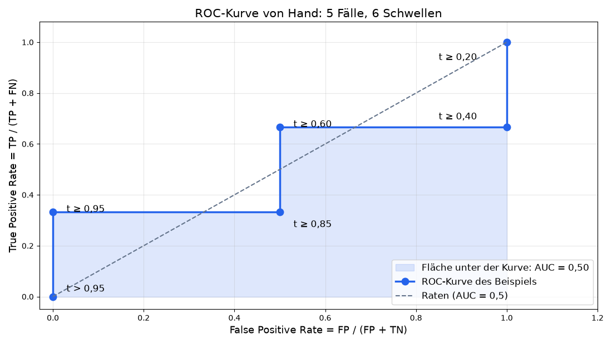

</div>
<div style="flex: 42">

+ x-Achse: FPR, y-Achse: TPR, ein Punkt je Schwelle <!-- .element: class="fragment" data-fragment-index="1" -->
+ Ideal: links oben (alle gefunden, kein Fehlalarm) <!-- .element: class="fragment" data-fragment-index="2" -->
+ Diagonale: Raten <!-- .element: class="fragment" data-fragment-index="3" -->
+ **AUC** = Fläche unter der Kurve, 1.0 perfekt, 0.5 Raten <!-- .element: class="fragment" data-fragment-index="4" -->
+ Von Hand: 0.5 · 0.33 + 0.5 · 0.67 = **0.50** <!-- .element: class="fragment" data-fragment-index="5" -->

<div class="fragment" data-fragment-index="6">

```python
from sklearn.metrics import roc_auc_score
y = [1, 0, 1, 0, 1]
p = [0.95, 0.85, 0.60, 0.40, 0.20]
print(roc_auc_score(y, p))   # -> 0.5
```

</div>

</div>
</div>

--

<!-- .slide: class="smaller" -->
## Accuracy bei ungleichen Klassen

1000 Personen, 950 gesund, 50 krank. Ein „Modell" sagt immer „gesund":

| | vorhergesagt gesund | vorhergesagt krank |
|---|---|---|
| **wirklich gesund** | TN = 950 | FP = 0 |
| **wirklich krank** | FN = 50 | TP = 0 |

+ Accuracy = 950 / 1000 = **95 Prozent** <!-- .element: class="fragment" data-fragment-index="1" -->
+ Recall = 0 / 50 = **0**: Kein einziger Kranker wird gefunden <!-- .element: class="fragment" data-fragment-index="2" -->
+ F1 = 0 <!-- .element: class="fragment" data-fragment-index="3" -->

<div class="fragment" data-fragment-index="4">

> [!warning]
> Bei 95 Prozent Mehrheitsklasse ist eine Accuracy von 95 Prozent der Wert eines Modells, das nichts gelernt hat. Vergleichen Sie jede Accuracy zuerst mit dem Anteil der häufigsten Klasse.

</div>

--

<!-- .slide: class="smaller" -->
## Ungleiche Klassen ohne Zusatzpakete behandeln

```python
from sklearn.datasets import make_classification
from sklearn.linear_model import LogisticRegression
from sklearn.metrics import classification_report
X, y = make_classification(n_samples=2000, weights=[0.95, 0.05],
                           random_state=1)
# 1. stratifizieren
X_train, X_test, y_train, y_test = train_test_split(
    X, y, test_size=0.2, stratify=y, random_state=1)
# 2. gewichten
model = LogisticRegression(class_weight="balanced", max_iter=1000)
model.fit(X_train, y_train)
# 3. passend messen
print(classification_report(y_test, model.predict(X_test)))
```

| Modell | Accuracy | Recall Klasse 1 |
|--------|----------|-----------------|
| ohne `class_weight` | 0.98 | 0.73 |
| mit `class_weight="balanced"` | 0.92 | 0.95 |

+ `class_weight="balanced"` gewichtet Fehler der seltenen Klasse stärker: Accuracy sinkt, Recall steigt von 0.73 auf 0.95 <!-- .element: class="fragment" data-fragment-index="1" -->
+ Dazu: Schwelle anpassen und mit Recall, F1 oder ROC-AUC statt Accuracy vergleichen <!-- .element: class="fragment" data-fragment-index="2" -->

--

<!-- .slide: class="smaller" -->
## `classification_report` lesen

```python
print(classification_report(y_true, y_pred))   # Zehn-Fälle-Beispiel
```

```text
              precision    recall  f1-score   support

           0       0.75      0.60      0.67         5
           1       0.67      0.80      0.73         5

    accuracy                           0.70        10
   macro avg       0.71      0.70      0.70        10
weighted avg       0.71      0.70      0.70        10
```

+ Eine Zeile je Klasse: Precision, Recall und F1 aus Sicht dieser Klasse. `support` ist die Anzahl der wahren Fälle. <!-- .element: class="fragment" data-fragment-index="1" -->
+ Zeile `1` enthält die von Hand gerechneten Werte: 0.67, 0.80, 0.73 <!-- .element: class="fragment" data-fragment-index="2" -->
+ `macro avg`: einfacher Mittelwert über die Klassen, jede Klasse zählt gleich. `weighted avg`: nach `support` gewichtet. <!-- .element: class="fragment" data-fragment-index="3" -->
+ Bei ungleichen Klassen zuerst die Zeile der seltenen Klasse und `macro avg` lesen <!-- .element: class="fragment" data-fragment-index="4" -->

--

<!-- .slide: class="smaller" -->
## Betriebliche Bewertungskriterien für Modelle

Eine gute Kennzahl reicht im Betrieb nicht. Ein Modell muss auch diese Fragen bestehen:

| Kriterium | Frage | Kriterium | Frage |
|-----------|-------|-----------|-------|
| **Genauigkeit** | Stimmen die Vorhersagen? | **Validität** | Tut das Modell, wofür es gebaut wurde? |
| **Aktualität** | Sind die Daten rechtzeitig verfügbar? | **Zuverlässigkeit** | Läuft es in der Zielumgebung stabil? |
| **Kosten** | Was kostet der Dienst? | **Sicherheit** | Ist das System vor Bedrohungen und schweren Folgen geschützt? |
| **Skalierbarkeit** | Verkraftet es wachsende Datenmengen? | **Machbarkeit** | Lässt es sich praktisch umsetzen? |
| **Zeit** | Wie lange dauern Verarbeitung und Antwort? | **Nachhaltigkeit** | Hält es sein Niveau ohne ständige Updates? |
| **Leistung und Durchsatz** | Wie viel Arbeit und wie viele Daten je Zeiteinheit? | **Ressourcen und Energie** | Wie stark sind Rechner ausgelastet, wie viel Energie wird verbraucht? |

--

## Zusammenfassung

+ Skalieren für abstands- und gradientenbasierte Verfahren, One-Hot für Kategorien ohne Rangfolge, `np.log1p` für schiefe Größen, neue Merkmale aus Fachwissen <!-- .element: class="fragment" data-fragment-index="1" -->
+ Erst teilen, dann `fit` nur auf den Trainingsdaten. Der Testteil wird genau einmal benutzt. <!-- .element: class="fragment" data-fragment-index="2" -->
+ Overfitting zeigt sich am Abstand zwischen Trainings- und Validierungswert. `cross_val_score` mit `StratifiedKFold` liefert Mittelwert und Streuung. <!-- .element: class="fragment" data-fragment-index="3" -->
+ `GridSearchCV` probiert jede Kombination per Cross-Validation, `RandomizedSearchCV` nur eine Stichprobe <!-- .element: class="fragment" data-fragment-index="4" -->
+ Regression: MAE, RMSE und R² zusammen lesen. Klassifikation: Konfusionsmatrix zuerst, dann Precision, Recall, F1 und AUC. Accuracy mit dem Anteil der häufigsten Klasse vergleichen. <!-- .element: class="fragment" data-fragment-index="5" -->

---

<!-- .slide: data-background-color="#183b66" -->
# Teil 7: Unüberwachtes Lernen: Clustering und Segmentierung

Gruppen in Daten finden, wenn es keine Zielgröße gibt, und diese Gruppen fachlich beschreiben.

--

## Was Sie in diesem Teil lernen

+ Wofür unüberwachtes Lernen da ist und worin es sich von Klassifikation unterscheidet <!-- .element: class="fragment" data-fragment-index="1" -->
+ Wie k-Means Schritt für Schritt arbeitet und wie Sie es mit scikit-learn einsetzen <!-- .element: class="fragment" data-fragment-index="2" -->
+ Wie Sie die Zahl der Cluster mit Ellbogen-Kurve und Silhouetten-Wert wählen <!-- .element: class="fragment" data-fragment-index="3" -->
+ Wie Sie Versichertendaten segmentieren, Profile je Segment bilden und Segmente benennen <!-- .element: class="fragment" data-fragment-index="4" -->
+ Wo k-Means an Grenzen stößt und wie PCA viele Merkmale in zwei Dimensionen darstellt <!-- .element: class="fragment" data-fragment-index="5" -->

--

## Unüberwachtes Lernen: wofür

+ Es gibt keine Zielgröße $y$, nur Eingabedaten $X$. Das Verfahren sucht selbst nach Struktur. <!-- .element: class="fragment" data-fragment-index="1" -->
+ **Clustering:** ähnliche Datenpunkte zu Gruppen zusammenfassen <!-- .element: class="fragment" data-fragment-index="2" -->
+ **Dimensionsreduktion:** viele Merkmale auf wenige verdichten, zum Beispiel für ein Diagramm <!-- .element: class="fragment" data-fragment-index="3" -->
+ **Anomalieerkennung:** Punkte finden, die zu keiner Gruppe passen <!-- .element: class="fragment" data-fragment-index="4" -->
+ Typische Anwendungen: Kunden- oder Versichertensegmente, Gruppen ähnlicher Krankheitsverläufe, Produktempfehlungen, auffällige Abrechnungen <!-- .element: class="fragment" data-fragment-index="5" -->

--

<!-- .slide: class="smaller" -->
## Unterschied zur Klassifikation

| | Klassifikation | Clustering |
|---|----------------|------------|
| Lernart | überwacht | unüberwacht |
| Zielgröße | bekannt (`y` mit Labels) | gibt es nicht |
| Gruppen | vorher festgelegt: „überlebt", „nicht überlebt" | ergeben sich aus den Daten |
| Bedeutung der Gruppen | durch die Labels gegeben | müssen Sie nachträglich deuten |
| Bewertung | Accuracy, Precision, Recall gegen die Wahrheit | keine Wahrheit: Kompaktheit, Trennung, fachliche Prüfung |
| scikit-learn | `fit(X, y)`, dann `predict(X)` | `fit(X)` oder `fit_predict(X)` |

> [!note]
> Die Clusternummern 0, 1, 2 sind beliebig. Bei einem neuen Lauf mit anderem Startwert kann dieselbe Gruppe eine andere Nummer tragen.

--

## k-Means Schritt für Schritt

+ **1. k festlegen:** Sie geben die Zahl der Cluster vor <!-- .element: class="fragment" data-fragment-index="1" -->
+ **2. Zentren wählen:** k Startpunkte als Clusterzentren setzen (zufällig) <!-- .element: class="fragment" data-fragment-index="2" -->
+ **3. Zuordnen:** jeder Punkt kommt zum nächstgelegenen Zentrum <!-- .element: class="fragment" data-fragment-index="3" -->
+ **4. Neu berechnen:** jedes Zentrum wandert in den Mittelwert seiner Punkte <!-- .element: class="fragment" data-fragment-index="4" -->
+ **5. Wiederholen:** Schritte 3 und 4, bis sich die Zentren nicht mehr ändern <!-- .element: class="fragment" data-fragment-index="5" -->

<div class="fragment" data-fragment-index="6">

> [!tip]
> k-Means verkleinert die Summe der quadrierten Abstände aller Punkte zu ihrem Zentrum. scikit-learn nennt diesen Wert `inertia_`.

</div>

--

<!-- .slide: class="smaller" -->
## k-Means als Skizze

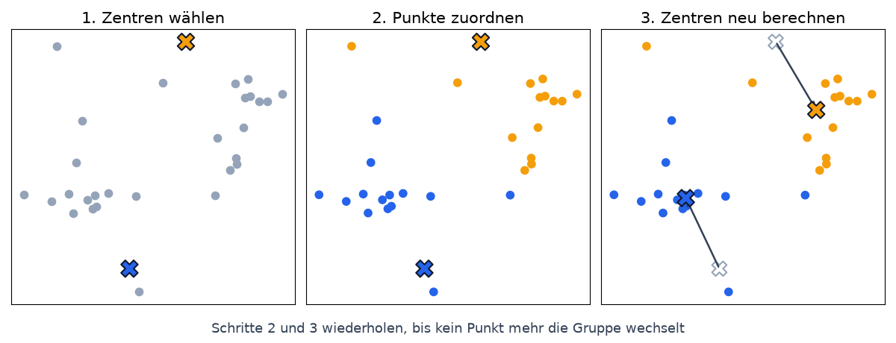

+ Meist stehen die Zentren nach wenigen Runden still: Das Verfahren ist konvergiert <!-- .element: class="fragment" data-fragment-index="1" -->
+ Ein anderer Start kann zu einem anderen Ergebnis führen. `n_init=10` startet zehnmal und behält den Lauf mit der kleinsten `inertia_`. <!-- .element: class="fragment" data-fragment-index="2" -->

--

<!-- .slide: class="smaller" -->
## `KMeans` in scikit-learn auf `make_blobs`

```python
import matplotlib.pyplot as plt
from sklearn.cluster import KMeans
from sklearn.datasets import make_blobs

# zweiter Rückgabewert (die wahren Gruppen) wird verworfen
X, _ = make_blobs(n_samples=600, random_state=1,
                  centers=[(-5, 7), (3, 3), (9, 0), (-9, -6)])

kmeans = KMeans(n_clusters=4, n_init=10, random_state=1)
labels = kmeans.fit_predict(X)            # Clusternummer je Punkt
print(kmeans.cluster_centers_.round(1))   # Koordinaten der 4 Zentren
print(round(kmeans.inertia_, 1))          # -> 1161.0

plt.scatter(X[:, 0], X[:, 1], c=labels, s=15)
plt.scatter(kmeans.cluster_centers_[:, 0], kmeans.cluster_centers_[:, 1],
            c="red", s=300, marker="X")
plt.show()
```

+ `make_blobs` erzeugt Punktwolken zum Ausprobieren, hier um vier fest vorgegebene Zentren <!-- .element: class="fragment" data-fragment-index="1" -->
+ `fit_predict(X)`: kein `y`, kein Train/Test-Split <!-- .element: class="fragment" data-fragment-index="2" -->

--

## Ergebnis: gefundene Cluster und Zentren

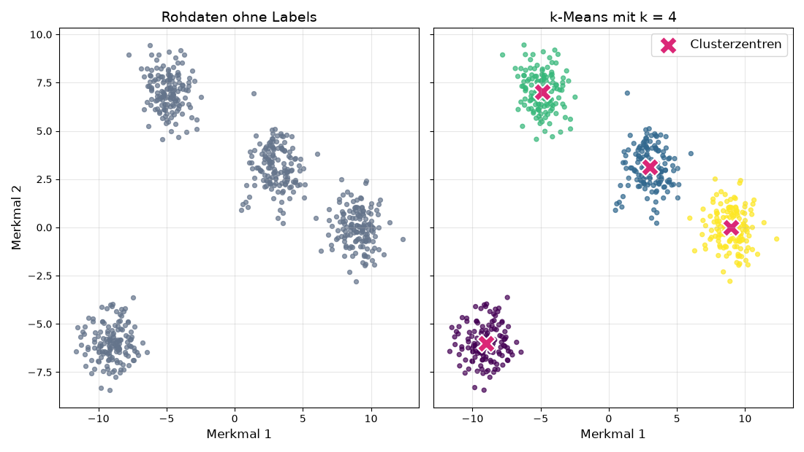

--

<!-- .slide: class="smaller" -->
## k wählen mit der Ellbogen-Kurve

<div class="two-col">
<div style="flex: 45">

```python
ks = range(1, 11)
inertias = []
for k in ks:
    km = KMeans(n_clusters=k, n_init=10,
                random_state=1)
    km.fit(X)
    inertias.append(km.inertia_)

plt.plot(ks, inertias, marker="o")
plt.xlabel("Anzahl Cluster k")
plt.ylabel("inertia_")
plt.show()
```

+ `inertia_` sinkt mit jedem weiteren Cluster, bei k = Anzahl der Punkte wäre sie 0 <!-- .element: class="fragment" data-fragment-index="1" -->
+ Gesucht ist der Knick: ab dort bringt ein weiteres Cluster nur noch wenig <!-- .element: class="fragment" data-fragment-index="2" -->

</div>
<div style="flex: 55">

<div class="fragment" data-fragment-index="3">

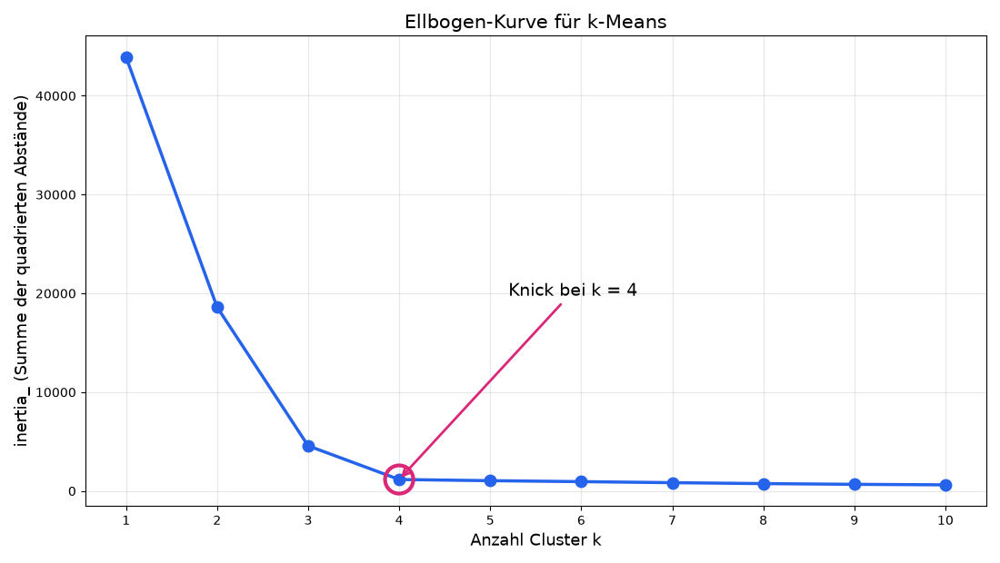

</div>

</div>
</div>

--

<!-- .slide: class="smaller" -->
## Silhouetten-Wert

Für jeden Punkt: Wie nah liegt er an seinem eigenen Cluster (a), wie nah am nächsten fremden Cluster (b)?

$s = \frac{b - a}{\max(a, b)}$

| Wert | Bedeutung |
|------|-----------|
| nahe 1 | Punkt liegt klar in seinem Cluster |
| nahe 0 | Punkt liegt auf der Grenze zwischen zwei Clustern |
| negativ | Punkt passt besser in ein anderes Cluster |

```python
from sklearn.metrics import silhouette_score

for k in range(2, 7):
    labels = KMeans(n_clusters=k, n_init=10, random_state=1).fit_predict(X)
    print(k, round(silhouette_score(X, labels), 2))
# -> 2 0.57 | 3 0.74 | 4 0.79 | 5 0.68 | 6 0.54
```

+ `silhouette_score` mittelt über alle Punkte. Der höchste Wert spricht für k = 4, passend zum Ellbogen. <!-- .element: class="fragment" data-fragment-index="1" -->

--

<!-- .slide: class="smaller" -->
## Skalieren vor dem Clustern

k-Means rechnet mit Abständen. Ohne Skalierung bestimmt das Merkmal mit den größten Zahlen fast allein das Ergebnis.

```python
import pandas as pd
df = pd.read_csv("data/versicherte.csv")
merkmale = ["alter", "bmi", "arztbesuche_jahr", "leistungsausgaben_eur"]
df = df.drop_duplicates().dropna(subset=merkmale)   # kein NaN erlaubt
print(df[merkmale].describe().loc[ ["min", "max", "std"] ].round(1))
```

+ Zwei Versicherte unterscheiden sich um 10 BMI-Punkte und um 1000 Euro Leistungsausgaben <!-- .element: class="fragment" data-fragment-index="1" -->
+ Quadrierter Abstand ohne Skalierung: 10² + 1000² = 100 + 1000000. Der BMI trägt 0.01 Prozent bei. <!-- .element: class="fragment" data-fragment-index="2" -->
+ Nach `StandardScaler` hat jedes Merkmal Mittelwert 0 und Standardabweichung 1 und zählt gleich viel <!-- .element: class="fragment" data-fragment-index="3" -->

<div class="fragment" data-fragment-index="4">

```python
from sklearn.preprocessing import StandardScaler
X_scaled = StandardScaler().fit_transform(df[merkmale])
```

</div>

<div class="fragment" data-fragment-index="5">

> [!warning]
> Ohne Skalierung segmentiert k-Means die Versicherten praktisch nur nach `leistungsausgaben_eur`.

</div>

--

<!-- .slide: class="smaller" -->
## Segmentierung der Versichertendaten: Cluster bilden

```python
from sklearn.cluster import KMeans

# 1. k prüfen: Ellbogen-Kurve auf den skalierten Daten
for k in range(2, 9):
    km = KMeans(n_clusters=k, n_init=10, random_state=1).fit(X_scaled)
    print(k, round(km.inertia_))

# 2. Mit dem gewählten k clustern und die Nummer in die Tabelle schreiben
kmeans = KMeans(n_clusters=4, n_init=10, random_state=1)
df["segment"] = kmeans.fit_predict(X_scaled)

# 3. Wie groß sind die Segmente?
print(df["segment"].value_counts().sort_index())
```

+ Geclustert wird auf `X_scaled`, beschrieben wird später auf den Originalwerten in `df` <!-- .element: class="fragment" data-fragment-index="1" -->
+ Nur Merkmale verwenden, die für die Fragestellung zählen. Eine Versichertennummer oder Postleitzahl hat im Abstand nichts verloren. <!-- .element: class="fragment" data-fragment-index="2" -->

--

<!-- .slide: class="smaller" -->
## Profil je Segment mit `groupby`

```python
# Mittelwerte der Originalmerkmale je Segment
profil = df.groupby("segment")[merkmale].mean().round(1)
profil["anzahl"] = df["segment"].value_counts().sort_index()
print(profil)

# Zum Vergleich: der Durchschnitt aller Versicherten
print(df[merkmale].mean().round(1))

# Merkmale, die nicht im Clustering waren, helfen beim Deuten
print(pd.crosstab(df["segment"], df["raucher"], normalize="index").round(2))
print(pd.crosstab(df["segment"], df["zusatzversicherung"],
                  normalize="index").round(2))
```

+ Lesen Sie die Profiltabelle zeilenweise: Worin weicht ein Segment am stärksten vom Gesamtdurchschnitt ab? <!-- .element: class="fragment" data-fragment-index="1" -->
+ Ein Segment mit sehr wenigen Mitgliedern besteht oft aus Ausreißern <!-- .element: class="fragment" data-fragment-index="2" -->
+ Auch `median()` ansehen: Einzelne sehr hohe Leistungsausgaben verzerren den Mittelwert <!-- .element: class="fragment" data-fragment-index="3" -->

--

<!-- .slide: class="smaller" -->
## Segmenten sprechende Namen geben

```python
# Namen aus der Profiltabelle ablesen. Die Nummern vergibt k-Means beliebig,
# deshalb erst die Tabelle lesen, dann das Wörterbuch schreiben.
namen = {
    0: "jung, selten beim Arzt",
    1: "mittleres Alter, durchschnittliche Ausgaben",
    2: "älter, viele Arztbesuche",
    3: "hohe Leistungsausgaben",
}
df["segment_name"] = df["segment"].map(namen)
print(df["segment_name"].value_counts())
```

+ Ein guter Name nennt die zwei oder drei Merkmale, in denen sich das Segment vom Durchschnitt abhebt <!-- .element: class="fragment" data-fragment-index="1" -->
+ Beschreibend bleiben, nicht wertend: „viele Arztbesuche" statt „Problemfälle" <!-- .element: class="fragment" data-fragment-index="2" -->
+ Prüfen Sie den Namen an Einzelfällen: `df[df["segment"] == 2].sample(5, random_state=1)` <!-- .element: class="fragment" data-fragment-index="3" -->

<div class="fragment" data-fragment-index="4">

> [!warning]
> Die Namen im Code sind Platzhalter. Welche Nummer zu welchem Profil gehört, zeigt erst Ihre Profiltabelle.

</div>

--

<!-- .slide: class="smaller" -->
## Grenzen von k-Means

| Grenze | Was passiert | Was Sie tun können |
|--------|--------------|--------------------|
| **Runde Cluster** | k-Means trennt nach Abstand zum Zentrum und findet nur kompakte, etwa kugelförmige Gruppen. Längliche oder ringförmige Gruppen werden zerschnitten. | anderes Verfahren (DBSCAN) |
| **Ausreißer** | Ein Extremwert zieht den Mittelwert und damit das Zentrum zu sich oder bekommt ein eigenes Cluster | Ausreißer vorher prüfen, schiefe Größen logarithmieren |
| **k vorgeben** | Das Verfahren liefert immer genau k Gruppen, auch wenn es keine gibt | Ellbogen, Silhouette, fachliche Prüfung |
| **Startwerte** | Ergebnis hängt vom Start ab | `n_init=10`, `random_state` setzen |
| **Nur Zahlen** | Mittelwerte und Abstände brauchen numerische, skalierte Merkmale | skalieren, Kategorien zur Beschreibung nutzen |

--

<!-- .slide: class="smaller" -->
## DBSCAN als Alternative

DBSCAN bildet Cluster dort, wo Punkte dicht beieinander liegen. Punkte in dünn besetzten Gegenden gelten als Rauschen.

```python
from sklearn.cluster import DBSCAN

X_blobs = StandardScaler().fit_transform(X)     # Blobs von vorhin, skaliert
labels = DBSCAN(eps=0.2, min_samples=5).fit_predict(X_blobs)
print(pd.Series(labels).value_counts().sort_index())
# -> -1: 2 | 0: 150 | 1: 149 | 2: 150 | 3: 149     (-1 = Rauschen)
```

| | k-Means | DBSCAN |
|---|---------|--------|
| Zahl der Cluster | geben Sie vor | ergibt sich |
| Form der Cluster | rund | beliebig |
| Ausreißer | werden einem Cluster zugeschlagen | bekommen das Label `-1` |
| Stellschrauben | `n_clusters` | `eps` (Radius der Nachbarschaft), `min_samples` |

+ Empfindlich gegenüber `eps`: mit `eps=0.3` verschmelzen hier zwei Wolken zu einem Cluster <!-- .element: class="fragment" data-fragment-index="1" -->

--

<!-- .slide: class="smaller" -->
## PCA zur zweidimensionalen Darstellung

Vier Merkmale lassen sich nicht in ein Streudiagramm zeichnen. PCA (Hauptkomponentenanalyse) bildet neue Achsen, die möglichst viel Streuung der Daten behalten.

```python
from sklearn.decomposition import PCA

pca = PCA(n_components=2, random_state=1)
X_pca = pca.fit_transform(X_scaled)               # 4 Spalten -> 2 Spalten

anteil = pca.explained_variance_ratio_
print(anteil.round(2), "Summe:", anteil.sum().round(2))

plt.scatter(X_pca[:, 0], X_pca[:, 1], c=df["segment"], s=8, alpha=0.5)
plt.xlabel(f"Hauptkomponente 1 ({anteil[0]:.0%})")
plt.ylabel(f"Hauptkomponente 2 ({anteil[1]:.0%})")
plt.show()
```

+ `explained_variance_ratio_`: Anteil der Gesamtstreuung je Hauptkomponente. Die Summe sagt, wie viel Information das 2D-Bild behält. <!-- .element: class="fragment" data-fragment-index="1" -->
+ Die Hauptkomponenten sind Mischungen der Originalmerkmale und unkorreliert. Vor der PCA die Merkmale standardisieren. <!-- .element: class="fragment" data-fragment-index="2" -->

--

## Segmente in der PCA-Ebene

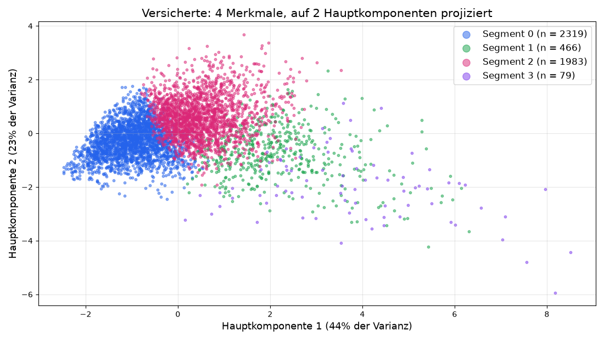

--

<!-- .slide: class="smaller" -->
## t-SNE als Ausblick

t-SNE (t-distributed Stochastic Neighbor Embedding) ordnet Punkte in 2D so an, dass Nachbarn aus dem hochdimensionalen Raum Nachbarn bleiben.

```python
from sklearn.manifold import TSNE

tsne = TSNE(n_components=2, random_state=1)
X_tsne = tsne.fit_transform(X_scaled)

plt.scatter(X_tsne[:, 0], X_tsne[:, 1], c=df["segment"], s=8, alpha=0.5)
plt.show()
```

| | PCA | t-SNE |
|---|-----|-------|
| Art | linear | nichtlinear |
| Achsen | deutbar (Mischung der Merkmale) | ohne Bedeutung |
| Abstände zwischen Gruppen | aussagekräftig | nicht aussagekräftig |
| Neue Daten | `transform` möglich | kein `transform` |
| Rechenzeit | kurz | deutlich länger |

+ t-SNE ist ein Werkzeug zum Ansehen von Daten, nicht zur Vorverarbeitung für Modelle <!-- .element: class="fragment" data-fragment-index="1" -->

--

## Zusammenfassung

+ Unüberwachtes Lernen arbeitet ohne Zielgröße. Clustering liefert Gruppennummern, die Bedeutung ergänzen Sie. <!-- .element: class="fragment" data-fragment-index="1" -->
+ k-Means: Zentren wählen, zuordnen, neu berechnen, wiederholen. Vorher skalieren, `n_init` und `random_state` setzen. <!-- .element: class="fragment" data-fragment-index="2" -->
+ k wählen: Knick in der Ellbogen-Kurve (`inertia_`), höchster `silhouette_score`, fachliche Brauchbarkeit <!-- .element: class="fragment" data-fragment-index="3" -->
+ Segmente beschreiben: `groupby("segment")` auf den Originalwerten, mit dem Gesamtdurchschnitt vergleichen, beschreibend benennen <!-- .element: class="fragment" data-fragment-index="4" -->
+ k-Means findet runde Cluster und leidet unter Ausreißern, DBSCAN ist eine Alternative. PCA zeigt viele Merkmale in 2D, `explained_variance_ratio_` sagt, wie viel dabei erhalten bleibt. <!-- .element: class="fragment" data-fragment-index="5" -->

---

<!-- .slide: data-background-color="#183b66" -->
# Teil 8: Einführung in Deep Learning

Vom einzelnen Neuron zum trainierten Netz in PyTorch, das Kleidungsstücke auf Bildern erkennt.

--

## Was Sie in diesem Teil lernen

+ Wie ein künstliches Neuron rechnet: Gewichte, Bias, Aktivierung <!-- .element: class="fragment" data-fragment-index="1" -->
+ Wie ein Netz trainiert wird: Vorwärtslauf, Verlust, Rückwärtslauf, Schritt des Optimierers <!-- .element: class="fragment" data-fragment-index="2" -->
+ Wie Sie in PyTorch Tensoren anlegen, ein `nn.Module` schreiben und es auf FashionMNIST trainieren <!-- .element: class="fragment" data-fragment-index="3" -->
+ Wie Sie die Genauigkeit (Accuracy) auf Testdaten messen und das Modell mit `state_dict` speichern <!-- .element: class="fragment" data-fragment-index="4" -->
+ Wann sich Deep Learning lohnt und wann ein klassisches Modell die bessere Wahl ist <!-- .element: class="fragment" data-fragment-index="5" -->

--

## Vom biologischen zum künstlichen Neuron

Künstliche neuronale Netze sind vom Gehirn inspiriert: Milliarden von Neuronen sind über Synapsen verbunden und tauschen elektrische und chemische Signale aus.

| Biologisches Netz               | Künstliches Netz                                  |
|---------------------------------|---------------------------------------------------|
| Neuron                          | Knoten im Netz                                    |
| Synapse                         | Verbindung mit einem **Gewicht**                  |
| elektrischer Impuls             | **Aktivierung**, berechnet aus den Eingabewerten  |
| Lernen durch Erfahrung          | Anpassen der Gewichte beim **Training**           |

--

<!-- .slide: class="smaller" -->
## Das künstliche Neuron: Gewichte, Bias, Aktivierung

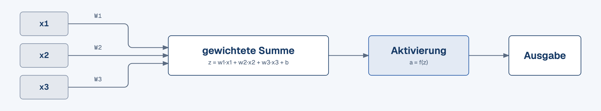

+ **Eingaben** `x`: die Merkmale, zum Beispiel Pixelwerte oder Spalten einer Tabelle <!-- .element: class="fragment" data-fragment-index="1" -->
+ **Gewichte** `w`: wie stark eine Eingabe weitergegeben wird <!-- .element: class="fragment" data-fragment-index="2" -->
+ **Bias** `b`: verschiebt die Schwelle, ab der das Neuron anspricht <!-- .element: class="fragment" data-fragment-index="3" -->
+ **Summation**: `z` ist die gewichtete Summe plus Bias (Präaktivierung) <!-- .element: class="fragment" data-fragment-index="4" -->
+ **Aktivierung**: eine Funktion `f` macht aus `z` den Ausgabewert `a` <!-- .element: class="fragment" data-fragment-index="5" -->

<div class="fragment" data-fragment-index="6">

> [!tip]
> Gewichte und Bias sind die Parameter, die das Training anpasst. Die Eingaben kommen aus den Daten.

</div>

--

<!-- .slide: class="smaller" -->
## Schichten: das Feed-Forward-Netz


+ Eine **Schicht** nimmt Eingaben entgegen, verarbeitet sie und gibt das Ergebnis weiter <!-- .element: class="fragment" data-fragment-index="1" -->
+ **Feed Forward**: von der Eingabe über versteckte Schichten zur Ausgabe, ohne Rückkopplung <!-- .element: class="fragment" data-fragment-index="2" -->
+ **Vollständig verbunden**: jedes Neuron einer Schicht hängt an jedem Neuron der nächsten <!-- .element: class="fragment" data-fragment-index="3" -->
+ Eine ganze Schicht ist eine Matrixrechnung: `Z = W X + b` <!-- .element: class="fragment" data-fragment-index="4" -->
+ In den versteckten Schichten entstehen **Merkmale**, die das Netz selbst aus den Daten bildet <!-- .element: class="fragment" data-fragment-index="5" -->

--

<!-- .slide: class="smaller" -->
## Warum Nichtlinearität und Tiefe helfen: XOR

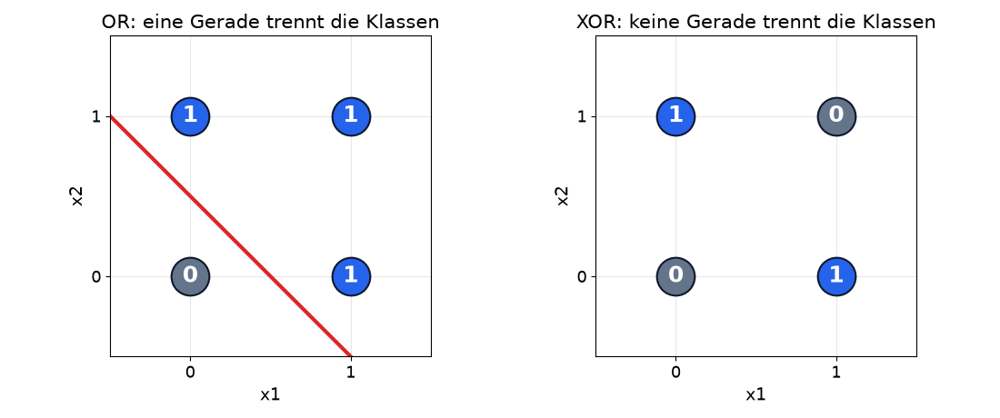

+ OR lässt sich mit einer einzigen Geraden trennen, XOR nicht <!-- .element: class="fragment" data-fragment-index="1" -->
+ Ein Netz aus nur linearen Schichten bleibt insgesamt eine lineare Funktion, egal wie viele Schichten es hat <!-- .element: class="fragment" data-fragment-index="2" -->
+ Erst die Aktivierungsfunktion zwischen den Schichten bringt Nichtlinearität ins Netz <!-- .element: class="fragment" data-fragment-index="3" -->
+ Mehr versteckte Schichten bedeuten mehr Tiefe: einfache Muster werden Schicht für Schicht zu komplexen kombiniert <!-- .element: class="fragment" data-fragment-index="4" -->

--

<!-- .slide: class="smaller" -->
## Aktivierungsfunktionen

| Funktion    | Formel                            | Wertebereich        | Typischer Einsatz                                             |
|-------------|-----------------------------------|---------------------|---------------------------------------------------------------|
| **ReLU**    | `max(0, z)`                       | 0 bis unendlich     | versteckte Schichten, Standardwahl in modernen Netzen         |
| **Sigmoid** | `1 / (1 + exp(-z))`               | 0 bis 1             | Ausgabe bei zwei Klassen, liest sich wie eine Wahrscheinlichkeit |
| **Tanh**    | `tanh(z)`                         | -1 bis 1            | ähnlich wie Sigmoid, gut für Werte um 0                       |
| **Softmax** | `exp(z_i) / Summe aller exp(z_j)` | 0 bis 1, Summe 1    | Ausgabe bei mehreren Klassen                                  |

+ ReLU setzt negative Werte auf 0: schnell zu rechnen und gut zu trainieren <!-- .element: class="fragment" data-fragment-index="1" -->
+ Sigmoid in versteckten Schichten gilt als veraltet, weil die Funktion an den Rändern sättigt <!-- .element: class="fragment" data-fragment-index="2" -->

<div class="fragment" data-fragment-index="3">

> [!warning]
> `nn.CrossEntropyLoss` in PyTorch rechnet Softmax schon mit ein. Die letzte Schicht gibt deshalb rohe Werte (Logits) aus, ohne eigene Softmax-Schicht.

</div>

--

## Aktivierungsfunktionen im Bild

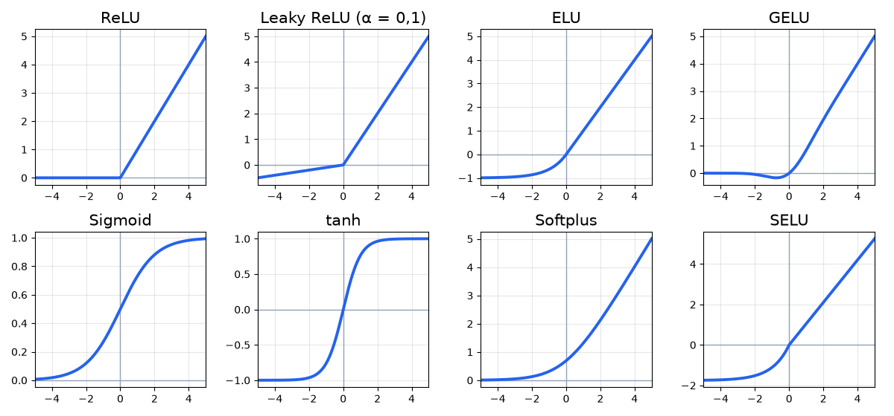

--

<!-- .slide: class="smaller" -->
## Verlustfunktionen

Die Verlustfunktion misst mit einer einzigen Zahl, wie schlecht die Vorhersagen sind. Das Training macht diese Zahl kleiner.

| Verlust                  | In einem Satz                                                                                   | PyTorch                 |
|--------------------------|--------------------------------------------------------------------------------------------------|-------------------------|
| **MSE**                  | Mittelwert der quadrierten Abstände zwischen Vorhersage und wahrem Wert, für Regression          | `nn.MSELoss()`          |
| **Cross-Entropy**        | Misst den Abstand zwischen vorhergesagten Klassenwahrscheinlichkeiten und wahren Labels, für mehrere Klassen | `nn.CrossEntropyLoss()` |
| **Binary Cross-Entropy** | Dasselbe für genau zwei Klassen, passt zu einer Sigmoid-Ausgabe                                   | `nn.BCELoss()`          |

> [!tip]
> Cross-Entropy bestraft große Abweichungen stark: eine falsche Vorhersage mit hoher Sicherheit kostet viel mehr als eine unsichere.

--

## Training als Schleife

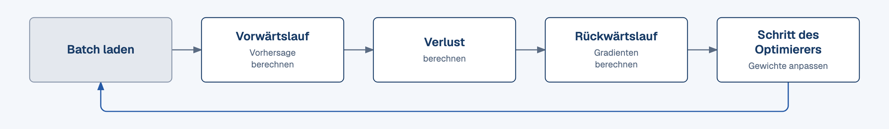

+ **Vorwärtslauf**: Eingaben laufen durch das Netz, am Ende steht eine Vorhersage <!-- .element: class="fragment" data-fragment-index="1" -->
+ **Verlust**: Vergleich von Vorhersage und wahrem Wert <!-- .element: class="fragment" data-fragment-index="2" -->
+ **Rückwärtslauf** (Backpropagation): für jedes Gewicht ausrechnen, in welche Richtung es den Verlust verändert <!-- .element: class="fragment" data-fragment-index="3" -->
+ **Schritt des Optimierers**: jedes Gewicht ein kleines Stück in die Richtung verschieben, die den Verlust senkt <!-- .element: class="fragment" data-fragment-index="4" -->

--

<!-- .slide: class="smaller" -->
## Epoche, Batch, Lernrate und Optimierer

| Begriff      | Bedeutung                                                                                  | Im Beispiel                   |
|--------------|---------------------------------------------------------------------------------------------|-------------------------------|
| **Batch**    | kleine Gruppe von Beispielen, auf der ein Gradient berechnet wird (üblich: 32 oder 64)     | `batch_size=64`               |
| **Epoche**   | ein vollständiger Durchlauf durch alle Trainingsdaten                                      | 60000 Bilder = 938 Batches    |
| **Lernrate** | Schrittweite, mit der die Gewichte angepasst werden                                        | `lr=1e-3`                     |
| **SGD**      | Gradientenabstieg auf Batches mit fester Lernrate                                          | `optim.SGD(..., lr=1e-2)`     |
| **Adam**     | Weiterentwicklung von SGD, passt die Schrittweite je Gewicht selbst an                     | `optim.Adam(..., lr=1e-3)`    |

+ Zu große Lernrate: der Verlust springt oder steigt. Zu kleine Lernrate: das Training kommt kaum voran <!-- .element: class="fragment" data-fragment-index="1" -->
+ Übliche Startwerte: `1e-2` für SGD, `1e-3` für Adam <!-- .element: class="fragment" data-fragment-index="2" -->

--

<!-- .slide: class="smaller" -->
## Overfitting bei Netzen: Dropout und Early Stopping

Ein Netz mit hunderttausend Gewichten kann die Trainingsdaten auswendig lernen. Das Zeichen dafür kennen Sie schon: der Verlust auf den Trainingsdaten sinkt weiter, der auf den Validierungsdaten steigt wieder.

<div class="two-col">
<div style="flex: 50">

**Dropout**

```python
self.drop = nn.Dropout(0.3)
```

- schaltet beim Training zufällig 30 % der Neuronen einer Schicht ab
- das Netz kann sich nicht auf einzelne Neuronen verlassen
- bei der Auswertung ist Dropout aus

</div>
<div style="flex: 50">

**Early Stopping**

- nach jeder Epoche den Verlust auf den Validierungsdaten messen
- die bisher besten Gewichte merken
- abbrechen, wenn sich der Wert mehrere Epochen lang nicht verbessert

</div>
</div>

> [!important]
> `model.train()` vor dem Training, `model.eval()` vor der Auswertung. Nur so ist Dropout zur richtigen Zeit an und aus.

--

<!-- .slide: class="smaller" -->
## PyTorch: Tensoren anlegen und rechnen

```python
import torch

x = torch.tensor([1, 2, 3])          # Tensor = n-dimensionales Array
zufall = torch.rand(2, 3)            # 2 Zeilen, 3 Spalten
print(zufall.shape, zufall.dtype)    # -> torch.Size([2, 3]) torch.float32

ones = torch.ones(2, 3)
print(x + ones)                      # Broadcasting wie in NumPy
# -> tensor([ [2., 3., 4.], [2., 3., 4.] ])

a = torch.tensor([ [1., 2], [3, 4] ])
b = torch.tensor([ [5., 6], [7, 8] ])
print(a @ b)      # Matrizenmultiplikation -> [ [19., 22.], [43., 50.] ]
print(a * b)      # elementweise           -> [ [ 5., 12.], [21., 32.] ]
print(a.sum(), b.mean())             # -> tensor(10.) tensor(6.5000)
```

Ein Tensor verhält sich wie ein NumPy-Array. Zusätzlich kann er Gradienten mitführen und auf einer Grafikkarte liegen.

--

<!-- .slide: class="smaller" -->
## Tensoren, NumPy und das Gerät

```python
import numpy as np

arr = np.array([ [1.0, 2.0], [3.0, 4.0] ])
t = torch.from_numpy(arr)            # NumPy -> Tensor, teilt den Speicher
print(t.dtype)                       # -> torch.float64
t = t.float()                        # float32, wie es nn.Linear erwartet
zurueck = t.numpy()                  # Tensor -> NumPy

device = torch.device("cpu")         # in diesem Kurs immer die CPU
t = t.to(device)
```

| Gerät  | Bedeutung                              |
|--------|----------------------------------------|
| `cpu`  | Prozessor, läuft überall               |
| `cuda` | NVIDIA-Grafikkarte                     |
| `mps`  | Grafikeinheit in Apple-Silicon-Rechnern |

> [!warning]
> NumPy rechnet mit `float64`, die Schichten in PyTorch mit `float32`. Ohne `.float()` bricht der Vorwärtslauf mit einem Typfehler ab.

--

## Autograd an einer kleinen Funktion

```python
x = torch.tensor(2.0, requires_grad=True)   # Gradienten mitführen

y = x**2 + 3*x + 5                          # f(x)
y.backward()                                # Ableitung berechnen

print(x.grad)                               # -> tensor(7.)
```

+ Von Hand: `f'(x) = 2*x + 3`, also `f'(2.0) = 7.0` <!-- .element: class="fragment" data-fragment-index="1" -->
+ `requires_grad=True`: PyTorch merkt sich jede Rechnung, an der `x` beteiligt ist <!-- .element: class="fragment" data-fragment-index="2" -->
+ `backward()` läuft diese Rechnungen rückwärts ab und legt die Ableitung in `x.grad` <!-- .element: class="fragment" data-fragment-index="3" -->
+ Genau das passiert im Rückwärtslauf für jedes Gewicht des Netzes <!-- .element: class="fragment" data-fragment-index="4" -->

--

<!-- .slide: class="smaller" -->
## Ein einzelner Trainingsschritt

```python
import torch.nn as nn
import torch.optim as optim

torch.manual_seed(42)
netz = nn.Linear(10, 1)                     # 10 Eingänge, 1 Ausgang: Wx + b
loss_fn = nn.MSELoss()
optimizer = optim.SGD(netz.parameters(), lr=1e-1)

x = torch.rand(10)                          # Eingabevektor
y = torch.ones(1)                           # Ziel: das Netz soll 1 ausgeben

loss = loss_fn(netz(x), y)                  # Vorwärtslauf und Verlust
print(f"Verlust vorher:  {loss.item():.4f}")
loss.backward()                             # Rückwärtslauf
optimizer.step()                            # Gewichte anpassen
print(f"Verlust nachher: {loss_fn(netz(x), y).item():.4f}")
```

Nach einem einzigen Schritt ist der Verlust kleiner als vorher. Training heißt, diesen Schritt viele tausend Mal zu wiederholen.

--

<!-- .slide: class="smaller" -->
## FashionMNIST laden

```python
from torch.utils.data import DataLoader
from torchvision import datasets
from torchvision.transforms import ToTensor

train_data = datasets.FashionMNIST(root="data", train=True,
                                   download=True, transform=ToTensor())
test_data = datasets.FashionMNIST(root="data", train=False,
                                  download=True, transform=ToTensor())

train_loader = DataLoader(train_data, batch_size=64, shuffle=True)
test_loader = DataLoader(test_data, batch_size=64, shuffle=False)

bilder, labels = next(iter(train_loader))
print(bilder.shape, labels.shape)
# -> torch.Size([64, 1, 28, 28]) torch.Size([64])
```

+ Graustufenbilder mit 28 x 28 Pixeln, zehn Produktkategorien (T-Shirt, Hose, Pullover, ...) <!-- .element: class="fragment" data-fragment-index="1" -->
+ 60000 Bilder zum Training, 10000 zum Testen <!-- .element: class="fragment" data-fragment-index="2" -->
+ `ToTensor()` macht aus jedem Bild einen Tensor mit Werten zwischen 0 und 1 <!-- .element: class="fragment" data-fragment-index="3" -->
+ Der `DataLoader` liefert die Daten in Batches und mischt die Trainingsdaten in jeder Epoche neu <!-- .element: class="fragment" data-fragment-index="4" -->

--

<!-- .slide: class="smaller" -->
## Ein `nn.Module` mit zwei Linearschichten

```python
class Netz(nn.Module):
    def __init__(self):
        super().__init__()
        self.flatten = nn.Flatten()              # 1x28x28 -> 784
        self.layer1 = nn.Linear(28 * 28, 128)    # 784 -> 128
        self.layer2 = nn.Linear(128, 10)         # 128 -> 10 Klassen

    def forward(self, x):
        x = self.flatten(x)
        x = torch.relu(self.layer1(x))           # x = ReLU(Wx + b)
        return self.layer2(x)                    # Logits, ohne Softmax

torch.manual_seed(42)
model = Netz()
print(sum(p.numel() for p in model.parameters()))    # -> 101770
```

+ `__init__` legt die Schichten an, `forward` beschreibt den Vorwärtslauf <!-- .element: class="fragment" data-fragment-index="1" -->
+ Sie rufen `forward` nicht direkt auf, sondern `model(bilder)` <!-- .element: class="fragment" data-fragment-index="2" -->
+ 101770 Parameter: `784*128 + 128` in der ersten, `128*10 + 10` in der zweiten Schicht <!-- .element: class="fragment" data-fragment-index="3" -->

--

<!-- .slide: class="smaller" -->
## Die vollständige Trainingsschleife

```python
loss_fn = nn.CrossEntropyLoss()              # mehrere Klassen
optimizer = optim.Adam(model.parameters(), lr=1e-3)
n_epochs = 3

for epoch in range(n_epochs):
    model.train()                            # Trainingsmodus
    running_loss = 0.0
    for bilder, labels in train_loader:
        optimizer.zero_grad()                # alte Gradienten löschen
        outputs = model(bilder)              # Vorwärtslauf
        loss = loss_fn(outputs, labels)      # Verlust
        loss.backward()                      # Rückwärtslauf
        optimizer.step()                     # Gewichte anpassen
        running_loss += loss.item()
    print(f"Epoche {epoch + 1}/{n_epochs}, "
          f"Verlust: {running_loss / len(train_loader):.4f}")
```

> [!warning]
> Ohne `optimizer.zero_grad()` addiert PyTorch die Gradienten aller Batches auf, und das Training läuft aus dem Ruder.

--

## Genauigkeit auf den Testdaten

```python
model.eval()                                 # Auswertungsmodus
correct, total = 0, 0

with torch.no_grad():                        # keine Gradienten nötig
    for bilder, labels in test_loader:
        outputs = model(bilder)
        predicted = outputs.argmax(dim=1)    # Klasse mit dem höchsten Logit
        total += labels.size(0)
        correct += (predicted == labels).sum().item()

print(f"Genauigkeit: {correct / total * 100:.2f} %")
```

+ `outputs` hat die Form `[64, 10]`: zehn Werte je Bild, der größte gewinnt <!-- .element: class="fragment" data-fragment-index="1" -->
+ Vergleichswert: ein untrainiertes Netz rät und liegt bei etwa 10 % (zehn Klassen) <!-- .element: class="fragment" data-fragment-index="2" -->

--

## Modell speichern und laden

```python
torch.save(model.state_dict(), "model.pth")      # nur die Gewichte

model2 = Netz()                                  # gleiche Architektur
model2.load_state_dict(torch.load("model.pth"))
model2.eval()                                    # bereit für Vorhersagen
```

+ `state_dict()` ist ein Wörterbuch: Name der Schicht, dazu der Tensor mit den Gewichten <!-- .element: class="fragment" data-fragment-index="1" -->
+ Gespeichert werden nur die Zahlen. Die Klasse `Netz` muss beim Laden als Code vorhanden sein <!-- .element: class="fragment" data-fragment-index="2" -->
+ `model2` liefert danach dieselben Vorhersagen wie `model` <!-- .element: class="fragment" data-fragment-index="3" -->

--

<!-- .slide: class="smaller" -->
## CNN: die Faltung

Ein kleiner Filter (zum Beispiel 3 x 3) wandert über das Bild. An jeder Stelle multipliziert er die Pixelwerte mit den Filterwerten und summiert die Produkte. Das Ergebnis ist eine **Feature Map**.

$$\underbrace{\begin{pmatrix} 1 & 2 & 3 \\ 4 & 5 & 6 \\ 7 & 8 & 9 \end{pmatrix}}_{\text{Bildausschnitt}} \odot \underbrace{\begin{pmatrix} 0 & 1 & 0 \\ 1 & -1 & 1 \\ 0 & 1 & 0 \end{pmatrix}}_{\text{Filter}} \;\Rightarrow\; 2 + 4 - 5 + 6 + 8 = 15$$

+ Der Filter erkennt ein lokales Muster, zum Beispiel eine Kante <!-- .element: class="fragment" data-fragment-index="1" -->
+ Derselbe Filter gilt für das ganze Bild: das Muster wird an jeder Position gefunden <!-- .element: class="fragment" data-fragment-index="2" -->
+ Die Filterwerte sind die Gewichte. Das Netz lernt sie im Training selbst <!-- .element: class="fragment" data-fragment-index="3" -->

<div class="fragment" data-fragment-index="4">

```python
nn.Conv2d(1, 32, kernel_size=3, padding=1)    # 1x28x28 -> 32x28x28
```

</div>

--

<!-- .slide: class="smaller" -->
## CNN: Pooling und der Nutzen für Bilder

$$\underbrace{\left(\begin{array}{cc|cc} 1 & 3 & 2 & 1 \\ 4 & 6 & 5 & 7 \\ \hline 8 & 6 & 9 & 4 \\ 3 & 2 & 4 & 8 \end{array}\right)}_{\text{Feature Map } 4 \times 4} \;\xrightarrow{\;\text{Max-Pooling } 2 \times 2\;}\; \begin{pmatrix} 6 & 7 \\ 8 & 9 \end{pmatrix}$$

+ **Max-Pooling** übernimmt je Bereich den größten Wert: die Feature Map schrumpft, die stärksten Signale bleiben <!-- .element: class="fragment" data-fragment-index="1" -->
+ Das spart Rechenaufwand und macht Merkmale robust gegen kleine Verschiebungen <!-- .element: class="fragment" data-fragment-index="2" -->
+ **Nachbarschaft bleibt erhalten**: eine Linearschicht sieht 784 einzelne Zahlen, eine Faltung sieht Pixel mit ihren Nachbarn <!-- .element: class="fragment" data-fragment-index="3" -->
+ **Wenige Parameter**: `Conv2d(1, 32, 3)` hat 320 Gewichte, die erste Linearschicht des Netzes von vorhin 100480 <!-- .element: class="fragment" data-fragment-index="4" -->
+ Typischer Aufbau: mehrmals Faltung, ReLU, Pooling, am Ende Linearschichten für die Klassen <!-- .element: class="fragment" data-fragment-index="5" -->

--

<!-- .slide: class="smaller" -->
## Hugging Face `datasets`

```python
from datasets import load_dataset
from torch.utils.data import DataLoader

ds = load_dataset("zalando-datasets/fashion_mnist")
print(ds)                  # DatasetDict mit den Teilen "train" und "test"

train = ds["train"].with_format("torch")    # Zugriff liefert Tensoren
beispiel = train[0]
print(beispiel["image"].shape, beispiel["label"])

loader = DataLoader(train, batch_size=64, shuffle=True)
```

+ Der Hugging Face Hub ist ein öffentlicher Katalog mit Datensätzen für Bild, Text und Audio <!-- .element: class="fragment" data-fragment-index="1" -->
+ `load_dataset("<name>")` lädt einen Datensatz einmal herunter und legt ihn im lokalen Cache ab <!-- .element: class="fragment" data-fragment-index="2" -->
+ `with_format("torch")` sorgt dafür, dass jeder Zugriff Tensoren liefert, die direkt in einen `DataLoader` passen <!-- .element: class="fragment" data-fragment-index="3" -->
+ Aufteilen geht ohne scikit-learn: `ds["train"].train_test_split(test_size=0.2, seed=42)` <!-- .element: class="fragment" data-fragment-index="4" -->

--

<!-- .slide: class="smaller" -->
## Typische Anwendungsfelder

| Daten              | Übliche Netze                        | Beispiele                                                        |
|--------------------|--------------------------------------|------------------------------------------------------------------|
| **Bilder**         | CNN                                  | Bilderkennung, Erkennen von Defekten in der Fertigung            |
| **Text und Sprache** | rekurrente Netze, heute Transformer | Spam-Erkennung, maschinelle Übersetzung, Spracherkennung, Chatbots |
| **Zeitreihen**     | rekurrente Netze                     | Vorhersage von Kursen oder Wetter                                |
| **Tabellendaten**  | Feed-Forward-Netze                   | Bewertung von Kreditrisiken                                      |

+ Bei Bildern, Audio und Text haben tiefe Netze die großen Durchbrüche gebracht <!-- .element: class="fragment" data-fragment-index="1" -->
+ Bei Tabellendaten gewinnen Gradient Boosting und Random Forest auf mittelgroßen Datensätzen (rund 10000 Zeilen) meist gegen neuronale Netze, bei deutlich geringerem Rechenaufwand (Grinsztajn, Oyallon, Varoquaux, NeurIPS 2022) <!-- .element: class="fragment" data-fragment-index="2" -->

--

<!-- .slide: class="smaller" -->
## Deep Learning oder klassisches ML

| Frage                                   | spricht für klassisches ML                          | spricht für Deep Learning                           |
|-----------------------------------------|-----------------------------------------------------|-----------------------------------------------------|
| Welche Daten liegen vor?                | Tabellen mit benannten Spalten                      | Bilder, Audio, freier Text                          |
| Wer bildet die Merkmale?                | Sie selbst, aus Fachwissen                          | das Netz, in den versteckten Schichten              |
| Wie viele Beispiele gibt es?            | reicht schon bei eher wenigen Beispielen            | zeigt seine Stärke erst bei sehr vielen Beispielen  |
| Muss das Modell erklärbar sein?         | Koeffizienten und Bäume lassen sich lesen           | 101770 Gewichte lassen sich nicht einzeln deuten    |
| Wie viel Rechenzeit ist vorhanden?      | Training auf dem Laptop                             | große Netze brauchen eine Grafikkarte               |

> [!tip]
> Beginnen Sie mit einem einfachen Modell aus scikit-learn als Vergleichswert. Ein Netz muss diesen Wert erst schlagen, bevor sich der Mehraufwand lohnt.

--

## Ausblick: Transformer und Sprachmodelle

+ Große Sprachmodelle (LLMs, zum Beispiel GPT und BERT) sind tiefe neuronale Netze <!-- .element: class="fragment" data-fragment-index="1" -->
+ Ihre Architektur heißt **Transformer**: der Attention-Mechanismus ersetzt die rekurrenten Schichten <!-- .element: class="fragment" data-fragment-index="2" -->
+ Trainiert werden sie mit derselben Schleife: Vorwärtslauf, Verlust, Rückwärtslauf, Schritt des Optimierers <!-- .element: class="fragment" data-fragment-index="3" -->
+ Anwendungen: Chatbots, Textassistenz, automatische Übersetzung <!-- .element: class="fragment" data-fragment-index="4" -->

<div class="fragment" data-fragment-index="5">

Literatur: Vaswani et al.: Attention Is All You Need (2017). Goodfellow, Bengio, Courville: Deep Learning (MIT Press, 2016). Zhang, Lipton, Li, Smola: Dive into Deep Learning (d2l.ai).

</div>

--

## Zusammenfassung

+ Ein Neuron rechnet `z = w*x + b` und wendet darauf eine Aktivierungsfunktion an. Ohne Aktivierung bliebe jedes Netz linear <!-- .element: class="fragment" data-fragment-index="1" -->
+ Training ist eine Schleife aus vier Schritten: `model(x)`, `loss_fn(...)`, `loss.backward()`, `optimizer.step()`, davor `optimizer.zero_grad()` <!-- .element: class="fragment" data-fragment-index="2" -->
+ Epochenzahl, Batchgröße und Lernrate steuern das Training. Dropout und Early Stopping bremsen Overfitting <!-- .element: class="fragment" data-fragment-index="3" -->
+ In PyTorch beschreiben Sie das Netz als `nn.Module`, laden Daten mit dem `DataLoader` und speichern die Gewichte mit `state_dict` <!-- .element: class="fragment" data-fragment-index="4" -->
+ Deep Learning spielt seine Stärke bei Bildern, Text und Audio aus. Für Tabellen bleiben die klassischen Modelle der Startpunkt <!-- .element: class="fragment" data-fragment-index="5" -->

---

<!-- .slide: data-background-color="#183b66" -->
# Teil 9: Der ML-Workflow mit scikit-learn

Aufbereitung, Modell und Bewertung in einem einzigen Objekt zusammenbauen, prüfen, speichern.

--

## Was Sie in diesem Teil lernen

+ Sie erkennen in scikit-learn-Klassen dieselben drei Methoden: `fit`, `transform`, `predict` <!-- .element: class="fragment" data-fragment-index="1" -->
+ Sie finden ein Datenleck im Code und schreiben die richtige Fassung <!-- .element: class="fragment" data-fragment-index="2" -->
+ Sie bauen aus Aufbereitung und Modell eine `Pipeline` und behandeln Zahlen- und Textspalten mit `ColumnTransformer` getrennt <!-- .element: class="fragment" data-fragment-index="3" -->
+ Sie prüfen die ganze Pipeline mit Cross-Validation und stellen sie mit `GridSearchCV` ein <!-- .element: class="fragment" data-fragment-index="4" -->
+ Sie speichern die fertige Pipeline und halten fest, womit sie entstanden ist <!-- .element: class="fragment" data-fragment-index="5" -->

--

<!-- .slide: class="smaller" -->
## Die drei Rollen in scikit-learn

| Rolle | Methoden | Was passiert | Beispiele |
|---|---|---|---|
| **Estimator** | `fit(X, y)` | lernt etwas aus Daten und merkt es sich | jede Klasse, die aus Daten lernt |
| **Transformer** | `fit`, `transform`, `fit_transform` | lernt Kennwerte und rechnet Daten damit um | `StandardScaler`, `OneHotEncoder`, `SimpleImputer`, `PCA` |
| **Predictor** | `fit`, `predict`, `score` | lernt ein Modell und sagt damit vorher | `LogisticRegression`, `RandomForestClassifier`, `KMeans` |

+ Gelernte Größen enden auf einen Unterstrich: `scaler.mean_`, `modell.coef_`, `kmeans.cluster_centers_` <!-- .element: class="fragment" data-fragment-index="1" -->
+ Einstellungen, die Sie selbst setzen, stehen im Konstruktor: `max_depth=5`, `strategy="median"` <!-- .element: class="fragment" data-fragment-index="2" -->
+ Weil diese Klassen dieselben Methoden haben, lassen sie sich hintereinanderstecken <!-- .element: class="fragment" data-fragment-index="3" -->

--

## `fit`, `transform`, `predict` im Code

```python
from sklearn.datasets import load_breast_cancer
from sklearn.model_selection import train_test_split
from sklearn.preprocessing import StandardScaler
from sklearn.linear_model import LogisticRegression

X, y = load_breast_cancer(return_X_y=True)
X_train, X_test, y_train, y_test = train_test_split(
    X, y, test_size=0.3, random_state=1, stratify=y)

scaler = StandardScaler()
scaler.fit(X_train)                    # lernt Mittelwert und Streuung
X_train_s = scaler.transform(X_train)  # rechnet um
print(scaler.mean_[:2])                # gelernte Größe, mit Unterstrich

modell = LogisticRegression(max_iter=1000)
modell.fit(X_train_s, y_train)         # lernt die Koeffizienten
```

--

## Das Datenleck am falschen Beispiel

```python
# FALSCH: der Scaler sieht alle Daten, auch die späteren Testdaten
scaler = StandardScaler()
X_scaled = scaler.fit_transform(X)

X_train, X_test, y_train, y_test = train_test_split(
    X_scaled, y, test_size=0.3, random_state=1, stratify=y)

modell = LogisticRegression(max_iter=1000)
modell.fit(X_train, y_train)
print(modell.score(X_test, y_test))
```

+ Der Code läuft ohne Fehlermeldung und liefert eine plausible Zahl <!-- .element: class="fragment" data-fragment-index="1" -->
+ Mittelwert und Streuung stammen aber auch aus den Testzeilen <!-- .element: class="fragment" data-fragment-index="2" -->
+ Die Testdaten sind damit nicht mehr ungesehen <!-- .element: class="fragment" data-fragment-index="3" -->

--

<!-- .slide: class="smaller" -->
## Was beim Leck durchsickert

```python
import pandas as pd
df = pd.read_csv("data/titanic.csv")
X_num = df[ ["Age", "Fare"] ].fillna(df[ ["Age", "Fare"] ].median())

X_tr, X_te = train_test_split(X_num, test_size=0.2, random_state=1)
print(StandardScaler().fit(X_num).mean_)  # -> [29.36 32.20]  alle Zeilen
print(StandardScaler().fit(X_tr).mean_)   # -> [29.73 31.95]  nur Training
```

| Schritt | Was aus den Testdaten ins Training gelangt |
|---|---|
| Skalieren vor dem Split | Mittelwert und Standardabweichung |
| Fehlende Werte vor dem Split füllen | Median oder häufigster Wert |
| Encoding vor dem Split | Kategorien, die nur in den Testdaten vorkommen |
| Ausreißer vor dem Split entfernen | Quartile und Grenzen |

> [!warning]
> Auch `fillna(df.median())` in Zeile 3 ist ein Leck: Der Median stammt aus allen Zeilen.

--

## Die richtige Fassung von Hand

```python
# RICHTIG: erst teilen, dann nur auf den Trainingsdaten lernen
X_train, X_test, y_train, y_test = train_test_split(
    X, y, test_size=0.3, random_state=1, stratify=y)

scaler = StandardScaler()
X_train_s = scaler.fit_transform(X_train)  # fit NUR auf Training
X_test_s = scaler.transform(X_test)        # Testdaten nur umrechnen

modell = LogisticRegression(max_iter=1000)
modell.fit(X_train_s, y_train)
print(modell.score(X_test_s, y_test))
```

> [!tip]
> Merkregel: `fit` und `fit_transform` sehen nur Trainingsdaten. Testdaten bekommen ausschließlich `transform` und `predict`.

--

## Wo die Handarbeit an Grenzen stößt

+ Jeder weitere Schritt (fehlende Werte füllen, Encoding, Skalierung) braucht wieder ein eigenes `fit` auf Training und `transform` auf Test <!-- .element: class="fragment" data-fragment-index="1" -->
+ Bei Cross-Validation müssten Sie das in jedem der fünf Durchgänge neu tun <!-- .element: class="fragment" data-fragment-index="2" -->
+ Für neue Daten im Einsatz müssen alle Schritte in derselben Reihenfolge noch einmal laufen <!-- .element: class="fragment" data-fragment-index="3" -->
+ Beim Speichern brauchen Sie Scaler, Encoder und Modell als getrennte Dateien <!-- .element: class="fragment" data-fragment-index="4" -->

<div class="fragment" data-fragment-index="5">

> [!important]
> Eine `Pipeline` fasst alle Schritte in einem Objekt mit einem `fit` und einem `predict` zusammen.

</div>

--

## `Pipeline` mit zwei Schritten

```python
from sklearn.pipeline import Pipeline

pipe = Pipeline([
    ("scaler", StandardScaler()),
    ("modell", LogisticRegression(max_iter=1000)),
])

pipe.fit(X_train, y_train)          # rohe Trainingsdaten hinein
print(pipe.score(X_test, y_test))   # rohe Testdaten hinein
```

+ Jeder Schritt ist ein Paar aus frei gewähltem Namen und Objekt <!-- .element: class="fragment" data-fragment-index="1" -->
+ Alle Schritte außer dem letzten müssen Transformer sein <!-- .element: class="fragment" data-fragment-index="2" -->
+ Der letzte Schritt ist meist ein Predictor <!-- .element: class="fragment" data-fragment-index="3" -->

--

<!-- .slide: class="smaller" -->
## Was `fit` und `predict` in der Pipeline auslösen

```text
pipe.fit(X_train, y_train)
    scaler.fit_transform(X_train)   ->  X_train_s
    modell.fit(X_train_s, y_train)

pipe.predict(X_test)
    scaler.transform(X_test)        ->  X_test_s      (kein fit!)
    modell.predict(X_test_s)        ->  y_pred
```

+ Bei `fit` ruft die Pipeline für jeden Transformer `fit_transform` auf und reicht das Ergebnis weiter <!-- .element: class="fragment" data-fragment-index="1" -->
+ Bei `predict` und `score` ruft sie nur `transform` auf <!-- .element: class="fragment" data-fragment-index="2" -->
+ Die Merkregel von eben ist damit fest eingebaut <!-- .element: class="fragment" data-fragment-index="3" -->

--

## Auf einzelne Schritte zugreifen

```python
pipe.named_steps["scaler"].mean_[:2]   # gelernte Größe des Scalers
pipe.named_steps["modell"].coef_       # Koeffizienten des Modells
pipe[:-1].transform(X_test)            # Daten nach der Aufbereitung

pipe.get_params()["modell__C"]         # -> 1.0
pipe.set_params(modell__C=0.1)         # Einstellung ändern
```

> [!tip]
> Parameter eines Schritts sprechen Sie mit `schrittname__parameter` an, mit doppeltem Unterstrich.

--

<!-- .slide: class="smaller" -->
## Titanic: Spalten wählen

```python
import pandas as pd

df = pd.read_csv("data/titanic.csv")

num_cols = ["Age", "Fare", "SibSp", "Parch"]
cat_cols = ["Pclass", "Sex", "Embarked"]

X = df[num_cols + cat_cols]
y = df["Survived"]
print(X.isna().sum())   # -> Age 177, Embarked 2, sonst 0
```

| Spalte | Entscheidung |
|---|---|
| `PassengerId`, `Name`, `Ticket` | weglassen: Kennungen ohne verallgemeinerbaren Inhalt |
| `Cabin` | weglassen: bei den meisten Zeilen leer |
| `Pclass` | als Kategorie behandeln: 1, 2, 3 sind Klassen, keine Messwerte |
| `Age`, `Embarked` | behalten, fehlende Werte füllt die Pipeline |

--

## Split mit `stratify`

```python
from sklearn.model_selection import train_test_split

X_train, X_test, y_train, y_test = train_test_split(
    X, y, test_size=0.2, random_state=1, stratify=y)

print(X_train.shape, X_test.shape)   # -> (712, 7) (179, 7)
print(y_train.mean(), y_test.mean()) # -> 0.383 0.385
```

+ `stratify=y` hält den Anteil der Überlebenden in beiden Teilen gleich <!-- .element: class="fragment" data-fragment-index="1" -->
+ `random_state=1` liefert bei jedem Lauf dieselbe Aufteilung <!-- .element: class="fragment" data-fragment-index="2" -->
+ Die Testdaten legen Sie jetzt zur Seite, bis das Modell fertig eingestellt ist <!-- .element: class="fragment" data-fragment-index="3" -->

--

## Aufbereitung je Spaltengruppe mit `ColumnTransformer`

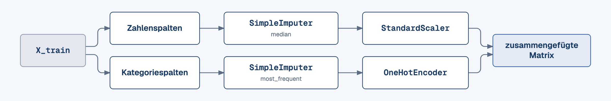

+ Zahlen und Kategorien brauchen verschiedene Aufbereitung <!-- .element: class="fragment" data-fragment-index="1" -->
+ `ColumnTransformer` wendet auf jede Spaltengruppe einen eigenen Transformer an und klebt die Ergebnisse nebeneinander <!-- .element: class="fragment" data-fragment-index="2" -->

--

## Zwei kleine Pipelines für zwei Spaltengruppen

```python
from sklearn.pipeline import Pipeline
from sklearn.impute import SimpleImputer
from sklearn.preprocessing import OneHotEncoder, StandardScaler

numeric_pipe = Pipeline([
    ("imputer", SimpleImputer(strategy="median")),
    ("scaler", StandardScaler()),
])

categorical_pipe = Pipeline([
    ("imputer", SimpleImputer(strategy="most_frequent")),
    ("encoder", OneHotEncoder(handle_unknown="ignore")),
])
```

+ Zahlen: fehlende Werte mit dem Median füllen, danach standardisieren <!-- .element: class="fragment" data-fragment-index="1" -->
+ Kategorien: fehlende Werte mit dem häufigsten Wert füllen, danach One-Hot-Encoding <!-- .element: class="fragment" data-fragment-index="2" -->

--

## `ColumnTransformer` zusammensetzen

```python
from sklearn.compose import ColumnTransformer

preprocess = ColumnTransformer([
    ("num", numeric_pipe, num_cols),
    ("cat", categorical_pipe, cat_cols),
])

Xt = preprocess.fit_transform(X_train)
print(Xt.shape)                          # -> (712, 12)
print(preprocess.get_feature_names_out())
```

```text
['num__Age' 'num__Fare' 'num__SibSp' 'num__Parch' 'cat__Pclass_1'
 'cat__Pclass_2' 'cat__Pclass_3' 'cat__Sex_female' 'cat__Sex_male'
 'cat__Embarked_C' 'cat__Embarked_Q' 'cat__Embarked_S']
```

--

<!-- .slide: class="smaller" -->
## `handle_unknown="ignore"` und unbekannte Kategorien

```python
hafen = X_train[ ["Embarked"] ].dropna()
neu = pd.DataFrame({"Embarked": ["X"]})   # Hafen fehlt im Training

streng = OneHotEncoder()                  # Standard: "error"
streng.fit(hafen)
streng.transform(neu)                     # -> ValueError

tolerant = OneHotEncoder(handle_unknown="ignore")
tolerant.fit(hafen)
print(tolerant.transform(neu).toarray())  # -> [ [0. 0. 0.] ]
```

+ Im Einsatz tauchen Kategorien auf, die das Training nie gesehen hat <!-- .element: class="fragment" data-fragment-index="1" -->
+ Mit `"ignore"` bekommt eine solche Zeile in allen Spalten dieser Kategorie eine 0 <!-- .element: class="fragment" data-fragment-index="2" -->
+ Das Modell rechnet weiter, statt mit einer Fehlermeldung abzubrechen <!-- .element: class="fragment" data-fragment-index="3" -->

--

## Vollständige Pipeline mit logistischer Regression

```python
from sklearn.linear_model import LogisticRegression

clf = Pipeline([
    ("prep", preprocess),
    ("modell", LogisticRegression(max_iter=1000)),
])

clf.fit(X_train, y_train)
```

+ `X_train` geht als DataFrame mit fehlenden Werten und Text hinein <!-- .element: class="fragment" data-fragment-index="1" -->
+ `prep` füllt, skaliert und kodiert, `modell` lernt auf dem Ergebnis <!-- .element: class="fragment" data-fragment-index="2" -->
+ Ein einziges Objekt `clf` enthält jetzt die gesamte Verarbeitung <!-- .element: class="fragment" data-fragment-index="3" -->

--

## Modell tauschen: Random Forest

```python
from sklearn.ensemble import RandomForestClassifier

rf = Pipeline([
    ("prep", preprocess),
    ("modell", RandomForestClassifier(n_estimators=200, random_state=1)),
])

rf.fit(X_train, y_train)
```

+ Die Aufbereitung bleibt unverändert, nur der letzte Schritt wechselt <!-- .element: class="fragment" data-fragment-index="1" -->
+ Bäume brauchen keine Skalierung, sie schadet ihnen aber auch nicht <!-- .element: class="fragment" data-fragment-index="2" -->
+ `random_state=1` im Modell, weil der Random Forest selbst Zufall benutzt <!-- .element: class="fragment" data-fragment-index="3" -->

--

## Cross-Validation der ganzen Pipeline

```python
from sklearn.model_selection import cross_val_score

for name, pipe in [("LogReg", clf), ("RandomForest", rf)]:
    scores = cross_val_score(pipe, X_train, y_train,
                             cv=5, scoring="accuracy")
    print(f"{name}: {scores.mean():.3f} +/- {scores.std():.3f}")

# -> LogReg: 0.795 +/- 0.018
# -> RandomForest: 0.780 +/- 0.031
```

> [!important]
> In jedem der fünf Durchgänge lernt die Pipeline Median, Skalierung und Kategorien neu, nur aus dem jeweiligen Trainingsteil.

--

<!-- .slide: class="smaller" -->
## `GridSearchCV` über Pipeline-Parameter

```python
from sklearn.model_selection import GridSearchCV

param_grid = {
    "modell__max_depth": [3, 5, 8, None],
    "modell__min_samples_leaf": [1, 3, 5],
}

search = GridSearchCV(rf, param_grid, cv=5, scoring="accuracy", n_jobs=-1)
search.fit(X_train, y_train)

print(search.best_params_)
# -> {'modell__max_depth': 5, 'modell__min_samples_leaf': 1}
print(round(search.best_score_, 3))   # -> 0.81
```

+ `modell__max_depth` heißt: Parameter `max_depth` im Schritt `modell` <!-- .element: class="fragment" data-fragment-index="1" -->
+ 4 mal 3 Kombinationen mal 5 Durchgänge ergeben 60 Trainingsläufe <!-- .element: class="fragment" data-fragment-index="2" -->

--

## Ergebnisse der Suche lesen

```python
ergebnis = pd.DataFrame(search.cv_results_)
spalten = ["param_modell__max_depth", "param_modell__min_samples_leaf",
           "mean_test_score", "std_test_score", "rank_test_score"]
print(ergebnis[spalten].sort_values("rank_test_score").head())

best = search.best_estimator_     # fertige, neu trainierte Pipeline
```

+ `mean_test_score` ist der Mittelwert über die fünf Validierungsteile, nicht das Testset <!-- .element: class="fragment" data-fragment-index="1" -->
+ Liegen die besten Zeilen enger beieinander als `std_test_score`, wählen Sie das einfachere Modell <!-- .element: class="fragment" data-fragment-index="2" -->
+ `best_estimator_` ist die Pipeline mit den besten Einstellungen, trainiert auf allen Trainingsdaten <!-- .element: class="fragment" data-fragment-index="3" -->

--

<!-- .slide: class="smaller" -->
## Auswertung auf dem Testset

```python
from sklearn.metrics import classification_report, confusion_matrix

y_pred = best.predict(X_test)
print(confusion_matrix(y_test, y_pred))
print(classification_report(y_test, y_pred, digits=2))
```

```text
[ [101   9]
  [ 19  50] ]
              precision    recall  f1-score   support
           0       0.84      0.92      0.88       110
           1       0.85      0.72      0.78        69
    accuracy                           0.84       179
```

> [!warning]
> Das Testset benutzen Sie genau einmal, ganz am Ende. Wer danach weiter einstellt und erneut misst, hat kein Testset mehr.

--

<!-- .slide: class="smaller" -->
## Pipeline speichern und laden

```python
import joblib

joblib.dump(best, "titanic_pipeline.joblib")

geladen = joblib.load("titanic_pipeline.joblib")
print(geladen.score(X_test, y_test))   # -> 0.84, wie vorher
```

+ Eine Datei enthält Imputer, Scaler, Encoder und Modell mit allen gelernten Größen <!-- .element: class="fragment" data-fragment-index="1" -->
+ Aufbereitung und Modell können im Einsatz nicht mehr auseinanderlaufen <!-- .element: class="fragment" data-fragment-index="2" -->
+ Zum Laden brauchen Sie dieselbe scikit-learn-Version wie beim Speichern: Laden mit einer anderen Version wird nicht unterstützt <!-- .element: class="fragment" data-fragment-index="3" -->

<div class="fragment" data-fragment-index="4">

> [!warning]
> Laden Sie `.joblib`-Dateien nur aus vertrauenswürdiger Quelle: Beim Laden kann beliebiger Code ausgeführt werden.

</div>

--

## Vorhersage für neue Daten

```python
neu = pd.DataFrame([{
    "Age": 30, "Fare": 50.0, "SibSp": 0, "Parch": 0,
    "Pclass": 1, "Sex": "female", "Embarked": "S",
}])

print(geladen.predict(neu))                  # -> [1]
print(geladen.predict_proba(neu).round(2))   # -> [ [0.06 0.94] ]
```

+ Neue Daten kommen als DataFrame mit denselben Spaltennamen wie im Training <!-- .element: class="fragment" data-fragment-index="1" -->
+ Fehlende Werte dürfen vorkommen, die Pipeline füllt sie mit den gelernten Werten <!-- .element: class="fragment" data-fragment-index="2" -->
+ Die Reihenfolge der Spalten ist egal, `ColumnTransformer` wählt nach Namen aus <!-- .element: class="fragment" data-fragment-index="3" -->

--

<!-- .slide: class="smaller" -->
## Reproduzierbarkeit

```python
import sys, sklearn, pandas, numpy
print(sys.version.split()[0], sklearn.__version__,
      pandas.__version__, numpy.__version__)
```

+ `random_state=1` an jeder Stelle mit Zufall: `train_test_split`, `RandomForestClassifier`, `KMeans`, `KFold(shuffle=True)` <!-- .element: class="fragment" data-fragment-index="1" -->
+ Versionen von Python, scikit-learn, pandas und numpy zusammen mit dem Modell notieren <!-- .element: class="fragment" data-fragment-index="2" -->
+ Rohdaten unverändert lassen und die Datei benennen, mit der trainiert wurde (Name, Datum, Zeilenzahl) <!-- .element: class="fragment" data-fragment-index="3" -->
+ Das ganze Notebook von oben nach unten durchlaufen lassen, bevor Sie Ergebnisse weitergeben <!-- .element: class="fragment" data-fragment-index="4" -->

<div class="fragment" data-fragment-index="5">

> [!tip]
> Test für Reproduzierbarkeit: Kernel neu starten, alles ausführen, dieselben Zahlen erhalten.

</div>

--

## Der Workflow im Überblick

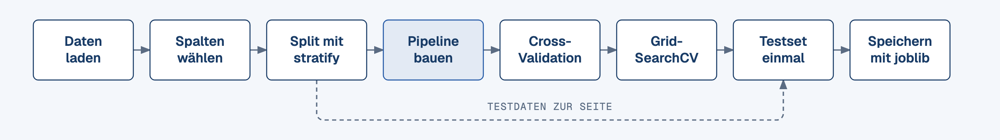

+ Alles zwischen Split und Testset läuft nur auf den Trainingsdaten <!-- .element: class="fragment" data-fragment-index="1" -->
+ Die Pipeline ist das Objekt, das durch alle Schritte wandert <!-- .element: class="fragment" data-fragment-index="2" -->

--

<!-- .slide: class="smaller" -->
## Checkliste: minimaler reproduzierbarer Workflow

+ Zielgröße und Merkmalsspalten ausdrücklich benennen, Kennungen weglassen <!-- .element: class="fragment" data-fragment-index="1" -->
+ `train_test_split` mit `random_state` und bei Klassifikation mit `stratify=y`, vor jeder Aufbereitung <!-- .element: class="fragment" data-fragment-index="2" -->
+ Imputation, Skalierung und Encoding stehen in der Pipeline, nicht davor <!-- .element: class="fragment" data-fragment-index="3" -->
+ `OneHotEncoder(handle_unknown="ignore")` für Kategorien <!-- .element: class="fragment" data-fragment-index="4" -->
+ Modellvergleich und Einstellung nur über Cross-Validation auf den Trainingsdaten <!-- .element: class="fragment" data-fragment-index="5" -->
+ Kennzahl passend zur Fragestellung wählen, bei ungleichen Klassen nicht Accuracy <!-- .element: class="fragment" data-fragment-index="6" -->
+ Testset genau einmal auswerten <!-- .element: class="fragment" data-fragment-index="7" -->
+ Pipeline mit `joblib.dump` speichern, Versionen und Datenstand dazuschreiben <!-- .element: class="fragment" data-fragment-index="8" -->

--

<!-- .slide: class="smaller" -->
## Häufige Fehler im Workflow

| Fehler | Folge |
|---|---|
| Scaler oder Encoder auf allen Daten anpassen, dann teilen | Datenleck, zu gute Zahlen |
| Zeilen mit fehlender Zielgröße löschen, ohne nach dem Grund zu fragen | verzerrte Stichprobe |
| Automatisch erkannten Datentypen vertrauen (Datum, Ja/Nein) | falsche Aufbereitung |
| Accuracy bei ungleichen Klassen | das Modell übersieht die seltene Klasse |
| Kategorien mit sehr vielen Ausprägungen ungeprüft one-hot-kodieren | tausende fast leere Spalten |
| Aufbereitung nicht mit dem Modell versionieren | Modell lässt sich nicht nachvollziehen |
| Zufälliger Split bei zeitlich geordneten Daten | das Modell lernt aus der Zukunft |

--

## Zusammenfassung

+ Transformer und Modelle teilen sich `fit`, `transform` und `predict`, deshalb lassen sie sich zu einer `Pipeline` verketten <!-- .element: class="fragment" data-fragment-index="1" -->
+ Ein Datenleck entsteht, sobald `fit` Testdaten sieht. Die Pipeline verhindert das, auch in jedem Durchgang der Cross-Validation <!-- .element: class="fragment" data-fragment-index="2" -->
+ `ColumnTransformer` gibt Zahlen- und Kategoriespalten getrennte Aufbereitung, `handle_unknown="ignore"` fängt neue Kategorien ab <!-- .element: class="fragment" data-fragment-index="3" -->
+ `GridSearchCV` stellt Pipeline-Parameter über `schritt__parameter` ein, das Testset kommt genau einmal am Ende <!-- .element: class="fragment" data-fragment-index="4" -->
+ Eine `.joblib`-Datei mit notierten Versionen und `random_state` macht das Ergebnis wiederholbar <!-- .element: class="fragment" data-fragment-index="5" -->

---

<!-- .slide: data-background-color="#183b66" -->
# Teil 10: Praxisbeispiele und Interpretation von Modellen

Drei Fragestellungen mit demselben Workflow lösen und danach prüfen, was die Modelle gelernt haben.

--

## Was Sie in diesem Teil lernen

+ Sie übertragen den Pipeline-Workflow auf Klassifikation, Regression und Clustering <!-- .element: class="fragment" data-fragment-index="1" -->
+ Sie bewerten ein Modell bei stark ungleichen Klassen mit Recall und Precision statt Accuracy <!-- .element: class="fragment" data-fragment-index="2" -->
+ Sie lesen Koeffizienten, einen Entscheidungsbaum und Merkmalswichtigkeiten <!-- .element: class="fragment" data-fragment-index="3" -->
+ Sie kennen die Schwächen von `feature_importances_` und setzen `permutation_importance` ein <!-- .element: class="fragment" data-fragment-index="4" -->
+ Sie wissen, was eine Interpretation aussagt, was nicht, und was in einen Ergebnisbericht gehört <!-- .element: class="fragment" data-fragment-index="5" -->

--

<!-- .slide: class="smaller" -->
## Drei Beispiele, ein Ablauf

| | Klassifikation | Regression | Clustering |
|---|---|---|---|
| **Frage** | Fällt die Maschine aus? | Wie hoch ist der Hauswert? | Welche Gruppen von Versicherten gibt es? |
| **Datei** | `data/ai4i2020.csv` | `data/california_housing.csv` | `data/versicherte.csv` |
| **Zielgröße** | `Machine failure` (0/1) | `MedHouseVal` | keine |
| **Besonderheit** | nur 3,4 % Ausfälle | Deckelung der Zielgröße | Skalierung entscheidet über das Ergebnis |
| **Kennzahl** | Recall, Precision | RMSE, MAE, R² | Segmentprofil, fachliche Lesbarkeit |
| **Letzter Schritt der Pipeline** | `RandomForestClassifier` | `LinearRegression` | `KMeans` |

--

<!-- .slide: class="smaller" -->
## Klassifikation: Maschinenausfall vorhersagen

```python
import pandas as pd

df = pd.read_csv("data/ai4i2020.csv")
print(df.shape)                                # -> (10000, 14)
print(df["Machine failure"].value_counts())    # -> 0: 9661, 1: 339
```

| Spalte | Bedeutung |
|---|---|
| `Type` | Produktvariante L, M oder H |
| `Air temperature [K]`, `Process temperature [K]` | Umgebungs- und Prozesstemperatur |
| `Rotational speed [rpm]`, `Torque [Nm]` | Drehzahl und Drehmoment |
| `Tool wear [min]` | aufgelaufener Werkzeugverschleiß |
| `Machine failure` | Zielgröße: Ausfall ja oder nein |
| `TWF`, `HDF`, `PWF`, `OSF`, `RNF` | Art des Ausfalls (Verschleiß, Wärme, Leistung, Überlast, Zufall) |

--

<!-- .slide: class="smaller" -->
## Spalten wählen, ohne die Antwort mitzugeben

```python
from sklearn.model_selection import train_test_split
from sklearn.compose import ColumnTransformer
from sklearn.preprocessing import OneHotEncoder, StandardScaler

num_cols = ["Air temperature [K]", "Process temperature [K]",
            "Rotational speed [rpm]", "Torque [Nm]", "Tool wear [min]"]
cat_cols = ["Type"]
X = df[num_cols + cat_cols]        # ohne UDI, Product ID, TWF ... RNF
y = df["Machine failure"]

X_train, X_test, y_train, y_test = train_test_split(
    X, y, test_size=0.2, random_state=1, stratify=y)

prep = ColumnTransformer([
    ("num", StandardScaler(), num_cols),
    ("cat", OneHotEncoder(handle_unknown="ignore"), cat_cols),
])
```

> [!warning]
> `TWF` bis `RNF` stehen erst fest, wenn der Ausfall schon passiert ist. Mit diesen Spalten erreicht ein Modell 99,9 % Accuracy und ist im Einsatz wertlos.

--

<!-- .slide: class="smaller" -->
## Baseline: hohe Accuracy, kaum Recall

```python
from sklearn.pipeline import Pipeline
from sklearn.model_selection import cross_validate
from sklearn.dummy import DummyClassifier
from sklearn.linear_model import LogisticRegression

def bewerte(modell):
    pipe = Pipeline([("prep", prep), ("modell", modell)])
    cv = cross_validate(pipe, X_train, y_train, cv=5,
                        scoring=["accuracy", "recall", "precision"])
    return {k[5:]: round(float(v.mean()), 2)
            for k, v in cv.items() if k.startswith("test_")}

print(bewerte(DummyClassifier(strategy="most_frequent")))
# -> {'accuracy': 0.97, 'recall': 0.0, 'precision': 0.0}
print(bewerte(LogisticRegression(max_iter=1000)))
# -> {'accuracy': 0.97, 'recall': 0.18, 'precision': 0.74}
```

+ Das Modell, das nie einen Ausfall meldet, erreicht 97 % Accuracy <!-- .element: class="fragment" data-fragment-index="1" -->
+ Die logistische Regression findet nur 18 von 100 Ausfällen <!-- .element: class="fragment" data-fragment-index="2" -->

--

<!-- .slide: class="smaller" -->
## `class_weight="balanced"`: seltene Klasse stärker gewichten

```python
from sklearn.ensemble import RandomForestClassifier

print(bewerte(LogisticRegression(max_iter=1000, class_weight="balanced")))
print(bewerte(RandomForestClassifier(n_estimators=200, random_state=1)))
print(bewerte(RandomForestClassifier(n_estimators=200, min_samples_leaf=5,
                                     class_weight="balanced",
                                     random_state=1)))
```

| Modell | Accuracy | Recall | Precision |
|---|---|---|---|
| immer „kein Ausfall" | 0,97 | 0,00 | 0,00 |
| LogisticRegression | 0,97 | 0,18 | 0,74 |
| LogisticRegression, `balanced` | 0,81 | 0,80 | 0,13 |
| RandomForest | 0,98 | 0,53 | 0,90 |
| RandomForest, `balanced`, `min_samples_leaf=5` | 0,96 | 0,85 | 0,43 |

+ `balanced` gewichtet Fehler auf der seltenen Klasse umgekehrt zu ihrer Häufigkeit <!-- .element: class="fragment" data-fragment-index="1" -->
+ Recall steigt, Precision sinkt: mehr gefundene Ausfälle, mehr Fehlalarme <!-- .element: class="fragment" data-fragment-index="2" -->

--

<!-- .slide: class="smaller" -->
## Schwellenwert festlegen und auf dem Testset prüfen

```python
from sklearn.model_selection import cross_val_predict
from sklearn.metrics import classification_report, confusion_matrix

rf = Pipeline([("prep", prep), ("modell", RandomForestClassifier(
    n_estimators=200, min_samples_leaf=5, class_weight="balanced",
    random_state=1))])

proba = cross_val_predict(rf, X_train, y_train, cv=5,
                          method="predict_proba")[:, 1]
# Schwelle 0.5: Recall 0.85, Precision 0.43
# Schwelle 0.3: Recall 0.92, Precision 0.27
# Schwelle 0.2: Recall 0.93, Precision 0.22

rf.fit(X_train, y_train)
y_pred = (rf.predict_proba(X_test)[:, 1] >= 0.3).astype(int)
print(confusion_matrix(y_test, y_pred))   # -> [ [1792 140] [3 65] ]
```

+ Testset mit Schwelle 0,3: 65 von 68 Ausfällen gefunden, dafür 140 Fehlalarme auf 2 000 Zeilen <!-- .element: class="fragment" data-fragment-index="1" -->
+ Welche Schwelle richtig ist, entscheidet die Fachseite: Was kostet ein übersehener Ausfall, was eine unnötige Wartung? <!-- .element: class="fragment" data-fragment-index="2" -->

--

## Regression: Hauswerte mit Pipeline

```python
from sklearn.linear_model import LinearRegression

df = pd.read_csv("data/california_housing.csv")
X = df.drop(columns="MedHouseVal")
y = df["MedHouseVal"]              # Median-Hauswert in 100.000 USD

X_train, X_test, y_train, y_test = train_test_split(
    X, y, test_size=0.2, random_state=1)

reg = Pipeline([
    ("scaler", StandardScaler()),
    ("modell", LinearRegression()),
])
reg.fit(X_train, y_train)
```

+ Alle acht Merkmale sind Zahlen ohne Lücken: Ein `StandardScaler` genügt als Aufbereitung <!-- .element: class="fragment" data-fragment-index="1" -->
+ Kein `stratify`, weil die Zielgröße stetig ist <!-- .element: class="fragment" data-fragment-index="2" -->

--

<!-- .slide: class="smaller" -->
## RMSE, MAE und R² auf dem Testset

```python
import numpy as np
from sklearn.metrics import (mean_squared_error, mean_absolute_error,
                             r2_score)
from sklearn.model_selection import cross_val_score

rmse_cv = -cross_val_score(reg, X_train, y_train, cv=5,
                           scoring="neg_root_mean_squared_error")
print(rmse_cv.mean().round(3))                # -> 0.727

y_pred = reg.predict(X_test)
print(round(np.sqrt(mean_squared_error(y_test, y_pred)), 3))  # -> 0.727
print(round(mean_absolute_error(y_test, y_pred), 3))          # -> 0.533
print(round(r2_score(y_test, y_pred), 3))                     # -> 0.597
```

+ RMSE 0,73 heißt: Die Vorhersage liegt typischerweise um rund 73.000 USD daneben <!-- .element: class="fragment" data-fragment-index="1" -->
+ scikit-learn gibt Fehlermaße negativ zurück, damit „größer ist besser" überall gilt <!-- .element: class="fragment" data-fragment-index="2" -->

--

## Residuenplot zeichnen

```python
import matplotlib.pyplot as plt

residuen = y_test - y_pred

fig, ax = plt.subplots(figsize=(7, 4))
ax.scatter(y_pred, residuen, s=6, alpha=0.3)
ax.axhline(0, color="black", linestyle="--")
ax.set_xlabel("Vorhersage")
ax.set_ylabel("Residuum = tatsächlich minus Vorhersage")
plt.show()
```

+ Ein gutes Modell zeigt eine strukturlose Punktwolke um die Nulllinie <!-- .element: class="fragment" data-fragment-index="1" -->
+ Muster im Residuenplot zeigen, was das Modell systematisch falsch macht <!-- .element: class="fragment" data-fragment-index="2" -->

--

## Residuenplot lesen

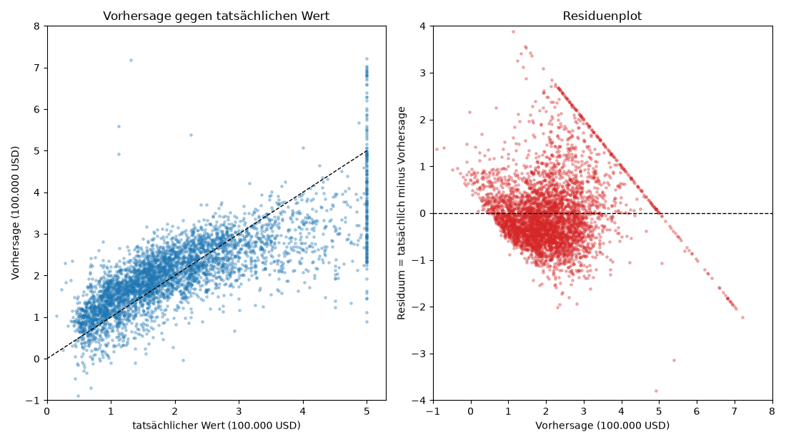

--

<!-- .slide: class="smaller" -->
## Clustering: Versicherte segmentieren

```python
from sklearn.impute import SimpleImputer
from sklearn.cluster import KMeans

df = pd.read_csv("data/versicherte.csv").drop_duplicates()
merkmale = ["alter", "bmi", "arztbesuche_jahr", "leistungsausgaben_eur"]

segmentierung = Pipeline([
    ("imputer", SimpleImputer(strategy="median")),
    ("scaler", StandardScaler()),
    ("kmeans", KMeans(n_clusters=4, n_init=10, random_state=1)),
])

df = df.assign(segment=segmentierung.fit_predict(df[merkmale]))
print(df["segment"].value_counts().sort_index())
```

+ `bmi` hat Lücken, `KMeans` bricht bei fehlenden Werten ab: Der Imputer gehört in die Pipeline <!-- .element: class="fragment" data-fragment-index="1" -->
+ Ohne Skalierung bestimmt allein `leistungsausgaben_eur` die Segmente, weil die Spalte die größten Zahlen hat <!-- .element: class="fragment" data-fragment-index="2" -->

--

<!-- .slide: class="smaller" -->
## Segmentprofil berechnen

```python
profil = (df.groupby("segment")[merkmale].mean().round(1)
            .assign(anzahl=df["segment"].value_counts().sort_index()))
print(profil)

print(df.groupby("segment")[ ["raucher", "zusatzversicherung"] ].mean()
        .round(2))
```

```text
         alter   bmi  arztbesuche_jahr  leistungsausgaben_eur  anzahl
segment
0         36.8  23.7               3.9                 1339.6    2367
1         62.4  29.0               4.6                 2905.3    1969
2         70.4  27.2              17.4                 6491.9     579
3         65.0  27.1               8.7                34563.5      85
```

+ Das Profil entsteht auf den Originalwerten, nicht auf den skalierten <!-- .element: class="fragment" data-fragment-index="1" -->
+ Merkmale, die nicht im Clustering waren (`raucher`, `zusatzversicherung`), helfen beim Beschreiben <!-- .element: class="fragment" data-fragment-index="2" -->

--

## Segmente beschreiben und benennen

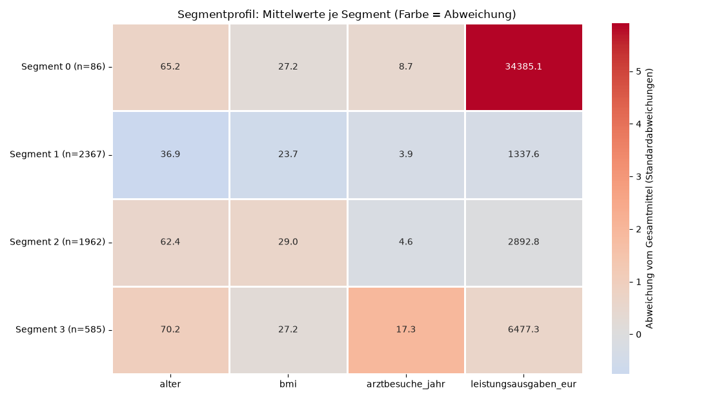

--

<!-- .slide: class="smaller" -->
## Koeffizienten eines linearen Modells lesen

```python
roh = LinearRegression().fit(X_train, y_train)
tabelle = pd.DataFrame({
    "roh": roh.coef_,
    "skaliert": reg.named_steps["modell"].coef_,
}, index=X_train.columns).round(3)
print(tabelle.loc[ ["MedInc", "AveBedrms", "Latitude", "Population"] ])
```

```text
              roh  skaliert
MedInc      0.439     0.830
AveBedrms   0.632     0.321
Latitude   -0.426    -0.910
Population -0.000    -0.004
```

+ Roh: Änderung der Vorhersage je Einheit des Merkmals. `AveBedrms` wirkt am größten, weil die Spalte nur in einem engen Bereich um 1 schwankt <!-- .element: class="fragment" data-fragment-index="1" -->
+ Skaliert: Änderung je Standardabweichung. Erst jetzt lassen sich die Beträge vergleichen <!-- .element: class="fragment" data-fragment-index="2" -->
+ Das Vorzeichen gibt die Richtung an, jeweils bei festgehaltenen übrigen Merkmalen <!-- .element: class="fragment" data-fragment-index="3" -->

<div class="fragment" data-fragment-index="4">

> [!tip]
> Koeffizienten vergleichen Sie nur nach Skalierung.

</div>

--

## Lasso setzt Koeffizienten auf null

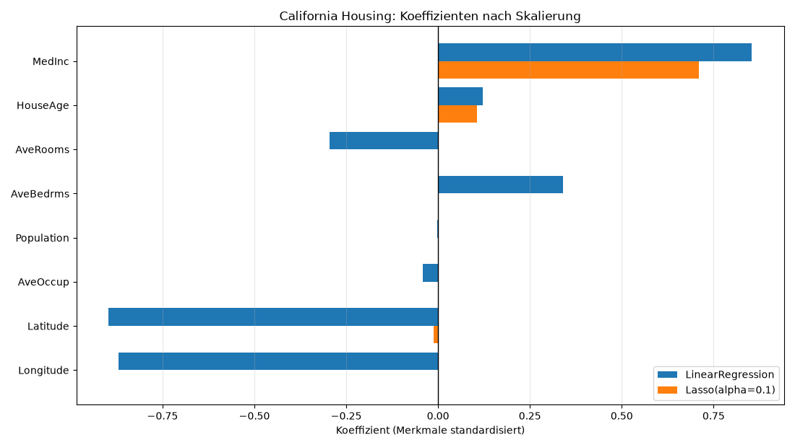

--

<!-- .slide: class="smaller" -->
## `plot_tree` mit Merkmalsnamen

```python
from sklearn.tree import DecisionTreeClassifier, plot_tree

baum = Pipeline([             # preprocess, X_train, y_train: Titanic
    ("prep", preprocess),
    ("modell", DecisionTreeClassifier(max_depth=3, min_samples_leaf=20,
                                      random_state=1)),
]).fit(X_train, y_train)

namen = (pd.Index(baum.named_steps["prep"].get_feature_names_out())
           .str.replace(r"^(num|cat)__", "", regex=True))

fig, ax = plt.subplots(figsize=(11, 6))
plot_tree(baum.named_steps["modell"], feature_names=list(namen),
          class_names=["gestorben", "überlebt"], filled=True,
          rounded=True, impurity=False, proportion=True,
          fontsize=9, ax=ax)
plt.show()
```

--

## Entscheidungsbaum lesen

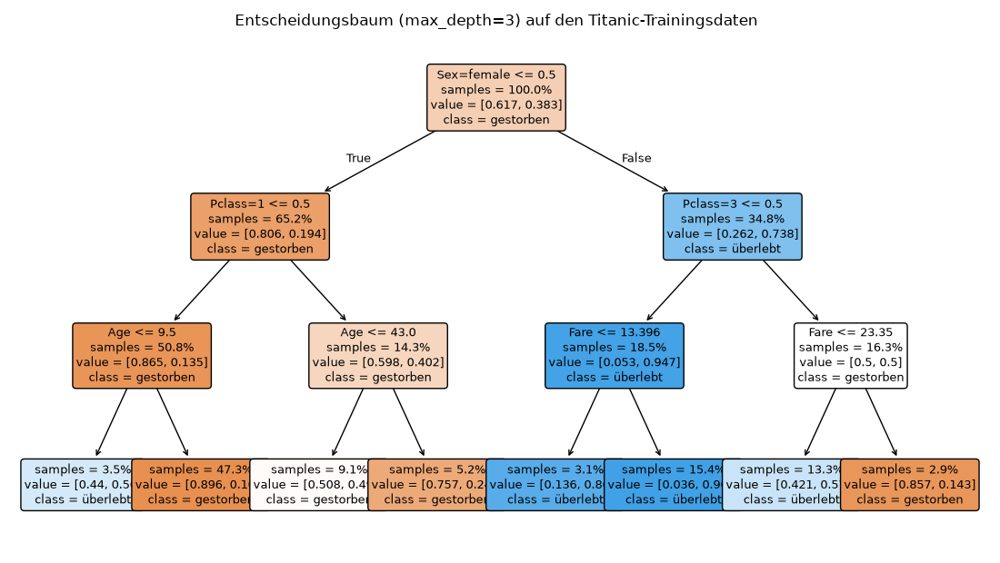

--

<!-- .slide: class="smaller" -->
## `feature_importances_` des Random Forest

```python
rf = Pipeline([
    ("prep", preprocess),
    ("modell", RandomForestClassifier(n_estimators=200, random_state=1)),
])
rf.fit(X_train, y_train)

wichtigkeit = pd.Series(
    rf.named_steps["modell"].feature_importances_,
    index=rf.named_steps["prep"].get_feature_names_out(),
).sort_values(ascending=False)
print(wichtigkeit.head(5).round(3))
```

+ Misst, wie stark ein Merkmal über alle Bäume hinweg die Unreinheit der Knoten verringert <!-- .element: class="fragment" data-fragment-index="1" -->
+ Die Werte summieren sich zu 1 und fallen beim Training ohne Mehraufwand an <!-- .element: class="fragment" data-fragment-index="2" -->
+ Sie sagen nichts über die Richtung: ob ein hoher Wert die Klasse wahrscheinlicher oder unwahrscheinlicher macht, bleibt offen <!-- .element: class="fragment" data-fragment-index="3" -->

--

## Schwächen von `feature_importances_`

+ Sie werden aus den Trainingsdaten berechnet: Ein Merkmal, mit dem der Wald nur auswendig lernt, erscheint trotzdem wichtig <!-- .element: class="fragment" data-fragment-index="1" -->
+ Merkmale mit vielen verschiedenen Werten (stetige Zahlen, Kennungen) werden bevorzugt, weil sie mehr Möglichkeiten zum Teilen bieten <!-- .element: class="fragment" data-fragment-index="2" -->
+ Bei stark zusammenhängenden Merkmalen kann jedes einzelne unbedeutend wirken, obwohl die gemeinsame Information wichtig ist <!-- .element: class="fragment" data-fragment-index="3" -->
+ One-Hot-Spalten einer Kategorie werden einzeln bewertet <!-- .element: class="fragment" data-fragment-index="4" -->

<div class="fragment" data-fragment-index="5">

> [!warning]
> scikit-learn warnt in der eigenen Dokumentation: Wichtigkeiten aus der Unreinheit können bei Merkmalen mit vielen Ausprägungen irreführen.

</div>

--

<!-- .slide: class="smaller" -->
## `permutation_importance` als robustere Alternative

```python
from sklearn.inspection import permutation_importance

result = permutation_importance(rf, X_test, y_test,
                                n_repeats=20, random_state=1)

perm = pd.DataFrame({
    "mittel": result.importances_mean,
    "std": result.importances_std,
}, index=X_test.columns).sort_values("mittel", ascending=False)
print(perm.round(3))
```

+ Idee: die Werte einer Spalte zufällig durchmischen und messen, wie stark die Kennzahl auf den Testdaten fällt <!-- .element: class="fragment" data-fragment-index="1" -->
+ Arbeitet mit der ganzen Pipeline und den Originalspalten: `Sex` ist ein Merkmal, nicht zwei <!-- .element: class="fragment" data-fragment-index="2" -->
+ Funktioniert für jedes Modell, nicht nur für Bäume <!-- .element: class="fragment" data-fragment-index="3" -->
+ `n_repeats=20` wiederholt das Mischen und liefert eine Streuung dazu <!-- .element: class="fragment" data-fragment-index="4" -->

--

## Beide Verfahren im Vergleich

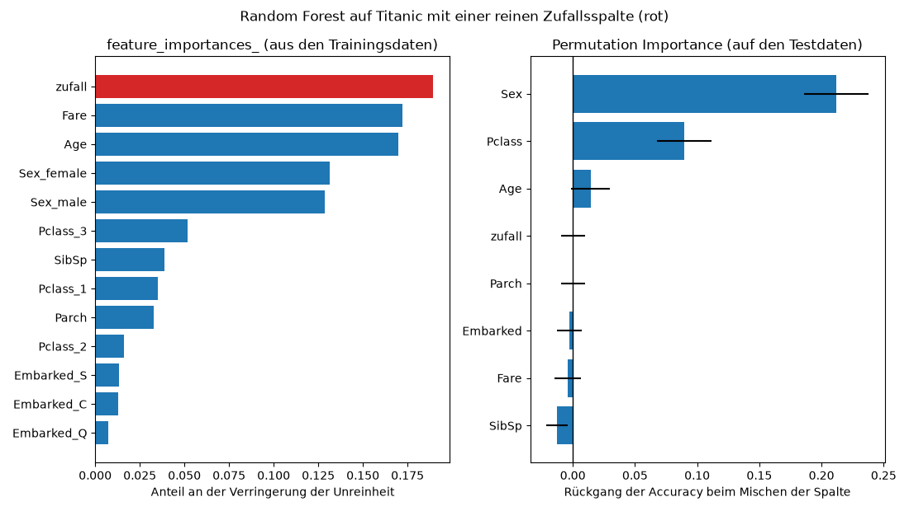

--

<!-- .slide: class="smaller" -->
## Partial Dependence

<div class="two-col">
<div style="flex: 45">

```python
from sklearn.ensemble import (
    RandomForestRegressor)
from sklearn.inspection import (
    PartialDependenceDisplay)

# X_train, y_train: California Housing
wald = RandomForestRegressor(
    n_estimators=100,
    min_samples_leaf=5,
    random_state=1, n_jobs=-1)
wald.fit(X_train, y_train)

PartialDependenceDisplay.from_estimator(
    wald, X_test.sample(1000,
                        random_state=1),
    features=["MedInc", "HouseAge"])
plt.show()
```

</div>
<div style="flex: 55">

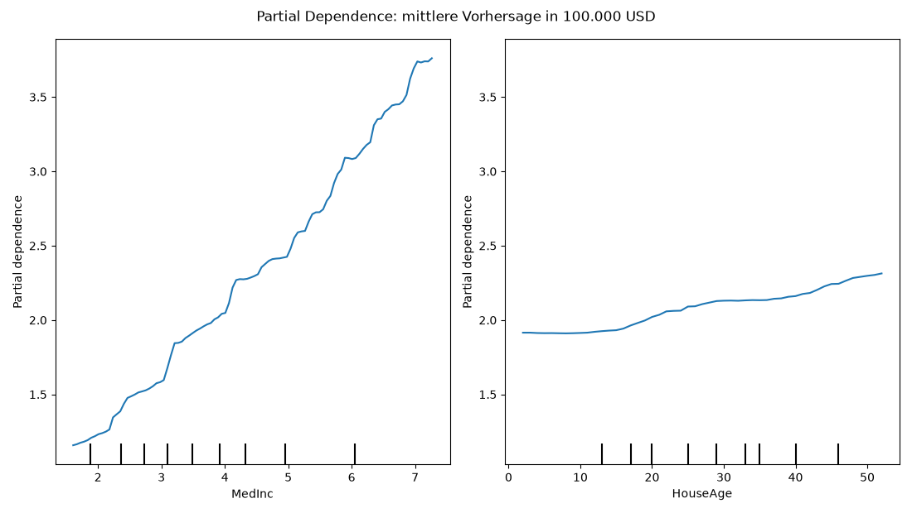

+ Zeigt die mittlere Vorhersage, wenn ein Merkmal variiert und alle anderen bleiben, wie sie sind <!-- .element: class="fragment" data-fragment-index="1" -->
+ Beantwortet die Frage nach der Richtung, die Wichtigkeiten offenlassen <!-- .element: class="fragment" data-fragment-index="2" -->

</div>
</div>

--

<!-- .slide: class="smaller" -->
## Grenzen der Interpretation

+ **Zusammenhang ist keine Ursache.** Das Modell nutzt, was mit der Zielgröße zusammen auftritt. Ob eine Änderung des Merkmals die Zielgröße ändert, beantwortet es nicht <!-- .element: class="fragment" data-fragment-index="1" -->
+ **Zusammenhängende Merkmale wirken einzeln unwichtig.** Zwei fast gleiche Spalten können beide unbedeutend erscheinen, obwohl die Information dahinter entscheidend ist <!-- .element: class="fragment" data-fragment-index="2" -->
+ **Die Interpretation gilt für das Modell, nicht für die Welt.** Ein anderes Modell mit gleicher Güte kann andere Merkmale bevorzugen <!-- .element: class="fragment" data-fragment-index="3" -->
+ **Ein schlechtes Modell hat nichts zu erklären.** Erst die Güte auf Testdaten prüfen, dann interpretieren <!-- .element: class="fragment" data-fragment-index="4" -->

<div class="fragment" data-fragment-index="5">

> [!important]
> Formulieren Sie „das Modell stützt sich vor allem auf X", nicht „X verursacht Y".

</div>

--

<!-- .slide: class="smaller" -->
## Ausblick: SHAP und LIME

| | SHAP | LIME |
|---|---|---|
| **Frage** | Welchen Beitrag hat jedes Merkmal zu dieser einen Vorhersage? | Welches einfache Modell beschreibt das Verhalten in der Nähe dieser einen Zeile? |
| **Idee** | verteilt die Abweichung vom Durchschnitt nach einem Verfahren aus der Spieltheorie (Shapley-Werte) auf die Merkmale | verändert die Zeile leicht, beobachtet die Vorhersagen und passt lokal ein lineares Modell an |
| **Ergebnis** | Beitrag je Merkmal und Zeile, über viele Zeilen auch eine globale Übersicht | Gewichte je Merkmal für eine einzelne Zeile |
| **Aufwand** | eigenes Paket, bei großen Daten rechenintensiv | eigenes Paket, Ergebnis schwankt mit der Zufallsstichprobe |

+ Beide erklären **einzelne** Vorhersagen, das können Permutation Importance und Partial Dependence nicht <!-- .element: class="fragment" data-fragment-index="1" -->
+ Beide Pakete gehören nicht zur Kursumgebung und werden hier nicht installiert <!-- .element: class="fragment" data-fragment-index="2" -->
+ Die Grenzen der vorigen Folie gelten unverändert <!-- .element: class="fragment" data-fragment-index="3" -->

--

<!-- .slide: class="smaller" -->
## Ergebnisse für die Fachabteilung darstellen

| Abschnitt im Ergebnisbericht | Inhalt |
|---|---|
| **Frage und Nutzen** | Welche Entscheidung soll das Modell unterstützen? |
| **Daten** | Quelle, Zeitraum, Zeilenzahl, weggelassene Spalten und warum |
| **Vorgehen** | Aufteilung, Pipeline, Art der Prüfung, in zwei bis drei Sätzen |
| **Güte** | eine zur Fragestellung passende Kennzahl, daneben die einfache Baseline |
| **Fehlerbild** | Konfusionsmatrix oder Residuenplot in Worten: Was wird übersehen, was fälschlich gemeldet? |
| **Wichtigste Merkmale** | Permutation Importance als Balkendiagramm, Richtung aus Partial Dependence oder Koeffizienten |
| **Grenzen** | für welche Fälle das Modell nicht gilt, bekannte Schwächen der Daten |
| **Wiederholbarkeit** | Datenstand, Versionen, `random_state`, Ablageort der Pipeline |

> [!tip]
> Übersetzen Sie Kennzahlen in Fälle: „Von 68 Ausfällen findet das Modell 65 und meldet 140 Mal falschen Alarm" statt „Recall 0,96".

--

## Zusammenfassung

+ Derselbe Ablauf aus Spaltenwahl, Split, Pipeline, Cross-Validation und einmaligem Testset trägt Klassifikation, Regression und Clustering <!-- .element: class="fragment" data-fragment-index="1" -->
+ Bei 3,4 % Ausfällen erreicht ein nutzloses Modell 97 % Accuracy: Recall, Precision, `class_weight="balanced"` und eine bewusst gewählte Schwelle sind die Werkzeuge <!-- .element: class="fragment" data-fragment-index="2" -->
+ Koeffizienten vergleichen Sie nur nach Skalierung, Lasso setzt entbehrliche auf null, ein Baum der Tiefe 3 lässt sich als Regeln vorlesen <!-- .element: class="fragment" data-fragment-index="3" -->
+ `feature_importances_` bevorzugt Spalten mit vielen Werten, `permutation_importance` auf Testdaten ist die robustere Wahl <!-- .element: class="fragment" data-fragment-index="4" -->
+ Jede Interpretation beschreibt das Modell, nicht die Ursachen in der Welt, und gehört mit Baseline und Grenzen in den Bericht <!-- .element: class="fragment" data-fragment-index="5" -->

---

<!-- .slide: data-background-color="#183b66" -->
# Teil 11: Transfer in die Praxis

Vom Kursbeispiel zum ersten eigenen Modell mit eigenen Daten.

--

## Was Sie in diesem Teil lernen

+ Sie ordnen die Themen des Kurses auf einer Landkarte ein. <!-- .element: class="fragment" data-fragment-index="1" -->
+ Sie prüfen mit einer Checkliste, ob ein Vorhaben reif für ein erstes Modell ist. <!-- .element: class="fragment" data-fragment-index="2" -->
+ Sie erkennen die typischen Fehler beim Einstieg und wissen, wie Sie sie vermeiden. <!-- .element: class="fragment" data-fragment-index="3" -->
+ Sie machen aus einem Notebook ein Skript, das morgen dasselbe Ergebnis liefert wie heute. <!-- .element: class="fragment" data-fragment-index="4" -->
+ Sie wissen, was nach dem Kurs auf Ihrem Gerät bleibt und womit Sie weiterlernen. <!-- .element: class="fragment" data-fragment-index="5" -->

--

<!-- .slide: class="smaller" -->
## Rückblick: die Landkarte des Kurses

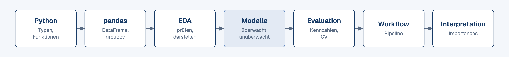

+ Jeder Kasten baut auf dem vorigen auf: ohne saubere Tabelle kein brauchbares Modell. <!-- .element: class="fragment" data-fragment-index="1" -->
+ Die meiste Arbeitszeit steckt in der linken Hälfte (Daten lesen, prüfen, aufbereiten). <!-- .element: class="fragment" data-fragment-index="2" -->
+ Deep Learning folgt demselben Ablauf, nur mit einem anderen Modelltyp im Kasten „Modelle“. <!-- .element: class="fragment" data-fragment-index="3" -->

--

<!-- .slide: class="smaller" -->
## Checkliste vor dem ersten eigenen Modell

| Punkt | Frage, die Sie beantworten können müssen |
|---|---|
| **Fragestellung** | Welche Entscheidung soll das Ergebnis unterstützen? In einem Satz. |
| **Zielgröße** | Welche Spalte sagen Sie voraus, und liegt sie zum Zeitpunkt der Vorhersage schon vor? |
| **Datenlage** | Kennen Sie Verteilungen, Ausreißer und fehlende Werte? Sind IDs und Leckquellen aussortiert? |
| **Baseline** | Wie gut ist die einfachste Lösung (häufigste Klasse, Mittelwert, bestehende Regel)? |
| **Kennzahl** | Welche Fehler sind fachlich teuer, und welche Kennzahl bildet das ab? |
| **Testdaten** | Liegt ein Teil der Daten unberührt zurück, bis das Modell fertig ist? |

> [!tip]
> Können Sie einen Punkt nicht beantworten, klären Sie ihn zuerst. Modellcode schreiben Sie danach.

--

<!-- .slide: class="smaller" -->
## Wann sich ML lohnt und wann nicht

<div class="two-col">
<div style="flex: 50">

**ML lohnt sich, wenn**

+ ausreichend historische Daten vorliegen, <!-- .element: class="fragment" data-fragment-index="1" -->
+ eine wiederkehrende Vorhersage oder Einordnung einen messbaren Nutzen hat, <!-- .element: class="fragment" data-fragment-index="2" -->
+ sich die Zusammenhänge nicht mehr mit einfachen Regeln beschreiben lassen, <!-- .element: class="fragment" data-fragment-index="3" -->
+ Sie Fehlentscheidungen bewerten können (was kostet ein Fehlalarm, was ein übersehener Fall?). <!-- .element: class="fragment" data-fragment-index="4" -->

</div>
<div style="flex: 50">

<div class="fragment" data-fragment-index="5">

**ML lohnt sich eher nicht, wenn**

</div>

+ es kaum Daten, aber viele Ausnahmen und Sonderfälle gibt, <!-- .element: class="fragment" data-fragment-index="6" -->
+ die eigentliche Entscheidung fachlich noch nicht klar formuliert ist, <!-- .element: class="fragment" data-fragment-index="7" -->
+ eine bekannte Regel das Problem schon zuverlässig löst, <!-- .element: class="fragment" data-fragment-index="8" -->
+ sich weder Nutzen noch Fehlerkosten bewerten lassen. <!-- .element: class="fragment" data-fragment-index="9" -->

</div>
</div>

--

## Voraussetzungen für ein brauchbares Modell

+ Ein gutes Modell ist Teil eines größeren Ablaufs: Daten beschaffen, prüfen, aufbereiten, bewerten, betreiben. <!-- .element: class="fragment" data-fragment-index="1" -->
+ Datenzugang, Datenqualität und eine saubere Zielgröße sind genauso wichtig wie der Algorithmus. <!-- .element: class="fragment" data-fragment-index="2" -->
+ Viele Vorhaben scheitern nicht am Modell, sondern an unreifen Daten oder einer unklaren Fragestellung. <!-- .element: class="fragment" data-fragment-index="3" -->
+ Ein Modell wird höchstens so gut wie seine Zielgröße: uneinheitlich oder verspätet erfasste Werte begrenzen jedes Ergebnis. <!-- .element: class="fragment" data-fragment-index="4" -->

<div class="fragment" data-fragment-index="5">

> [!important]
> Bevor Sie das Modell wechseln, prüfen Sie die Daten: `df.info()`, `df.describe()`, `df.isna().sum()`, `df.duplicated().sum()`.

</div>

--

<!-- .slide: class="smaller" -->
## Typische Fehler beim Einstieg

| Fehler | Woran Sie ihn erkennen | Gegenmittel |
|---|---|---|
| **Datenleck** | Testergebnis unrealistisch gut | Erst `train_test_split`, dann alles Weitere in einer `Pipeline` |
| **Nur Accuracy** | 95 % Accuracy, aber die seltene Klasse wird nie erkannt | Konfusionsmatrix, Precision, Recall, F1 |
| **Kein Baseline-Vergleich** | Niemand weiß, ob 0,80 gut ist | `DummyClassifier` oder `DummyRegressor` zuerst |
| **Zellen in falscher Reihenfolge** | Notebook läuft nach Neustart nicht mehr durch | „Restart Kernel and Run All“ vor dem Weitergeben |
| **Keine festen Zufallswerte** | Jeder Lauf liefert andere Zahlen | `random_state=1` bei Split, Modell und CV |
| **Datentypen ungeprüft** | Datum oder Zahl steht als Text (`object` oder `str`) in `df.dtypes` | `pd.to_datetime`, `pd.to_numeric`, `astype` |
| **Zufälliger Split bei Zeitbezug** | Modell lernt aus der Zukunft | Nach Datum trennen: ältere Daten trainieren, neuere testen |

--

<!-- .slide: class="smaller" -->
## Personenbezogene und besonders schützenswerte Daten

+ Sobald sich Daten auf eine identifizierbare Person beziehen, gilt die **DSGVO**, auch für Auswertungen und Modelle im Notebook. <!-- .element: class="fragment" data-fragment-index="1" -->
+ **Gesundheitsdaten** sind besondere Kategorien personenbezogener Daten nach **Art. 9 DSGVO**: Die Verarbeitung ist grundsätzlich untersagt, Ausnahmen regelt Art. 9 Abs. 2. <!-- .element: class="fragment" data-fragment-index="2" -->
+ Arbeiten Sie nur mit den Spalten, die Sie für die Frage brauchen (Datenminimierung), und nur für den festgelegten Zweck (Zweckbindung). <!-- .element: class="fragment" data-fragment-index="3" -->
+ **Ohne Namen ist nicht anonym:** Geschlecht, Geburtsdatum und Postleitzahl können einen Datensatz eindeutig machen. Auch pseudonymisierte Daten bleiben personenbezogen (Art. 4 Nr. 5 DSGVO). <!-- .element: class="fragment" data-fragment-index="4" -->
+ Zum Lernen und Ausprobieren: **synthetische oder anonymisierte Daten**, so wie die Versichertentabelle in diesem Kurs. Synthetische Daten sind aber nicht automatisch anonym. <!-- .element: class="fragment" data-fragment-index="5" -->

--

<!-- .slide: class="smaller" -->
## Vom Notebook zum wiederholbaren Skript

```python
import pandas as pd
from sklearn.ensemble import RandomForestClassifier
from sklearn.model_selection import train_test_split

def lade_daten(pfad):
    df = pd.read_csv(pfad)
    X = df[ ["Pclass", "SibSp", "Parch", "Fare"] ]
    X = X.assign(weiblich=df["Sex"] == "female")
    return X, df["Survived"]

def trainiere(X, y):
    X_tr, X_te, y_tr, y_te = train_test_split(
        X, y, test_size=0.2, random_state=1, stratify=y)
    modell = RandomForestClassifier(random_state=1).fit(X_tr, y_tr)
    return modell, modell.score(X_te, y_te)

if __name__ == "__main__":
    modell, acc = trainiere(*lade_daten("data/titanic.csv"))
    print(f"Accuracy Test: {acc:.3f}")   # -> Accuracy Test: 0.810
```

+ Jeder Schritt ist eine **Funktion** mit Eingabe und Rückgabe, nichts hängt von der Reihenfolge einzelner Zellen ab. <!-- .element: class="fragment" data-fragment-index="1" -->
+ Start aus dem Terminal ab Repo-Wurzel: `python train.py` <!-- .element: class="fragment" data-fragment-index="2" -->

--

<!-- .slide: class="smaller" -->
## Umgebung und Stand festhalten

<div class="two-col">
<div style="flex: 50">

**Pakete festschreiben**

```text
conda env export --from-history > environment.yml
pip freeze > requirements.txt
```

- `environment.yml` beschreibt die conda-Umgebung, `requirements.txt` die pip-Pakete mit Version.
- Auf einem anderen Gerät: `conda env create -f environment.yml`

</div>
<div style="flex: 50">

**Stand mit Git sichern**

```text
git status
git add train.py environment.yml
git commit -m "Erstes Modell: Baseline + Random Forest"
```

- Ein Commit pro abgeschlossenem Schritt, mit einer Nachricht, die das Ergebnis nennt.
- Daten mit Personenbezug gehören nicht ins Repository (`.gitignore`).

</div>
</div>

> [!tip]
> Wiederholbar heißt: gleicher Code, gleiche Paketversionen, gleiche Daten, gleicher `random_state`.

--

<!-- .slide: class="smaller" -->
## Ein erstes eigenes Projekt zuschneiden

+ **Klein anfangen:** eine Tabelle, eine Frage, ein Notebook. Kein Datenbankanschluss, kein Dashboard. <!-- .element: class="fragment" data-fragment-index="1" -->
+ **Vorhandene Tabelle nehmen:** eine Auswertung, die Sie heute schon in Excel pflegen und deren Spalten Sie fachlich kennen. <!-- .element: class="fragment" data-fragment-index="2" -->
+ **Eine Frage formulieren:** „Welche Merkmale hängen mit X zusammen?“ oder „Lässt sich Y aus den übrigen Spalten vorhersagen?“ <!-- .element: class="fragment" data-fragment-index="3" -->
+ **Erst beschreiben, dann modellieren:** `describe`, `groupby`, zwei bis drei Diagramme. Oft ist die Frage damit schon beantwortet. <!-- .element: class="fragment" data-fragment-index="4" -->
+ **Dann der Kursablauf:** Baseline, einfaches Modell, Kennzahl auf zurückgehaltenen Testdaten, Interpretation. <!-- .element: class="fragment" data-fragment-index="5" -->

<div class="fragment" data-fragment-index="6">

> [!tip]
> Legen Sie das erste eigene Notebook in den nächsten Tagen an. Training wirkt vor allem dann, wenn Anwendung und Follow-up folgen (Salas et al. 2012).

</div>

--

<!-- .slide: class="smaller" -->
## Ihre Umgebung nach dem Kurs

| Was | Bleibt es? | Hinweis |
|---|---|---|
| conda-Umgebung mit allen Kurspaketen | ja | Aktivieren wie im Kurs mit `conda activate` und dem Namen Ihrer Kursumgebung |
| VS Code mit Python- und Jupyter-Erweiterung | ja | Kernel der Kursumgebung auswählen |
| Kursrepo mit Folien, Notebooks, Lösungen und Daten | ja | Liegt lokal vollständig vor, läuft ohne Netz |
| Netzfreigaben für Paketquellen (Anaconda, PyPI, PyTorch, Hugging Face) | **nein** | Werden nach der Schulung zurückgesetzt |

+ Die Notebooks des Kurses laufen weiter, weil Pakete und Datensätze bereits lokal liegen. <!-- .element: class="fragment" data-fragment-index="1" -->
+ `conda install` und `pip install` erreichen ihre Quellen danach nicht mehr. <!-- .element: class="fragment" data-fragment-index="2" -->

<div class="fragment" data-fragment-index="3">

> [!important]
> Neue Pakete oder Updates fordern Sie über Ihre eigene IT an. Nennen Sie dabei Paketname, Version und Quelle (conda-Kanal oder PyPI).

</div>

--

<!-- .slide: class="smaller" -->
## Literatur und Lernpfad

| Schritt | Titel | Wofür |
|---|---|---|
| 1. Python festigen | Allen B. Downey: *Think Python*, 2. Auflage (frei bei Green Tea Press) | Sprache von Grund auf, mit Aufgaben |
| 2. Daten | Wes McKinney: *Python for Data Analysis*, 3. Auflage (frei: wesmckinney.com/book) | pandas vom Autor der Bibliothek |
| 2. Daten | Jake VanderPlas: *Python Data Science Handbook* (frei: jakevdp.github.io/PythonDataScienceHandbook) | NumPy, pandas, matplotlib, scikit-learn in einem Band |
| 3. Machine Learning | Aurélien Géron: *Hands-On Machine Learning with Scikit-Learn, Keras and TensorFlow* (O'Reilly, 2019) | Durchgehende Praxisprojekte, Pipelines |
| 3. Machine Learning | scikit-learn User Guide (scikit-learn.org) | Nachschlagen: jedes Verfahren mit Beispiel |
| 4. Deep Learning | Zhang, Lipton, Li, Smola: *Dive into Deep Learning* (frei: d2l.ai) | Neuronale Netze mit PyTorch-Code |

> [!tip]
> Ein Buch, ein eigener Datensatz. Jedes Kapitel sofort an der eigenen Tabelle nachvollziehen.

--

## Fragen für Ihren Arbeitsalltag

+ Welche Tabelle aus Ihrem Alltag eignet sich für ein erstes kleines Projekt, und welche eine Frage stellen Sie an sie? <!-- .element: class="fragment" data-fragment-index="1" -->
+ Wo reicht eine saubere Auswertung mit pandas aus, und wo würde ein Modell wirklich etwas hinzufügen? <!-- .element: class="fragment" data-fragment-index="2" -->
+ Welcher Fehler wäre in Ihrem Anwendungsfall teurer: ein falscher Alarm oder ein übersehener Fall? <!-- .element: class="fragment" data-fragment-index="3" -->
+ Was müssen Sie intern klären, bevor Sie mit echten Daten arbeiten (Datenschutz, Zugriff, Pakete)? <!-- .element: class="fragment" data-fragment-index="4" -->

--

## Zusammenfassung

+ Der Ablauf bleibt gleich: Daten prüfen, Baseline, einfaches Modell, passende Kennzahl, zurückgehaltene Testdaten, Interpretation. <!-- .element: class="fragment" data-fragment-index="1" -->
+ Datenqualität und eine klare Fragestellung entscheiden mehr als die Wahl des Algorithmus. <!-- .element: class="fragment" data-fragment-index="2" -->
+ Fünf Gewohnheiten schützen vor den häufigsten Fehlern: zuerst trennen, `Pipeline` nutzen, mehr als Accuracy ansehen, `random_state=1` setzen, Notebook komplett neu durchlaufen lassen. <!-- .element: class="fragment" data-fragment-index="3" -->
+ Gesundheitsdaten sind besondere Kategorien nach Art. 9 DSGVO: üben Sie mit synthetischen oder anonymisierten Daten und klären Sie echte Daten vorab. <!-- .element: class="fragment" data-fragment-index="4" -->
+ Umgebung und Kursrepo bleiben auf Ihrem Gerät, neue Pakete kommen über Ihre IT. <!-- .element: class="fragment" data-fragment-index="5" -->

--

<!-- .slide: data-background-color="#183b66" -->
## Vielen Dank

Dr.-Ing. Grigory Devadze

Kursmaterial: `https://github.com/grigory-consulting/python-ml-grundlagen`
